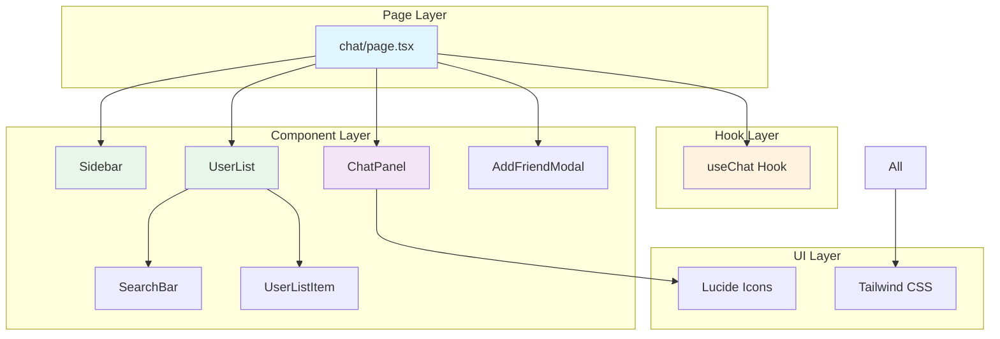
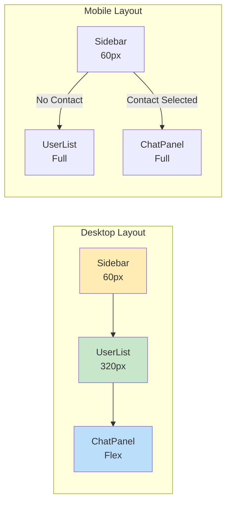
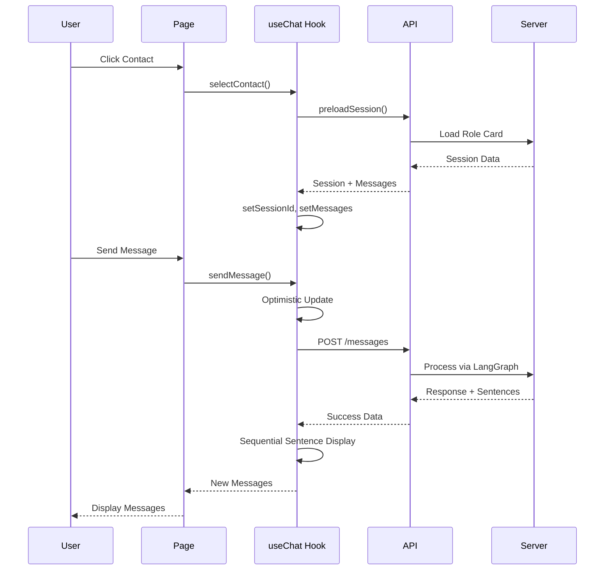

# Chat Frontend Components

## Architecture Level

The Chat frontend is built with **Next.js 14** and **React**, providing a responsive three-column layout for managing conversations with AI role-playing characters.

### Component Hierarchy



### Layout Structure



### Data Flow



## Function Level

### Component Responsibilities

| Component | File | Props | Responsibilities |
|-----------|------|-------|------------------|
| **ChatPage** | `page.tsx` | - | Layout orchestration, mobile detection |
| **useChat** | `hooks/useChat.ts` | - | State management, API calls, business logic |
| **Sidebar** | `components/Sidebar.tsx` | - | Navigation menu |
| **UserList** | `components/UserList.tsx` | contacts, onSelect | Display and filter contacts |
| **SearchBar** | `components/SearchBar.tsx` | value, onChange | Search input |
| **UserListItem** | `components/UserListItem.tsx` | contact, onClick | Single contact display |
| **ChatPanel** | `components/ChatPanel.tsx` | contact, messages, onSend | Message display and input |
| **AddFriendModal** | `components/AddFriendModal.tsx` | isOpen, onClose | Add new friend by code |

### State Management

The `useChat` hook manages all chat state:

| State | Type | Description |
|-------|------|-------------|
| `contacts` | `Contact[]` | List of available contacts |
| `selectedContact` | `Contact \| null` | Currently selected contact |
| `messages` | `Message[]` | Current conversation messages |
| `sessionId` | `string \| null` | Active session ID |
| `isLoading` | `boolean` | Loading state indicator |
| `searchQuery` | `string` | Contact search filter |

### API Interactions

| Method | Endpoint | Purpose |
|--------|----------|---------|
| `loadContacts()` | `GET /api/chat/contacts` | Load contact list |
| `preloadSession()` | `GET /api/chat/sessions/preload/:userId` | Preload session data |
| `loadMessages()` | `GET /api/chat/sessions/:id/messages` | Load message history |
| `sendMessage()` | `POST /api/chat/sessions/:id/messages` | Send new message |
| `endSession()` | `POST /api/chat/sessions/:id/end-chat` | End conversation |

## Code Level

### useChat Hook

**File:** `web/app/chat/hooks/useChat.ts`

```typescript
interface Contact {
  targetUserId: string
  targetUserName: string
  targetUniqueCode: string
  relationType: 'family' | 'friend' | 'stranger'
  specificRelation: string
  sessionId: string | null
  lastMessage: string | null
  lastMessageAt: string | null
  sentimentScore: number
}

interface Message {
  id: string
  role: 'user' | 'assistant'
  content: string
  timestamp: Date
  pending?: boolean
  streaming?: boolean
  failed?: boolean
  error?: string
}

export function useChat() {
  const [contacts, setContacts] = useState<Contact[]>([])
  const [selectedContact, setSelectedContact] = useState<Contact | null>(null)
  const [messages, setMessages] = useState<Message[]>([])
  const [sessionId, setSessionId] = useState<string | null>(null)
  const [isLoading, setIsLoading] = useState(false)
  const [searchQuery, setSearchQuery] = useState('')

  // Load contacts
  const loadContacts = useCallback(async () => {
    const token = localStorage.getItem('token')
    const res = await fetch(
      `${process.env.NEXT_PUBLIC_API_URL}/api/chat/contacts`,
      { headers: { Authorization: `Bearer ${token}` } }
    )
    const data = await res.json()
    if (data.success) {
      setContacts(data.contacts)
    }
  }, [])

  // Preload session (when clicking contact)
  const preloadSession = useCallback(async (targetUserId: string) => {
    const token = localStorage.getItem('token')
    const res = await fetch(
      `${process.env.NEXT_PUBLIC_API_URL}/api/chat/sessions/preload/${targetUserId}`,
      { headers: { Authorization: `Bearer ${token}` } }
    )
    const data = await res.json()
    if (data.success) {
      return data.session
    }
    return null
  }, [])

  // Select contact
  const selectContact = useCallback(async (contact: Contact) => {
    setSelectedContact(contact)
    setMessages([])
    setIsLoading(true)

    try {
      const session = await preloadSession(contact.targetUserId)

      if (session) {
        setSessionId(session.sessionId)
        if (session.hasHistory) {
          await loadMessages(session.sessionId)
        }
      } else {
        setSessionId(null)
      }
    } catch (err) {
      console.error('预加载会话失败:', err)
      setSessionId(null)
    } finally {
      setIsLoading(false)
    }
  }, [preloadSession, loadMessages])

  // Send message with optimistic update
  const sendMessage = useCallback(async (content: string) => {
    if (!content.trim() || !selectedContact) return

    const tempId = `temp_${Date.now()}`
    setMessages(prev => [...prev, {
      id: tempId,
      role: 'user',
      content,
      timestamp: new Date(),
      pending: true
    }])

    setIsLoading(true)

    try {
      let sid = sessionId
      if (!sid) {
        // Create session first
        const res = await fetch(
          `${process.env.NEXT_PUBLIC_API_URL}/api/chat/sessions/by-code`,
          {
            method: 'POST',
            headers: {
              'Content-Type': 'application/json',
              Authorization: `Bearer ${token}`
            },
            body: JSON.stringify({ targetUniqueCode: selectedContact.targetUniqueCode })
          }
        )
        const data = await res.json()
        if (data.success) {
          sid = data.session.sessionId
          setSessionId(sid)
        }
      }

      const res = await fetch(
        `${process.env.NEXT_PUBLIC_API_URL}/api/chat/sessions/${sid}/messages`,
        {
          method: 'POST',
          headers: {
            'Content-Type': 'application/json',
            Authorization: `Bearer ${token}`
          },
          body: JSON.stringify({ message: content })
        }
      )
      const data = await res.json()

      if (data.success) {
        // Remove temp message, add real user message
        setMessages(prev => {
          const filtered = prev.filter(m => m.id !== tempId)
          return [...filtered, {
            id: `real_${Date.now()}`,
            role: 'user',
            content,
            timestamp: new Date()
          }]
        })

        // Sequential sentence display
        const sentences = data.sentences || [data.message]
        let currentIndex = 0

        const addNextSentence = () => {
          if (currentIndex >= sentences.length) return

          setMessages(prev => [...prev, {
            id: `ai_${Date.now()}_${currentIndex}`,
            role: 'assistant',
            content: sentences[currentIndex],
            timestamp: new Date()
          }])

          currentIndex++

          if (currentIndex < sentences.length) {
            const delay = 1000 + Math.random() * 1000
            setTimeout(addNextSentence, delay)
          }
        }

        const initialDelay = 1000 + Math.random() * 1000
        setTimeout(addNextSentence, initialDelay)

        await loadContacts()
      } else {
        // Mark as failed
        setMessages(prev => prev.map(m =>
          m.id === tempId
            ? { ...m, pending: false, failed: true, error: data.error }
            : m
        ))
      }
    } catch (err) {
      setMessages(prev => prev.map(m =>
        m.id === tempId
          ? { ...m, pending: false, failed: true, error: '网络错误' }
          : m
      ))
    } finally {
      setIsLoading(false)
    }
  }, [selectedContact, sessionId, loadContacts])

  return {
    contacts: contacts.filter(c => c.targetUserName.includes(searchQuery)),
    selectedContact,
    messages,
    isLoading,
    searchQuery,
    setSearchQuery,
    loadContacts,
    selectContact,
    sendMessage,
    endSession,
    setSelectedContact
  }
}
```

### ChatPanel Component

**File:** `web/app/chat/components/ChatPanel.tsx`

```typescript
interface ChatPanelProps {
  contact: Contact | null
  messages: Message[]
  isLoading: boolean
  onSend: (message: string) => void
  onBack?: () => void
  isMobile?: boolean
}

// Format message content with action descriptions in parentheses
function formatMessageContent(content: string) {
  const parts = content.split(/([（(][^）)]*[）)])/g)

  return parts.map((part, index) => {
    if (/^[（(][^）)]*[）)]$/.test(part)) {
      return (
        <span key={index} className="text-gray-400 italic text-xs">
          {part}
        </span>
      )
    }
    return <span key={index}>{part}</span>
  })
}

export function ChatPanel({
  contact,
  messages,
  isLoading,
  onSend,
  onBack,
  isMobile
}: ChatPanelProps) {
  const [input, setInput] = useState('')
  const messagesEndRef = useRef<HTMLDivElement>(null)

  useEffect(() => {
    messagesEndRef.current?.scrollIntoView({ behavior: 'smooth' })
  }, [messages])

  const handleSend = () => {
    if (!input.trim() || isLoading) return
    onSend(input)
    setInput('')
  }

  if (!contact) {
    return (
      <div className="flex-1 flex items-center justify-center bg-gray-50">
        <p className="text-gray-400">请选择左侧用户开始对话</p>
      </div>
    )
  }

  return (
    <div className="flex-1 w-full md:w-auto flex flex-col bg-gray-50">
      {/* Header */}
      <header className="bg-white border-b border-gray-200 px-4 py-3 flex items-center shrink-0">
        {isMobile && onBack && (
          <button onClick={onBack} className="mr-3 p-1">
            <ArrowLeft className="w-5 h-5 text-gray-600" />
          </button>
        )}
        <div>
          <h1 className="font-bold text-gray-900">{contact.targetUserName}</h1>
          <p className="text-xs text-gray-500">#{contact.targetUniqueCode}</p>
        </div>
      </header>

      {/* Messages */}
      <div className="flex-1 overflow-y-auto p-4 space-y-3">
        {messages.map((msg) => (
          <div
            key={msg.id}
            className={`flex ${msg.role === 'user' ? 'justify-end' : 'justify-start'} items-end gap-1`}
          >
            {msg.role === 'user' && msg.failed && (
              <div className="flex-shrink-0 mb-1" title={msg.error}>
                <AlertCircle className="w-5 h-5 text-red-500" />
              </div>
            )}

            <div
              className={`max-w-[75%] rounded-2xl px-4 py-2 ${
                msg.role === 'user'
                  ? msg.failed
                    ? 'bg-gray-300 text-gray-600'
                    : 'bg-gradient-to-r from-orange-500 to-orange-600 text-black'
                  : 'bg-white border border-gray-200 text-black'
              }`}
            >
              <p className="text-sm whitespace-pre-wrap">
                {formatMessageContent(msg.content)}
              </p>
              <span className="text-xs text-gray-500 mt-1 block">
                {msg.timestamp.toLocaleTimeString('zh-CN', {
                  hour: '2-digit',
                  minute: '2-digit'
                })}
                {msg.failed && <span className="text-red-500 ml-1">· 发送失败</span>}
              </span>
            </div>
          </div>
        ))}

        {isLoading && (
          <div className="flex justify-start">
            <div className="bg-white border border-gray-200 rounded-2xl px-4 py-2 flex items-center gap-2">
              <Loader2 className="w-4 h-4 animate-spin text-orange-500" />
              <span className="text-sm text-gray-500">正在输入中...</span>
            </div>
          </div>
        )}

        <div ref={messagesEndRef} />
      </div>

      {/* Input */}
      <div className="bg-white border-t border-gray-200 p-3 shrink-0">
        <div className="flex items-center gap-2">
          <input
            type="text"
            placeholder="输入消息..."
            value={input}
            onChange={(e) => setInput(e.target.value)}
            onKeyPress={(e) => {
              if (e.key === 'Enter' && !e.shiftKey) {
                e.preventDefault()
                handleSend()
              }
            }}
            className="flex-1 px-4 py-2 bg-gray-100 rounded-full text-sm focus:outline-none focus:ring-2 focus:ring-orange-500"
            disabled={isLoading}
          />
          <button
            onClick={handleSend}
            disabled={isLoading || !input.trim()}
            className="p-2 bg-gradient-to-r from-orange-500 to-orange-600 rounded-full disabled:opacity-50"
          >
            <Send className="w-5 h-5 text-white" />
          </button>
        </div>
      </div>
    </div>
  )
}
```

### ChatPage Component

**File:** `web/app/chat/page.tsx`

```typescript
export default function ChatPage() {
  const {
    contacts,
    selectedContact,
    messages,
    isLoading,
    searchQuery,
    setSearchQuery,
    loadContacts,
    selectContact,
    sendMessage,
    setSelectedContact
  } = useChat()

  const [showAddModal, setShowAddModal] = useState(false)
  const [isMobile, setIsMobile] = useState(false)

  useEffect(() => {
    loadContacts()

    const checkMobile = () => setIsMobile(window.innerWidth < 768)
    checkMobile()
    window.addEventListener('resize', checkMobile)
    return () => window.removeEventListener('resize', checkMobile)
  }, [loadContacts])

  // Mobile view control
  const showUserList = !isMobile || !selectedContact
  const showChat = !isMobile || !!selectedContact

  const handleBack = () => {
    setSelectedContact(null)
  }

  return (
    <div className="flex bg-gray-100 h-[calc(100dvh-140px)] md:h-[calc(100vh-140px)]">
      {/* Left sidebar */}
      {showUserList && <Sidebar />}

      {/* Middle user list */}
      {showUserList && (
        <UserList
          contacts={contacts}
          selectedId={selectedContact?.targetUserId || null}
          searchQuery={searchQuery}
          onSearchChange={setSearchQuery}
          onSelect={selectContact}
          onAddFriend={() => setShowAddModal(true)}
        />
      )}

      {/* Right chat panel */}
      {showChat && (
        <ChatPanel
          contact={selectedContact}
          messages={messages}
          isLoading={isLoading}
          onSend={sendMessage}
          onBack={handleBack}
          isMobile={isMobile}
        />
      )}

      {/* Add friend modal */}
      <AddFriendModal
        isOpen={showAddModal}
        onClose={() => setShowAddModal(false)}
        onSuccess={loadContacts}
      />
    </div>
  )
}
```

### Sequential Message Display

The frontend implements a sequential sentence display for natural conversation flow:

```typescript
// In sendMessage callback
const sentences = data.sentences || [data.message]
let currentIndex = 0

const addNextSentence = () => {
  if (currentIndex >= sentences.length) return

  setMessages(prev => [...prev, {
    id: `ai_${Date.now()}_${currentIndex}`,
    role: 'assistant',
    content: sentences[currentIndex],
    timestamp: new Date()
  }])

  currentIndex++

  if (currentIndex < sentences.length) {
    const delay = 1000 + Math.random() * 1000  // 1-2 seconds between sentences
    setTimeout(addNextSentence, delay)
  }
}

// First sentence after 1-2 seconds
const initialDelay = 1000 + Math.random() * 1000
setTimeout(addNextSentence, initialDelay)
```

### Responsive Layout

The chat page adapts to mobile screens:

```typescript
const [isMobile, setIsMobile] = useState(false)

useEffect(() => {
  const checkMobile = () => setIsMobile(window.innerWidth < 768)
  checkMobile()
  window.addEventListener('resize', checkMobile)
  return () => window.removeEventListener('resize', checkMobile)
}, [])

// Conditional rendering
const showUserList = !isMobile || !selectedContact
const showChat = !isMobile || !!selectedContact
```

### Optimistic Updates

Messages are immediately shown with pending state:

```typescript
// Add optimistic message
const tempId = `temp_${Date.now()}`
setMessages(prev => [...prev, {
  id: tempId,
  role: 'user',
  content,
  timestamp: new Date(),
  pending: true
}])

// After API response
if (data.success) {
  // Replace with real message
  setMessages(prev => {
    const filtered = prev.filter(m => m.id !== tempId)
    return [...filtered, { id: `real_${Date.now()}`, role: 'user', content, timestamp: new Date() }]
  })
} else {
  // Mark as failed
  setMessages(prev => prev.map(m =>
    m.id === tempId ? { ...m, pending: false, failed: true, error: data.error } : m
  ))
}
```

### Error Handling

Failed messages are visually indicated:

```typescript
{msg.role === 'user' && msg.failed && (
  <div className="flex-shrink-0 mb-1" title={msg.error}>
    <AlertCircle className="w-5 h-5 text-red-500" />
  </div>
)}

<div className={msg.failed ? 'bg-gray-300 text-gray-600' : 'bg-gradient-to-r from-orange-500 to-orange-600'}>
  ...
  {msg.failed && <span className="text-red-500 ml-1">· 发送失败</span>}
</div>
```
