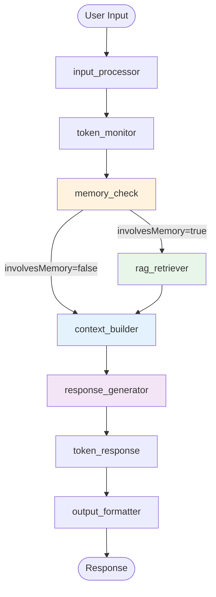
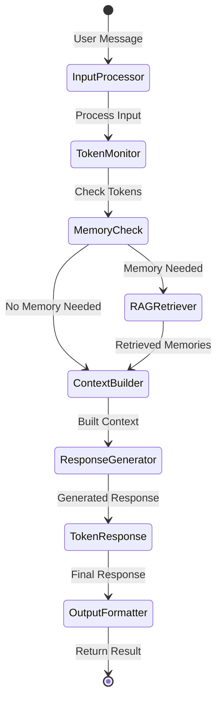
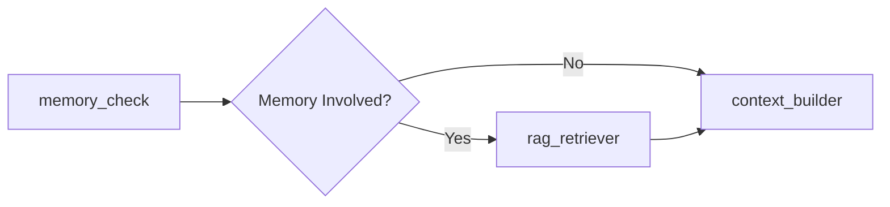

# LangGraph Structure

## Architecture Level

The Chat System uses **LangGraph** to orchestrate a complex, state-driven conversation pipeline. LangGraph provides a flexible framework for building stateful, multi-actor applications with LLMs.

### Graph Structure Overview



### State Flow Diagram



### Conditional Routing



## Function Level

### Node Execution Order

| Step | Node | Input | Output | Description |
|------|------|-------|--------|-------------|
| 1 | `input_processor` | `state.currentInput` | `state.metadata.inputProcessor` | Process input, detect end intent |
| 2 | `token_monitor` | Full state | `state.tokenInfo` | Calculate token usage |
| 3 | `memory_check` | `state.currentInput` | `state.metadata.involvesMemory` | Semantic analysis for memory |
| 4a | `rag_retriever` (conditional) | Input + relation | `state.retrievedMemories` | Vector search memories |
| 4b | `context_builder` | All state | `state.contextMessages` | Assemble LLM context |
| 5 | `response_generator` | `state.contextMessages` | `state.generatedResponse` | Generate AI response |
| 6 | `token_response` | `state.tokenInfo` + response | Final response | Handle token limits |
| 7 | `output_formatter` | All state | Formatted output | Format for frontend |

### Edge Types

#### Static Edges
Always route to the same next node:

```javascript
export const edges = {
  'input_processor': 'token_monitor',
  'token_monitor': 'memory_check',
  'rag_retriever': 'context_builder',
  'context_builder': 'response_generator',
  'response_generator': 'token_response',
  'token_response': 'output_formatter'
};
```

#### Conditional Edges
Route based on state conditions:

```javascript
export const conditionalEdges = {
  'memory_check': routeByMemoryCheck
};

export function routeByMemoryCheck(state) {
  if (state.metadata?.involvesMemory) {
    return 'rag_retriever';
  }
  return 'context_builder';
}
```

### State Management

The `ConversationState` class maintains all conversation data:

```javascript
class ConversationState {
  constructor(initialData = {}) {
    this.userId = initialData.userId || '';
    this.userName = initialData.userName || '';
    this.interlocutor = initialData.interlocutor || {};
    this.messages = initialData.messages || [];
    this.retrievedMemories = initialData.retrievedMemories || [];
    this.systemPrompt = initialData.systemPrompt || '';
    this.currentInput = initialData.currentInput || '';
    this.generatedResponse = initialData.generatedResponse || '';
    this.metadata = initialData.metadata || {};
    this.errors = initialData.errors || [];
  }

  setState(updates) {
    Object.assign(this, updates);
    return this;
  }

  addError(error) {
    this.errors.push({
      message: error.message,
      timestamp: new Date(),
      stack: error.stack
    });
    return this;
  }

  addMessage(role, content, metadata = {}) {
    this.messages.push({
      role,
      content,
      timestamp: new Date(),
      metadata
    });
    return this;
  }
}
```

## Code Level

### Orchestrator Graph Execution

Located in `server/src/modules/chat/orchestrator.js:749`

```javascript
async executeGraph(state) {
  let currentNode = 'input_processor';
  const executionHistory = [];
  const nodeTimings = {};
  const totalStartTime = Date.now();

  while (currentNode && currentNode !== 'output_formatter') {
    const nodeFunction = this.nodes[currentNode];
    if (!nodeFunction) {
      throw new Error(`节点不存在: ${currentNode}`);
    }

    const nodeStartTime = Date.now();
    logger.info(`[ChatGraphOrchestrator] 执行节点: ${currentNode}`);

    await nodeFunction(state);

    const nodeEndTime = Date.now();
    const nodeDuration = nodeEndTime - nodeStartTime;
    nodeTimings[currentNode] = nodeDuration;

    logger.info(`[ChatGraphOrchestrator] 节点 ${currentNode} 完成，耗时: ${nodeDuration}ms`);

    executionHistory.push({
      node: currentNode,
      timestamp: new Date(),
      duration: nodeDuration
    });

    currentNode = this.getNextNode(currentNode, state);
  }

  if (currentNode === 'output_formatter') {
    const nodeStartTime = Date.now();
    const result = await this.nodes['output_formatter'](state);
    const nodeDuration = Date.now() - nodeStartTime;
    nodeTimings['output_formatter'] = nodeDuration;

    const totalDuration = Date.now() - totalStartTime;

    // Performance report
    logger.info('='.repeat(60));
    logger.info('[ChatGraphOrchestrator] 性能报告:');
    for (const [node, duration] of Object.entries(nodeTimings)) {
      const percentage = ((duration / totalDuration) * 100).toFixed(1);
      logger.info(`  ${node}: ${duration}ms (${percentage}%)`);
    }
    logger.info(`[ChatGraphOrchestrator] 总耗时: ${totalDuration}ms`);
    logger.info('='.repeat(60));

    return result;
  }

  throw new Error('LangGraph执行流程异常');
}
```

### Next Node Resolution

```javascript
getNextNode(currentNode, state) {
  let nextNode = edges[currentNode];

  // If current node has conditional edge, use it
  if (conditionalEdges[currentNode]) {
    nextNode = conditionalEdges[currentNode](state);
  }

  return nextNode;
}
```

### Node Registration

Nodes are registered in the orchestrator constructor:

```javascript
constructor() {
  this.nodes = {
    input_processor: inputProcessorNode,
    token_monitor: tokenMonitorNode,
    memory_check: memoryCheckNode,
    rag_retriever: ragRetrieverNode,
    context_builder: contextBuilderNode,
    response_generator: responseGeneratorNode,
    token_response: tokenResponseNode,
    output_formatter: outputFormatterNode
  };
}
```

### Node Function Signature

All nodes follow this pattern:

```javascript
export async function nodeName(state) {
  try {
    logger.info('[NodeName] Processing...');

    // Process state
    // ...

    // Update state
    state.someProperty = newValue;

    return state;
  } catch (error) {
    logger.error('[NodeName] Error:', error);
    state.addError(error);
    return state;
  }
}
```

### Conditional Routing Implementation

The `memory_check` node uses LLM to decide routing:

```javascript
export async function memoryCheckNode(state) {
  const { currentInput } = state;
  const llmClient = createDefaultLLMClient();

  const prompt = `判断消息是否需要从记忆库检索信息。只输出"需要检索"或"不需要检索"。

需要检索的情况：
1. 询问过去的事件/经历（如：还记得、小时候、以前、去年）
2. 询问角色的事实信息（如：你有哪些好友、你的家人、你做过什么工作）
3. 提及需要历史上下文的话题

不需要检索的情况：
1. 当前状态/问候（如：你好、身体怎么样、在干嘛）
2. 当前情感/动作（如：想你了、来看你）
3. 日常闲聊不需要历史信息

消息："${currentInput}"
判断：`;

  const response = await llmClient.generate(prompt, {
    temperature: 0.1,
    maxTokens: 10
  });

  const answer = response?.trim();
  const involvesMemory = answer.includes('需要检索') && !answer.includes('不需要');

  state.metadata = state.metadata || {};
  state.metadata.involvesMemory = involvesMemory;

  return state;
}
```

### Graph Execution Flow Example

```
User: "还记得我们上次去公园吗？"

1. input_processor
   - Input: "还记得我们上次去公园吗？"
   - Output: endIntentDetected=false

2. token_monitor
   - Calculates token usage
   - Output: action='continue'

3. memory_check
   - LLM analysis: involvesMemory=true
   - Routes to: rag_retriever

4. rag_retriever
   - Vector search for "公园"
   - Output: retrievedMemories=[{content: "上次和女儿去了中央公园..."}]

5. context_builder
   - Assembles: systemPrompt + memories + messages
   - Output: contextMessages

6. response_generator
   - LLM generates: "当然记得！我们去了中央公园，那天天气真好..."

7. token_response
   - Token usage OK
   - Output: message unchanged

8. output_formatter
   - Final JSON response
```

### Performance Monitoring

The orchestrator automatically tracks node execution time:

```javascript
// Sample output:
// ============================================================
// [ChatGraphOrchestrator] 性能报告:
//   input_processor: 45ms (2.3%)
//   token_monitor: 12ms (0.6%)
//   memory_check: 1234ms (63.5%)
//   rag_retriever: 89ms (4.6%)
//   context_builder: 34ms (1.7%)
//   response_generator: 521ms (26.8%)
//   token_response: 5ms (0.3%)
//   output_formatter: 2ms (0.1%)
// [ChatGraphOrchestrator] 总耗时: 1942ms
// ============================================================
```

### Error Handling

Each node wraps its logic in try-catch:

```javascript
try {
  // Node logic
} catch (error) {
  logger.error('[NodeName] 处理失败:', error);
  state.addError(error);
  return state;
}
```

The orchestrator checks for errors in the final output:

```javascript
if (result.success === false) {
  return {
    success: false,
    error: result.error
  };
}
```
