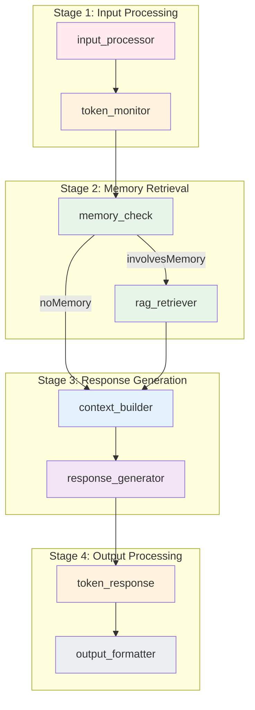
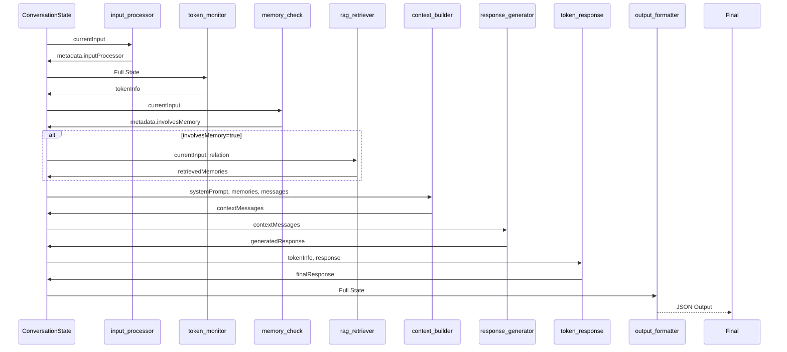

# LangGraph Nodes Documentation

## Architecture Level

The Chat System's LangGraph consists of 8 nodes that process a user message through a sophisticated pipeline. Each node has a specific responsibility in the conversation flow.

### Node Dependency Graph



### Data Flow Through Nodes



## Function Level

### Node Summary Table

| Node | File | Input | Output | Key Functions |
|------|------|-------|--------|---------------|
| **input_processor** | `nodes/inputProcessor.js` | User message | Processed input, end intent | `detectEndIntentWithLLM()` |
| **token_monitor** | `nodes/tokenMonitor.js` | Full state | Token usage info | `calculateConversationTokens()`, `estimateTokens()` |
| **memory_check** | `nodes/memoryCheck.js` | User message | Memory involvement boolean | LLM semantic analysis |
| **rag_retriever** | `nodes/ragRetriever.js` | Input, relation type | Relevant memories | `retrieveMemories()` |
| **context_builder** | `nodes/contextBuilder.js` | All state | Formatted context messages | Memory filtering, pending topics |
| **response_generator** | `nodes/responseGenerator.js` | Context messages | AI response | LLM generation |
| **token_response** | `nodes/tokenResponse.js` | Token info, response | Final response | `generateClosingMessage()` |
| **output_formatter** | `nodes/outputFormatter.js` | All state | JSON output | Response formatting |

## Code Level

### 1. Input Processor Node

**File:** `server/src/modules/chat/nodes/inputProcessor.js`

Processes user input and detects conversation end intent using LLM semantic analysis.

```javascript
/**
 * LLM-based end intent detection
 */
async function detectEndIntentWithLLM(message) {
  const llmClient = createDefaultLLMClient();

  const prompt = `判断用户消息是否表示想要结束当前对话。只输出"是"或"否"。

需要判定为结束意图的情况：
1. 明确说再见/告别（如：再见、拜拜、下次聊、bye）
2. 表示要离开/有事（如：我先走了、要去忙了、有点事）
3. 表示对话该结束了（如：今天就到这里、不聊了）
4. 表示时间晚了（如：太晚了、该睡了）

不是结束意图的情况：
1. 普通问候/关心
2. 继续话题
3. 表达情感
4. 询问信息

消息："${message}"
判断：`;

  const response = await llmClient.generate(prompt, {
    temperature: 0.1,
    maxTokens: 10
  });

  const answer = response?.trim();
  const isEndIntent = answer?.includes('是') && !answer?.includes('不是');

  return {
    isEndIntent,
    confidence: isEndIntent ? 0.9 : 0.1,
    reason: isEndIntent ? 'llm_detected' : 'llm_not_detected'
  };
}

export async function inputProcessorNode(state) {
  const { currentInput, userName } = state;

  if (!currentInput || currentInput.trim().length === 0) {
    throw new Error('输入内容为空');
  }

  const processedInput = currentInput.trim();
  const endIntentResult = await detectEndIntentWithLLM(processedInput);

  const inputProcessor = {
    originalInput: currentInput,
    processedInput,
    inputLength: currentInput.length,
    inputWords: processedInput.split(/\s+/).length,
    processedAt: new Date(),
    metadata: { userName, timestamp: new Date() },
    endIntent: endIntentResult.isEndIntent ? {
      detected: true,
      confidence: endIntentResult.confidence,
      reason: endIntentResult.reason
    } : { detected: false }
  };

  state.metadata = {
    ...state.metadata,
    inputProcessor,
    endIntentDetected: endIntentResult.isEndIntent,
    endIntentConfidence: endIntentResult.confidence
  };

  if (endIntentResult.isEndIntent && endIntentResult.confidence >= 0.7) {
    state.metadata.shouldEndSession = true;
    state.metadata.endSessionReason = 'user_intent';
  }

  return state;
}
```

### 2. Token Monitor Node

**File:** `server/src/modules/chat/nodes/tokenMonitor.js`

Monitors token usage and triggers warnings/termination when approaching context limits.

```javascript
const MODEL_LIMITS = {
  'deepseek-r1:14b': 65536,
  'deepseek-chat': 65536,
  'qwen2.5': 32768,
  'default': 65536
};

const THRESHOLDS = {
  gentleReminder: 0.6,  // 60%
  forceTerminate: 0.7   // 70%
};

const RESPONSE_BUFFER = 1000;

export async function tokenMonitorNode(state) {
  const modelUsed = state.metadata?.modelUsed || 'deepseek-r1:14b';
  const contextLimit = MODEL_LIMITS[modelUsed] || MODEL_LIMITS.default;

  // Calculate token usage
  const tokenUsage = calculateConversationTokens(state);
  const totalTokens = tokenUsage.total + RESPONSE_BUFFER;
  const usageRatio = totalTokens / contextLimit;

  // Determine action
  let action = 'continue';
  let message = null;

  if (usageRatio >= THRESHOLDS.forceTerminate) {
    action = 'terminate';
    message = await generateTerminationMessage(state, usageRatio);
  } else if (usageRatio >= THRESHOLDS.gentleReminder) {
    action = 'remind';
    message = await generateReminderMessage(state, usageRatio);
  }

  state.tokenInfo = {
    modelUsed,
    contextLimit,
    usage: tokenUsage,
    usageRatio,
    action,
    message,
    checkedAt: new Date().toISOString()
  };

  return state;
}

function calculateConversationTokens(state) {
  const counts = {
    systemPrompt: 0,
    messages: 0,
    memories: 0,
    currentInput: 0,
    total: 0
  };

  if (state.systemPrompt) {
    counts.systemPrompt = estimateTokens(state.systemPrompt);
  }

  if (state.messages && Array.isArray(state.messages)) {
    for (const msg of state.messages) {
      if (msg.content) {
        counts.messages += estimateTokens(msg.content);
      }
    }
  }

  if (state.retrievedMemories && Array.isArray(state.retrievedMemories)) {
    for (const memory of state.retrievedMemories) {
      const content = typeof memory === 'string'
        ? memory
        : (memory.content || memory.summary || JSON.stringify(memory));
      counts.memories += estimateTokens(content);
    }
  }

  if (state.currentInput) {
    counts.currentInput = estimateTokens(state.currentInput);
  }

  counts.total = counts.systemPrompt + counts.messages +
                 counts.memories + counts.currentInput;

  return counts;
}

export function estimateTokens(text) {
  if (!text || typeof text !== 'string') return 0;

  let tokenCount = 0;

  for (const char of text) {
    const code = char.charCodeAt(0);

    if (code >= 0x4E00 && code <= 0x9FFF) {
      // CJK Unified Ideographs (Chinese)
      tokenCount += 1.5;
    } else if (code < 128) {
      // ASCII characters
      tokenCount += 0.25;
    } else {
      // Other Unicode
      tokenCount += 0.5;
    }
  }

  return Math.ceil(tokenCount);
}
```

### 3. Memory Check Node

**File:** `server/src/modules/chat/nodes/memoryCheck.js`

Uses LLM semantic analysis to determine if RAG retrieval is needed.

```javascript
export async function memoryCheckNode(state) {
  const { currentInput } = state;
  const llmClient = createDefaultLLMClient();

  const prompt = `判断消息是否需要从记忆库检索信息。只输出"需要检索"或"不需要检索"。

需要检索的情况：
1. 询问过去的事件/经历（如：还记得、小时候、以前、去年）
2. 询问角色的事实信息（如：你有哪些好友、你的家人）
3. 提及需要历史上下文的话题

不需要检索的情况：
1. 当前状态/问候（如：你好、身体怎么样、在干嘛）
2. 当前情感/动作（如：想你了、来看你）
3. 日常闲聊不需要历史信息

消息："${currentInput}"
判断：`;

  const response = await llmClient.generate(prompt, {
    temperature: 0.1,
    maxTokens: 10
  });

  const answer = response?.trim();
  const involvesMemory = answer.includes('需要检索') && !answer.includes('不需要');

  state.metadata = state.metadata || {};
  state.metadata.involvesMemory = involvesMemory;

  return state;
}
```

### 4. RAG Retriever Node

**File:** `server/src/modules/chat/nodes/ragRetriever.js`

Retrieves relevant memories from vector store based on relation type.

```javascript
export async function ragRetrieverNode(state) {
  const { currentInput, interlocutor, userId } = state;
  const relationType = interlocutor.relationType;

  let retrievedMemories = [];

  if (relationType === 'stranger') {
    // Stranger mode: no memory retrieval
  } else {
    // Retrieval strategy:
    // 1. Always search self category (character's own experiences)
    // 2. If family/friend, also search relation-specific memories

    const selfMemories = await retrieveMemories(
      currentInput, 'self', userId, null
    );

    let relationMemories = [];
    if (relationType === 'family' || relationType === 'friend') {
      relationMemories = await retrieveMemories(
        currentInput, relationType, userId, interlocutor.specificId
      );
    }

    // Merge and deduplicate
    const memoryMap = new Map();
    for (const mem of [...selfMemories, ...relationMemories]) {
      const key = mem.content.substring(0, 100);
      if (!memoryMap.has(key)) {
        memoryMap.set(key, mem);
      }
    }

    // Sort by relevance (lower distance = more relevant)
    retrievedMemories = Array.from(memoryMap.values())
      .sort((a, b) => a.relevanceScore - b.relevanceScore)
      .slice(0, 5);
  }

  state.retrievedMemories = retrievedMemories;
  return state;
}

async function retrieveMemories(query, category, userId, relationSpecificId) {
  const VectorIndexService = (await import('../../../core/storage/vector.js')).default;
  const vectorService = new VectorIndexService();

  const exists = await vectorService.indexExists(userId);
  if (!exists) return [];

  return await vectorService.search(
    userId,
    query,
    5,
    category,
    relationSpecificId
  );
}
```

### 5. Context Builder Node

**File:** `server/src/modules/chat/nodes/contextBuilder.js`

Assembles the complete context including system prompt, filtered memories, pending topics, and message history.

```javascript
const RELEVANCE_THRESHOLD = 2.0;  // Only keep memories with distance < 2.0
const HIGH_RELEVANCE_THRESHOLD = 1.5;

export async function contextBuilderNode(state) {
  const { systemPrompt, retrievedMemories, messages, currentInput } = state;

  let contextMessages = [];

  // System prompt
  if (systemPrompt) {
    contextMessages.push({
      role: 'system',
      content: systemPrompt
    });
  }

  // Filter memories by relevance
  if (retrievedMemories && retrievedMemories.length > 0) {
    const relevantMemories = retrievedMemories.filter(mem => {
      const score = mem.relevanceScore || 999;
      return score < RELEVANCE_THRESHOLD;
    });

    if (relevantMemories.length > 0) {
      const memoriesContent = relevantMemories.map((mem, idx) => {
        const score = mem.relevanceScore || 999;
        const relevanceLevel = score < HIGH_RELEVANCE_THRESHOLD ? '高相关' : '中等相关';
        return `${idx + 1}. [${relevanceLevel}] ${mem.content}`;
      }).join('\n');

      contextMessages.push({
        role: 'system',
        content: `【参考记忆】
以下是一些可能相关的记忆，仅供参考。只有当它们与当前对话真正相关时才使用，不要生硬地插入无关内容。

${memoriesContent}

提示：如果这些记忆与当前话题无关，请忽略它们，直接根据角色设定回复。`
      });
    }
  }

  // Check for pending topics (30% probability)
  if (state.userId && state.interlocutor?.id) {
    const pendingTopicsManager = getPendingTopicsManager();
    const topic = await pendingTopicsManager.getRandomTopicToMention(
      state.userId,
      state.interlocutor.id,
      0.3
    );

    if (topic) {
      state.pendingTopicToMention = topic;

      contextMessages.push({
        role: 'system',
        content: `【待跟进话题】
话题: ${topic.topic}
背景: ${topic.context || '无'}
建议跟进: ${topic.suggestedFollowUp || '无'}

提示: 可以在对话中自然地提及此话题，但不要生硬插入。`
      });

      await pendingTopicsManager.markAsChecked(state.userId, topic.id);
    }
  }

  // Add recent message history
  if (messages && messages.length > 0) {
    const recentMessages = messages.slice(-10);
    contextMessages.push(...recentMessages);
  }

  // Current input
  contextMessages.push({
    role: 'user',
    content: currentInput
  });

  state.contextMessages = contextMessages;
  return state;
}
```

### 6. Response Generator Node

**File:** `server/src/modules/chat/nodes/responseGenerator.js`

Generates the AI response using the LLM.

```javascript
const MAX_HISTORY_TURNS = 20;
const MAX_MESSAGE_LENGTH = 500;

export async function responseGeneratorNode(state) {
  const { contextMessages, userName } = state;
  const llmClient = createDefaultLLMClient();

  // Extract system prompt and conversation history
  const systemMessage = contextMessages.find(m => m.role === 'system');
  const conversationHistory = contextMessages.filter(m => m.role !== 'system');

  // Build prompt
  let prompt = '';

  if (systemMessage) {
    prompt = systemMessage.content + '\n\n';
  }

  const recentHistory = conversationHistory.slice(-MAX_HISTORY_TURNS * 2);
  if (recentHistory.length > 0) {
    prompt += '===对话历史===\n';
    for (const msg of recentHistory) {
      if (msg.role === 'user') {
        prompt += `[对方]: ${msg.content}\n`;
      } else if (msg.role === 'assistant') {
        const content = msg.content.length > MAX_MESSAGE_LENGTH
          ? msg.content.substring(0, MAX_MESSAGE_LENGTH) + '...'
          : msg.content;
        prompt += `[你]: ${content}\n`;
      }
    }
    prompt += '=============\n\n';
  }

  const lastUserMsg = [...recentHistory].reverse().find(m => m.role === 'user');

  prompt += `【当前消息】对方说："${lastUserMsg?.content || '你好'}"

请作为角色本人，用第一人称自然地回复。
- 直接说出你的回复，不要加任何前缀或标记
- 保持角色性格和说话风格
- 可以引用对话历史中的内容

你的回复：`;

  const response = await llmClient.generate(prompt, {
    temperature: 0.7,
    maxTokens: 500
  });

  // Clean response
  let cleanResponse = response;
  const stopPatterns = ['对话者:', '对方说:', '[对方]:', '[你]:', '对方:', '你:'];
  for (const pattern of stopPatterns) {
    if (cleanResponse.includes(pattern)) {
      cleanResponse = cleanResponse.split(pattern)[0];
    }
  }

  cleanResponse = cleanResponse.replace(/^\[?[你我对方]+\]?:?\s*/i, '').trim();

  state.generatedResponse = cleanResponse;
  const modelInfo = llmClient.getModelInfo();
  state.metadata.modelUsed = modelInfo.model;
  state.metadata.llmBackend = modelInfo.backend;

  return state;
}
```

### 7. Token Response Node

**File:** `server/src/modules/chat/nodes/tokenResponse.js`

Handles token limit warnings and generates closing messages when needed.

```javascript
const TOKEN_CONFIG = {
  WARNING_THRESHOLD: 0.6,
  TERMINATE_THRESHOLD: 0.7,
  SOFT_END_THRESHOLD: 0.5
};

export async function tokenResponseNode(state) {
  const tokenInfo = state.tokenInfo;
  const { userName, interlocutor, generatedResponse } = state;

  if (!tokenInfo) {
    return { message: generatedResponse, shouldEnd: false };
  }

  const { usageRatio } = tokenInfo;

  // Force terminate at 70%
  if (usageRatio >= TOKEN_CONFIG.TERMINATE_THRESHOLD || tokenInfo.action === 'terminate') {
    const closingMessage = await generateClosingMessage(userName, interlocutor, true);

    state.metadata.shouldEndSession = true;
    state.metadata.forceEnd = true;
    state.metadata.terminationReason = 'token_limit';
    state.generatedResponse = closingMessage;

    return {
      message: closingMessage,
      shouldEnd: true,
      forceEnd: true,
      needMemoryUpdate: true
    };
  }

  // Soft warning at 50%-70%
  if (usageRatio >= TOKEN_CONFIG.SOFT_END_THRESHOLD) {
    state.metadata.shouldAskToEnd = true;
    state.metadata.tokenWarning = true;
    state.metadata.usagePercent = Math.round(usageRatio * 100);

    const hint = `\n\n（我们的对话已经进行了不少，如果你需要休息，随时可以告诉我。）`;
    const finalMessage = generatedResponse + hint;

    state.generatedResponse = finalMessage;

    return {
      message: finalMessage,
      shouldEnd: false,
      shouldAskToEnd: true,
      usagePercent: state.metadata.usagePercent
    };
  }

  return { message: generatedResponse, shouldEnd: false };
}

async function generateClosingMessage(userName, interlocutor, isForceEnd) {
  const relationType = interlocutor?.relationType || 'stranger';
  const specificRelation = interlocutor?.specificRelation || '朋友';

  let prompt;
  if (isForceEnd) {
    prompt = `你是一位名叫${userName}的长者，正在和你的${specificRelation}聊天。

由于聊天时间较长，需要自然地结束这次对话。

请生成一句简短、温暖的结束语（20-30字），要求：
1. 符合${userName}的说话风格
2. 表达对下次聊天的期待
3. 语气自然、亲切

只输出结束语，不要其他内容。`;
  }

  const response = await llmClient.generate(prompt);
  return response?.trim() || '今天聊得很开心，下次再聊吧！';
}
```

### 8. Output Formatter Node

**File:** `server/src/modules/chat/nodes/outputFormatter.js`

Formats the final output for the frontend.

```javascript
export async function outputFormatterNode(state) {
  const { generatedResponse, interlocutor, metadata, retrievedMemories } = state;

  const formattedOutput = {
    success: true,
    message: generatedResponse,
    metadata: {
      relationType: interlocutor.relationType,
      sentimentScore: interlocutor.sentimentScore,
      retrievedMemoriesCount: retrievedMemories?.length || 0,
      modelUsed: metadata.modelUsed || '',
      ragUsed: metadata.inputProcessor?.ragUsed || false,
      memoryUpdated: metadata.memoryUpdated || false,
      timestamp: new Date()
    }
  };

  if (state.errors.length > 0) {
    formattedOutput.success = false;
    formattedOutput.errors = state.errors.map(e => e.message);
  }

  return formattedOutput;
}
```
