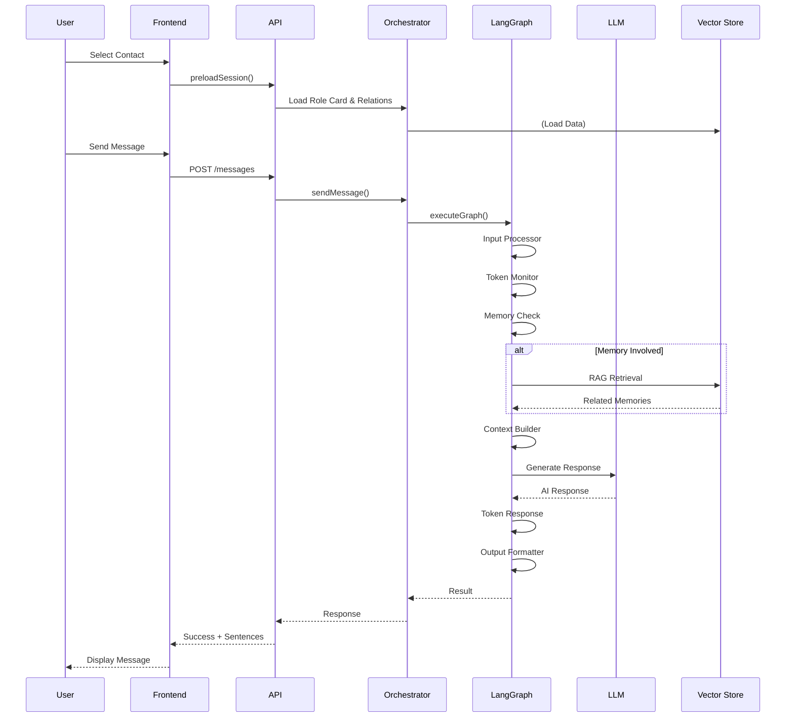
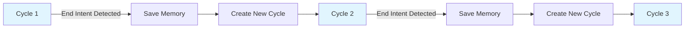

# Chat System Overview

## Architecture Level

The Chat System is the core conversational AI module of AFS System, built using **LangGraph** for orchestrating a complex multi-node conversation pipeline. It provides intelligent, context-aware conversations between users and AI role-playing characters.

### System Architecture

```mermaid
graph TB
    subgraph "Frontend Layer"
        A[Chat Page] --> B[useChat Hook]
        B --> C[ChatPanel Component]
        B --> D[UserList Component]
    end

    subgraph "API Layer"
        E[Chat Controller] --> F[/api/chat/*]
    end

    subgraph "Orchestration Layer"
        G[ChatGraphOrchestrator]
        G --> H[ConversationState]
    end

    subgraph "LangGraph Pipeline"
        I[Input Processor]
        J[Token Monitor]
        K[Memory Check]
        L[RAG Retriever]
        M[Context Builder]
        N[Response Generator]
        O[Token Response]
        P[Output Formatter]

        I --> J --> K
        K -->|Memory Involved| L
        K -->|No Memory| M
        L --> M
        M --> N --> O --> P
    end

    subgraph "Core Services"
        Q[LLM Client]
        R[Vector Store]
        S[Memory Store]
        T[Dual Storage]
        U[Prompt Assembler]
    end

    C --> F
    D --> F
    F --> E
    E --> G
    G --> I
    N --> Q
    L --> R
    L --> S
    G --> T
    G --> U
```

### Conversation Flow



### Conversation Cycles

The system implements **Conversation Cycles** for better memory management:



Each cycle represents an independent conversation context. When an end intent is detected:
1. Conversation memory is saved to vector store
2. Current cycle is marked as ended
3. A new cycle begins with fresh context

## Function Level

### Core Components

| Component | File | Responsibility |
|-----------|------|-----------------|
| **ChatGraphOrchestrator** | `orchestrator.js` | Manages LangGraph execution, session lifecycle, memory operations |
| **ChatController** | `controller.js` | HTTP request handling, API endpoints |
| **ConversationState** | `state/ConversationState.js` | Immutable state object for LangGraph nodes |
| **ChatSession Model** | `model.js` | MongoDB schema for session persistence |

### LangGraph Nodes

| Node | File | Function |
|------|------|----------|
| **input_processor** | `nodes/inputProcessor.js` | Process user input, detect end intent using LLM |
| **token_monitor** | `nodes/tokenMonitor.js` | Calculate token usage, check context limits |
| **memory_check** | `nodes/memoryCheck.js` | LLM semantic analysis for memory retrieval |
| **rag_retriever** | `nodes/ragRetriever.js` | Vector search for relevant memories |
| **context_builder** | `nodes/contextBuilder.js` | Assemble system prompt, memories, messages |
| **response_generator** | `nodes/responseGenerator.js` | Generate AI response using LLM |
| **token_response** | `nodes/tokenResponse.js` | Handle token limit warnings/termination |
| **output_formatter** | `nodes/outputFormatter.js` | Format response for frontend |

### Key Services

| Service | Location | Purpose |
|---------|----------|---------|
| **LLM Client** | `core/llm/client.js` | Unified interface for Ollama/DeepSeek |
| **Vector Store** | `core/storage/vector.js` | ChromaDB vector operations |
| **Memory Store** | `modules/memory/` | Bidirectional memory storage |
| **Dual Storage** | `core/storage/dual.js` | Role card and relation layer loading |
| **Prompt Assembler** | `modules/rolecard/v2/` | Dynamic role card assembly |

## Code Level

### ChatGraphOrchestrator Class

Located in `server/src/modules/chat/orchestrator.js`

```javascript
class ChatGraphOrchestrator {
  constructor() {
    this.nodes = {
      input_processor: inputProcessorNode,
      token_monitor: tokenMonitorNode,
      memory_check: memoryCheckNode,
      rag_retriever: ragRetrieverNode,
      context_builder: contextBuilderNode,
      response_generator: responseGeneratorNode,
      token_response: tokenResponseNode,
      output_formatter: outputFormatterNode
    };
    this.activeSessions = new Map();
    this.dualStorage = new DualStorage();
    this.promptAssembler = new PromptAssembler();
    this.memoryStore = new MemoryStore();
    this.memoryExtractor = new MemoryExtractor();
  }
}
```

### Key Methods

#### `preloadSession(options)`
Preloads role card and complex relation layers when user clicks a contact:

```javascript
async preloadSession(options) {
  const { targetUserId, interlocutorUserId } = options;

  // 1. Find or create session
  let session = await ChatSession.findOne({
    targetUserId,
    interlocutorUserId,
    isActive: true
  });

  // 2. Check assist relation
  const assistRelation = await AssistRelation.findOne({
    assistantId: interlocutorUserId,
    targetId: targetUserId,
    isActive: true
  });

  // 3. Load role card core layer
  const roleCardV2 = await this.dualStorage.loadRoleCardV2(targetUserId);

  // 4. Load complex relation layer (if not stranger)
  let complexRelationLayer = null;
  if (assistRelation && relationType !== 'stranger') {
    const relationLayers = await this.dualStorage.loadAllRelationLayers(targetUserId);
    // Find matching relation layer...
  }

  // 5. Build system prompt
  const assembleResult = this.promptAssembler.assemble({
    coreLayer: roleCardV2.coreLayer,
    relationLayers: relationLayers,
    guardrails: roleCardV2.safetyGuardrails,
    dynamicData: dynamicData,
    calibration: roleCardV2.calibration
  });

  // 6. Create or update session
  // 7. Cache state in memory
}
```

#### `sendMessage(sessionId, message)`
Processes user message through LangGraph:

```javascript
async sendMessage(sessionId, message) {
  // Get or restore session data
  let sessionData = this.activeSessions.get(sessionId);
  if (!sessionData) {
    // Restore from database...
  }

  const { state } = sessionData;
  state.currentInput = message;

  // Execute LangGraph
  const result = await this.executeGraph(state);

  // Check for LLM generation failure
  if (result.success === false) {
    return { success: false, error: result.error };
  }

  // Split AI response into sentences
  const sentences = aiResponse.split(/([。！？])/).filter(s => s.trim());

  // Save to current cycle
  await ChatSession.findOneAndUpdate(
    { sessionId, 'cycles.cycleId': currentCycleId },
    {
      $push: { 'cycles.$.messages': messagesToSave },
      lastMessageAt: new Date()
    }
  );

  // Check for end intent and start new cycle if needed
  if (state.metadata?.shouldEndSession) {
    await this.saveConversationMemory(sessionId, state);
    await this.startNewCycle(sessionId, sessionData);
  }

  return {
    success: true,
    message: aiResponse,
    sentences: combinedSentences,
    shouldEndSession: state.metadata?.shouldEndSession || false,
    cycleEnded,
    currentCycleId: sessionData.session.currentCycleId
  };
}
```

#### `executeGraph(state)`
Main LangGraph execution loop:

```javascript
async executeGraph(state) {
  let currentNode = 'input_processor';
  const executionHistory = [];

  while (currentNode && currentNode !== 'output_formatter') {
    const nodeFunction = this.nodes[currentNode];
    await nodeFunction(state);

    executionHistory.push({
      node: currentNode,
      timestamp: new Date(),
      duration: nodeDuration
    });

    currentNode = this.getNextNode(currentNode, state);
  }

  // Execute final output formatter
  return await this.nodes['output_formatter'](state);
}
```

### LLM Client

Located in `server/src/core/llm/client.js`

```javascript
class LLMClient {
  constructor(model = DEFAULT_MODEL, options = {}) {
    this.backend = options.backend || LLM_BACKEND; // 'ollama' | 'deepseek'
    this.model = model;
    this.temperature = options.temperature ?? 0.7;
    this.maxRetries = options.maxRetries || 3;
    this.timeout = options.timeout || 60000;

    if (this.backend === 'deepseek') {
      this.llm = new ChatOpenAI({
        model: this.model,
        configuration: {
          baseURL: DEEPSEEK_BASE_URL,
          apiKey: DEEPSEEK_API_KEY
        }
      });
    } else {
      this.llm = new ChatOllama({
        model: this.model,
        baseUrl: OLLAMA_BASE_URL
      });
    }
  }

  async generate(prompt, options = {}) {
    const response = await this.llm.invoke(prompt, {
      temperature: options.temperature,
      maxTokens: options.maxTokens
    });
    return response.content;
  }
}
```

### Conversation Cycles Data Structure

In `server/src/modules/chat/model.js`:

```javascript
cycles: [{
  cycleId: {
    type: String,
    required: true
  },
  startedAt: { type: Date, default: Date.now },
  endedAt: Date,
  messages: [{
    role: { type: String, enum: ['user', 'assistant', 'system'] },
    content: String,
    timestamp: Date,
    metadata: {
      ragUsed: Boolean,
      retrievedMemories: [mongoose.Schema.Types.Mixed],
      modelUsed: String
    }
  }]
}],

currentCycleId: {
  type: String,
  default: null
}
```

### Edge Definitions

In `server/src/modules/chat/edges/edges.js`:

```javascript
export const edges = {
  'input_processor': 'token_monitor',
  'token_monitor': 'memory_check',
  'rag_retriever': 'context_builder',
  'context_builder': 'response_generator',
  'response_generator': 'token_response',
  'token_response': 'output_formatter'
};

export const conditionalEdges = {
  'memory_check': routeByMemoryCheck
};

export function routeByMemoryCheck(state) {
  if (state.metadata?.involvesMemory) {
    return 'rag_retriever';
  }
  return 'context_builder';
}
```
