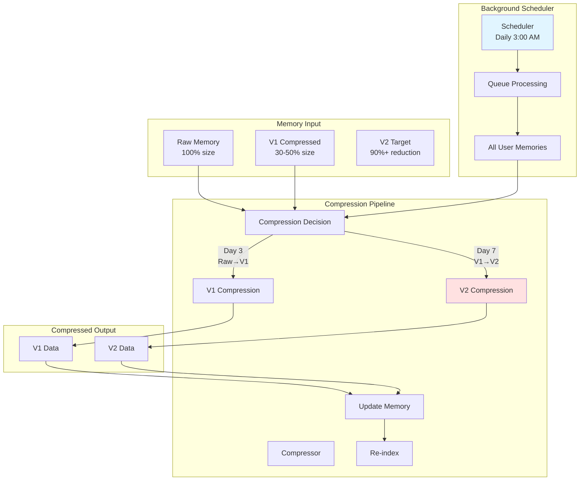
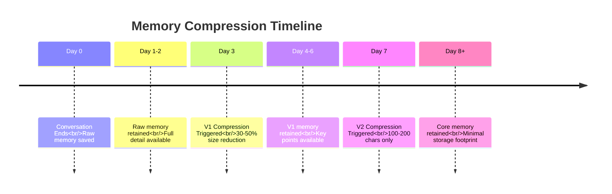
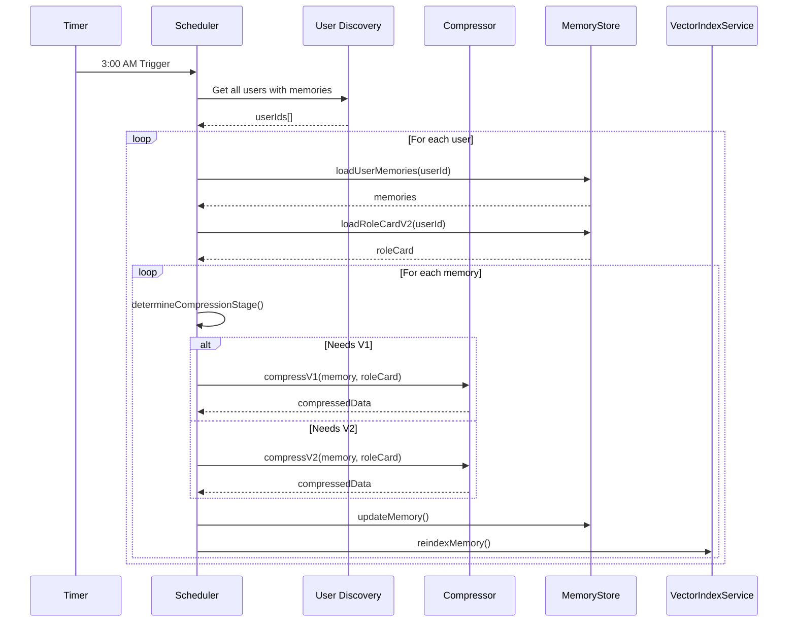

# Memory Compression

Memory compression progressively reduces memory storage requirements while preserving essential information through personality-driven summarization. The system uses a two-stage compression process that runs automatically on a schedule.

## Architecture



## Compression Stages

### Stage Timeline



### Compression Comparison

| Aspect | Raw | V1 (Day 3) | V2 (Day 7) |
|--------|-----|------------|------------|
| **Size** | 100% | 30-50% | 5-10% |
| **Content** | Full conversation | Summary + key points | Core memory only |
| **Length** | Variable | ~500-1000 chars | 100-200 chars |
| **Facts** | All details | Key facts | Core facts only |
| **Emotions** | Full journey | Highlights | Residue only |
| **Searchability** | Full text | Compressed text | Core text |

## Compressor Class

**Location**: `server/src/modules/memory/Compressor.js`

### Initialization

```javascript
// From Compressor.js:22-32
constructor() {
  // 使用统一的LLM配置
  this.llmClient = createDefaultLLMClient();
  this.compressionTemperature = 0.3;
  memoryLogger.info('Compressor initialized', {
    model: this.llmClient.getModelInfo().model,
    backend: this.llmClient.getModelInfo().backend,
    temperature: this.compressionTemperature
  });
}
```

### Compression Decision

```javascript
// From Compressor.js:257-287
determineCompressionStage(memory) {
  const createdAt = new Date(memory.meta?.createdAt);
  const daysOld = this.getDaysSinceCreation(createdAt);
  const currentStage = memory.meta?.compressionStage || 'raw';

  // V1 compression: Day 3, still at raw stage
  if (currentStage === 'raw' && daysOld >= 3 && !memory.meta?.compressedAt) {
    return {
      needsCompression: true,
      targetStage: 'v1',
      reason: `Memory is ${daysOld} days old, ready for V1 compression`
    };
  }

  // V2 compression: Day 7, already at V1 stage
  if (currentStage === 'v1' && daysOld >= 7) {
    return {
      needsCompression: true,
      targetStage: 'v2',
      reason: `Memory is ${daysOld} days old, ready for V2 compression`
    };
  }

  return null;
}
```

## V1 Compression

### Overview

V1 compression removes redundancy while preserving key information points. It occurs on Day 3 for memories still at the "raw" stage.

### compressV1() Method

```javascript
// From Compressor.js:66-142
async compressV1(memory, roleCard) {
  const memoryId = memory.memoryId;

  // Format inputs
  const personalityText = this.formatPersonality(roleCard);
  const memoryContent = this.formatMemoryForPrompt(memory);

  // Check if content is too short to compress
  if (memoryContent.length < 100) {
    return {
      skipped: true,
      reason: 'Memory too short',
      originalLength: memoryContent.length
    };
  }

  // Build prompt
  const prompt = buildCompressV1Prompt({
    roleCardPersonality: personalityText,
    memoryContent
  });

  // Call LLM
  const response = await this.llmClient.generate(prompt, {
    temperature: 0.3,
    maxTokens: 2000
  });

  // Parse response
  const compressedData = this.parseResponse(response);

  return {
    compressedContent: compressedData.compressedContent,
    compressionRatio: compressedData.compressionRatio || 0.5,
    keyPoints: compressedData.keyPoints || [],
    emotionalHighlights: compressedData.emotionalHighlights || [],
    personalityAdjustment: compressedData.personalityAdjustment || {},
    originalLength: compressedData.originalLength || memoryContent.length,
    compressedLength: compressedData.compressedLength || compressedData.compressedContent?.length || 0,
    compressionStage: 'v1',
    compressedAt: new Date().toISOString()
  };
}
```

### V1 Prompt Structure

**Location**: `server/src/modules/memory/prompts/compressV1.js`

```javascript
# ROLE
你是一位专业的记忆压缩专家，擅长将详细的对话记录精炼为简洁但信息丰富的摘要。

# CONTEXT
## 角色卡人格特质
{roleCardPersonality}

## 原始记忆内容
{memoryContent}

# TASK
将上述对话记忆压缩为简洁版本，要求：
1. 保留核心信息和关键事实
2. 去除冗余和重复内容
3. 基于人格特质判断哪些信息最重要
4. 目标长度为原内容的30-50%

# OUTPUT FORMAT
{
  "compressedContent": "压缩后的内容（200-500字）",
  "compressionRatio": 0.4,
  "keyPoints": ["关键点1", "关键点2", "关键点3"],
  "emotionalHighlights": ["情感高光1", "情感高光2"],
  "personalityAdjustment": {
    "emphasized": ["基于人格强调的内容"],
    "deemphasized": ["基于人格弱化的内容"]
  },
  "originalLength": 1000,
  "compressedLength": 400
}
```

### V1 Output Schema

```javascript
{
  compressedContent: "Compressed summary of conversation...",
  compressionRatio: 0.45,        // Target: 0.3-0.5
  keyPoints: [
    "Main point discussed",
    "Important fact remembered",
    "Decision made"
  ],
  emotionalHighlights: [
    "Joyful moment when...",
    "Concern expressed about..."
  ],
  personalityAdjustment: {
    emphasized: ["Topics aligned with values"],
    deemphasized": ["Less relevant details"]
  },
  originalLength: 1200,
  compressedLength: 540,
  compressionStage: "v1",
  compressedAt: "2025-01-18T03:00:00.000Z"
}
```

## V2 Compression

### Overview

V2 compression creates ultra-compact core memories of 100-200 characters. It occurs on Day 7 for memories at the "v1" stage.

### compressV2() Method

```javascript
// From Compressor.js:151-250
async compressV2(memory, roleCard) {
  const memoryId = memory.memoryId;

  // Format inputs
  const personalityText = this.formatPersonality(roleCard);

  // Use V1 compressed content if available
  let compressedMemory = '';
  if (memory.compression?.v1?.compressedContent) {
    compressedMemory = memory.compression.v1.compressedContent;
  } else if (memory.content?.processed) {
    compressedMemory = this.formatProcessedContent(memory.content.processed);
  } else if (memory.content?.raw) {
    compressedMemory = memory.content.raw;
  }

  // Build prompt
  const prompt = buildCompressV2Prompt({
    roleCardPersonality: personalityText,
    compressedMemory
  });

  // Call LLM
  const response = await this.llmClient.generate(prompt, {
    temperature: 0.3,
    maxTokens: 2000
  });

  // Parse response
  const compressedData = this.parseResponse(response);

  return {
    coreMemory: compressedData.coreMemory || '',
    coreMemoryPoints: compressedData.coreMemoryPoints || [],
    memoryTraces: compressedData.memoryTraces || {
      clear: [],
      fuzzy: [],
      vague: []
    },
    forgotten: compressedData.forgotten || {
      details: [],
      reason: ''
    },
    emotionalResidue: compressedData.emotionalResidue || {
      dominantEmotion: '',
      intensity: 0,
      summary: ''
    },
    personalityNotes: compressedData.personalityNotes || '',
    compressionStage: 'v2',
    compressedAt: new Date().toISOString()
  };
}
```

### V2 Prompt Structure

**Location**: `server/src/modules/memory/prompts/compressV2.js`

```javascript
# ROLE
你是一位专业的长期记忆管理专家，擅长从压缩的记忆中提取最核心的精华。

# CONTEXT
## 角色卡人格特质
{roleCardPersonality}

## 已压缩的记忆内容
{compressedMemory}

# TASK
将上述记忆进一步压缩为核心记忆，要求：
1. 提取最核心的信息（100-200字）
2. 基于人格特质判断最重要的记忆点
3. 分类记忆痕迹清晰度
4. 记录情感残留

# OUTPUT FORMAT
{
  "coreMemory": "最核心的记忆（100-200字）",
  "coreMemoryPoints": ["核心点1", "核心点2"],
  "memoryTraces": {
    "clear": ["清晰记忆"],
    "fuzzy": ["模糊记忆"],
    "vague": ["模糊印象"]
  },
  "forgotten": {
    "details": ["被遗忘的细节"],
    "reason": "遗忘原因"
  },
  "emotionalResidue": {
    "dominantEmotion": "主要情感",
    "intensity": 0.7,
    "summary": "情感残留描述"
  },
  "personalityNotes": "基于人格的备注"
}
```

### V2 Output Schema

```javascript
{
  coreMemory: "Discussed health improvement plans with daughter, agreed on daily walks.",
  coreMemoryPoints: [
    "Health topic discussed",
    "Action plan agreed",
    "Family support received"
  ],
  memoryTraces: {
    clear: ["Specific exercise plan", "Start date agreed"],
    fuzzy: ["Other health topics mentioned"],
    vague: ["Casual conversation details"]
  },
  forgotten: {
    details: ["Exact time of conversation", "Minor side topics"],
    reason: "Less relevant to daily life"
  },
  emotionalResidue: {
    dominantEmotion: "hopeful",
    intensity: 0.8,
    summary: "Felt encouraged about health journey"
  },
  personalityNotes: "Aligns with value of family support for health goals",
  compressionStage: "v2",
  compressedAt: "2025-01-22T03:00:00.000Z"
}
```

## Scheduler Class

**Location**: `server/src/modules/memory/Scheduler.js`

### Daily Execution



### Scheduler Methods

#### start()

```javascript
// From Scheduler.js:46-88
start() {
  if (this.isRunning) return;

  this.isRunning = true;

  // Calculate time until next 3:00 AM
  const now = new Date();
  const nextRun = new Date(
    now.getFullYear(),
    now.getMonth(),
    now.getDate(),
    this.dailyRunHour,  // 3
    0,
    0,
    0
  );

  // If already past 3:00 AM today, schedule for tomorrow
  if (nextRun <= now) {
    nextRun.setDate(nextRun.getDate() + 1);
  }

  const delayMs = nextRun.getTime() - now.getTime();
  this.nextRunTime = nextRun.toISOString();

  // Schedule first run
  this.timerId = setTimeout(() => {
    this.runDailyTask();
    // Then schedule every 24 hours
    this.timerId = setInterval(() => {
      this.runDailyTask();
    }, 24 * 60 * 60 * 1000);
  }, delayMs);
}
```

#### processUserMemories()

```javascript
// From Scheduler.js:221-345
async processUserMemories(userId) {
  const result = {
    compressed: 0,
    v1Count: 0,
    v2Count: 0,
    skipped: 0,
    errors: []
  };

  // Load user's role card for personality-driven compression
  const roleCard = await this.dualStorage.loadRoleCardV2(userId);

  // Load all memories for this user
  const allMemories = await this.memoryStore.loadUserMemories(userId);

  // Process each conversation partner's memories
  for (const [partnerId, memories] of Object.entries(allMemories)) {
    for (const memory of memories) {
      // Check if memory needs compression
      const compressionInfo = this.compressor.determineCompressionStage(memory);

      if (!compressionInfo || !compressionInfo.needsCompression) {
        continue;
      }

      // Perform compression
      const compressedData = await this.compressor.compress(
        memory,
        compressionInfo.targetStage,
        roleCard
      );

      // Build updates based on compression stage
      const updates = this.buildMemoryUpdates(compressedData, compressionInfo.targetStage);

      // Update memory file with compressed data
      await this.memoryStore.updateMemory(filePath, updates);

      // Update compression stage
      await this.memoryStore.updateCompressionStage(filePath, compressionInfo.targetStage);

      // Re-index in vector store
      await this.reindexMemory(userId, updatedMemory);

      result.compressed++;
      if (compressionInfo.targetStage === 'v1') result.v1Count++;
      else if (compressionInfo.targetStage === 'v2') result.v2Count++;
    }
  }

  return result;
}
```

#### buildMemoryUpdates()

```javascript
// From Scheduler.js:353-388
buildMemoryUpdates(compressedData, stage) {
  if (stage === 'v1') {
    return {
      compression: {
        v1: {
          compressedContent: compressedData.compressedContent,
          compressionRatio: compressedData.compressionRatio,
          keyPoints: compressedData.keyPoints,
          emotionalHighlights: compressedData.emotionalHighlights,
          personalityAdjustment: compressedData.personalityAdjustment,
          compressedAt: compressedData.compressedAt
        },
        currentStage: 'v1'
      }
    };
  }

  if (stage === 'v2') {
    return {
      compression: {
        v2: {
          coreMemory: compressedData.coreMemory,
          coreMemoryPoints: compressedData.coreMemoryPoints,
          memoryTraces: compressedData.memoryTraces,
          forgotten: compressedData.forgotten,
          emotionalResidue: compressedData.emotionalResidue,
          personalityNotes: compressedData.personalityNotes,
          compressedAt: compressedData.compressedAt
        },
        currentStage: 'v2'
      }
    };
  }

  return {};
}
```

### Re-indexing After Compression

```javascript
// From Scheduler.js:395-437
async reindexMemory(userId, memory) {
  // Build searchable text from compressed content
  let searchText = '';

  if (memory.compression?.v2?.coreMemory) {
    searchText = memory.compression.v2.coreMemory;
  } else if (memory.compression?.v1?.compressedContent) {
    searchText = memory.compression.v1.compressedContent;
  } else if (memory.content?.processed?.summary) {
    searchText = memory.content.processed.summary;
  }

  // Update in vector store
  await this.vectorService.updateMemory(userId, memory.memoryId, {
    ...memory,
    searchableText: searchText
  });
}
```

## Memory Content Formatting

### formatMemoryForPrompt()

```javascript
// From Compressor.js:306-371
formatMemoryForPrompt(memory) {
  const parts = [];

  // Add summary if available
  if (memory.content?.processed?.summary) {
    parts.push(`【摘要】${memory.content.processed.summary}`);
  }

  // Add key topics
  if (memory.content?.processed?.keyTopics?.length > 0) {
    parts.push(`【主要话题】${memory.content.processed.keyTopics.join('、')}`);
  }

  // Add facts
  if (memory.content?.processed?.facts?.length > 0) {
    parts.push(`【事实信息】${memory.content.processed.facts.join('；')}`);
  }

  // Add emotional journey
  const journey = memory.content?.processed?.emotionalJourney;
  if (journey) {
    const journeyParts = [];
    if (journey.start) journeyParts.push(`开始: ${journey.start}`);
    if (journey.peak) journeyParts.push(`高潮: ${journey.peak}`);
    if (journey.end) journeyParts.push(`结束: ${journey.end}`);
    if (journeyParts.length > 0) {
      parts.push(`【情感变化】${journeyParts.join(' → ')}`);
    }
  }

  // Add memorable moments
  if (memory.content?.processed?.memorableMoments?.length > 0) {
    const moments = memory.content.processed.memorableMoments
      .map(m => `${m.content}${m.emotionTag ? ` (${m.emotionTag})` : ''}`)
      .join('；');
    parts.push(`【难忘时刻】${moments}`);
  }

  // Add pending topics
  if (memory.pendingTopics?.topics?.length > 0) {
    const topics = memory.pendingTopics.topics
      .map(t => t.topic || t)
      .join('、');
    parts.push(`【待处理话题】${topics}`);
  }

  return parts.join('\n') || '无记忆内容';
}
```

## Compression Statistics

The scheduler tracks compression metrics:

```javascript
{
  usersProcessed: 5,
  totalMemoriesCompressed: 23,
  v1Compressions: 12,      // Raw → V1
  v2Compressions: 11,      // V1 → V2
  errors: [],
  skipped: 3,              // Too short to compress
  durationMs: 45000        // Total processing time
}
```

## Related Documentation

- [Memory Overview](./overview) - System architecture
- [Memory Extraction](./extraction) - Pre-compression processing
- [Storage Implementation](./storage) - File storage details
