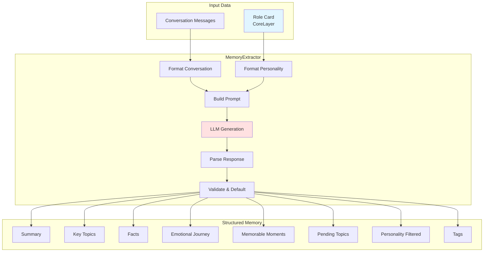

# Memory Extraction

Memory extraction is the process of converting raw conversation messages into structured, personality-filtered memory data using LLM analysis. This enables the system to retain meaningful information while discarding irrelevant content based on the user's personality profile.

## Architecture



## MemoryExtractor Class

**Location**: `server/src/modules/memory/MemoryExtractor.js`

### Initialization

```javascript
// From MemoryExtractor.js:21-30
constructor() {
  // 使用统一的LLM配置
  this.llmClient = createDefaultLLMClient();
  this.extractionTemperature = 0.3;
  memoryLogger.info('MemoryExtractor initialized', {
    model: this.llmClient.getModelInfo().model,
    backend: this.llmClient.getModelInfo().backend,
    temperature: this.extractionTemperature
  });
}
```

### Main Extraction Method

```javascript
// From MemoryExtractor.js:42-116
async extract(options) {
  const {
    roleCard,
    roleCardOwnerName,
    interlocutorName,
    relationType,
    messages
  } = options;

  // If no role card, return simplified raw memory
  if (!roleCard || !roleCard.coreLayer) {
    return this.createRawMemory(messages, { roleCardOwnerName, interlocutorName });
  }

  // Format personality and conversation for the prompt
  const personalityText = this.formatPersonality(roleCard.coreLayer);
  const conversationHistory = this.formatConversation(messages, roleCardOwnerName, interlocutorName);

  // Build the prompt
  const prompt = buildMemoryExtractionPrompt({
    roleCardPersonality: personalityText,
    roleCardOwnerName: roleCardOwnerName || '我',
    interlocutorName: interlocutorName || '对方',
    relationType: relationType || '未知',
    conversationHistory
  });

  // Call LLM with the extraction prompt
  const response = await this.llmClient.generate(prompt, {
    temperature: 0.3,
    maxTokens: 2000
  });

  // Parse response
  const extractedData = this.parseResponse(response);

  return {
    ...extractedData,
    messageCount: messages?.length || 0,
    extractedAt: new Date().toISOString(),
    hasRoleCard: true
  };
}
```

## Personality Formatting

### formatPersonality()

```javascript
// From MemoryExtractor.js:123-173
formatPersonality(coreLayer) {
  if (!coreLayer) {
    return '未提供人格特质信息';
  }

  const sections = [];

  // Add personality description
  if (coreLayer.personality?.summary || coreLayer.personality?.compressed) {
    sections.push(`【性格特质】${coreLayer.personality.summary || coreLayer.personality.compressed}`);
  }

  // Add communication style
  if (coreLayer.communicationStyle?.summary || coreLayer.communicationStyle?.compressed) {
    sections.push(`【沟通风格】${coreLayer.communicationStyle.summary || coreLayer.communicationStyle.compressed}`);
  }

  // Add values
  if (coreLayer.values?.keyPoints?.length > 0) {
    sections.push(`【价值观】${coreLayer.values.keyPoints.join('；')}`);
  }

  // Add interests
  if (coreLayer.interests?.keyPoints?.length > 0) {
    sections.push(`【兴趣爱好】${coreLayer.interests.keyPoints.join('；')}`);
  }

  // Add emotional needs
  if (coreLayer.emotionalNeeds?.keyPoints?.length > 0) {
    sections.push(`【情感需求】${coreLayer.emotionalNeeds.keyPoints.join('；')}`);
  }

  // Add preferences
  if (coreLayer.preferences?.keyPoints?.length > 0) {
    sections.push(`【偏好】${coreLayer.preferences.keyPoints.join('；')}`);
  }

  return sections.length > 0 ? sections.join('\n') : '未提供人格特质信息';
}
```

## Conversation Formatting

```javascript
// From prompts/memoryExtraction.js:170-182
export function formatConversationForPrompt(messages, ownerName = '我', partnerName = '对方') {
  if (!messages || messages.length === 0) {
    return '无对话记录';
  }

  return messages
    .map((msg, index) => {
      const speaker = msg.isOwner ? ownerName : partnerName;
      const timestamp = msg.timestamp ? `[${new Date(msg.timestamp).toLocaleString('zh-CN')}]` : '';
      return `${index + 1}. ${speaker}${timestamp}: ${msg.content}`;
    })
    .join('\n');
}
```

## Extraction Prompt

**Location**: `server/src/modules/memory/prompts/memoryExtraction.js`

### Prompt Structure

```javascript
# ROLE
你是一位专业的对话记忆分析师，擅长从对话中提取关键信息并结构化存储。
你的核心能力是基于角色卡所有者的人格特质来分析对话，确定哪些信息值得记忆。

# CONTEXT
## 任务背景
你正在为一位老年人分析对话记录，帮助他们记住与亲友的重要交流。

## 角色卡所有者信息
**姓名**: {roleCardOwnerName}
**人格特质描述**:
{roleCardPersonality}

# INPUT
## 对话伙伴
**对话对象**: {interlocutorName}
**关系类型**: {relationType}

## 对话记录
{conversationHistory}

# STEPS
1. 理解角色视角
2. 分析对话内容
3. 人格过滤 (Personality Filtering)
4. 提取结构化信息
5. 识别待处理话题

# OUTPUT FORMAT
{
  "summary": "2-3句话的对话摘要",
  "topicSummary": "10字以内的主题词",
  "keyTopics": ["话题1", "话题2"],
  "facts": ["重要事实1", "重要事实2"],
  "emotionalJourney": {
    "start": "对话开始时的情感状态",
    "peak": "对话中的情感高潮",
    "end": "对话结束时的情感状态"
  },
  "memorableMoments": [{
    "content": "难忘时刻的具体内容",
    "importance": 0.9,
    "emotionTag": "开心/感动/担忧",
    "reason": "为什么这个时刻重要"
  }],
  "pendingTopics": [{
    "topic": "待跟进的话题",
    "context": "话题的背景和上下文",
    "suggestedFollowUp": "建议的后续行动或问题",
    "urgency": "high/medium/low"
  }],
  "personalityFiltered": {
    "retentionScore": 0.85,
    "likelyToRecall": ["很可能记住的内容"],
    "likelyToForget": ["可能忘记的内容"],
    "forgetReason": "可能忘记的原因说明"
  },
  "tags": ["标签1", "标签2"],
  "messageCount": 24
}
```

## Response Parsing

### parseResponse()

```javascript
// From MemoryExtractor.js:191-226
parseResponse(response) {
  if (!response) {
    throw new Error('Empty LLM response');
  }

  try {
    let jsonStr = response;

    // Handle thinking tags from deepseek-r1
    const thinkMatch = response.match(/<\/think>\s*([\s\S]*)/);
    if (thinkMatch) {
      jsonStr = thinkMatch[1].trim();
    }

    // Try to find JSON object in the response
    const jsonMatch = jsonStr.match(/\{[\s\S]*\}/);
    if (jsonMatch) {
      jsonStr = jsonMatch[0];
    }

    const parsed = JSON.parse(jsonStr);
    return this.validateAndDefault(parsed);
  } catch (error) {
    // Return default structure on parse error
    return this.getDefaultExtraction();
  }
}
```

### validateAndDefault()

```javascript
// From MemoryExtractor.js:233-276
validateAndDefault(data) {
  const defaults = this.getDefaultExtraction();

  return {
    summary: data.summary || defaults.summary,
    topicSummary: (data.topicSummary || defaults.topicSummary).substring(0, 10),
    keyTopics: Array.isArray(data.keyTopics) ? data.keyTopics : defaults.keyTopics,
    facts: Array.isArray(data.facts) ? data.facts : defaults.facts,
    emotionalJourney: {
      start: data.emotionalJourney?.start || '',
      peak: data.emotionalJourney?.peak || '',
      end: data.emotionalJourney?.end || ''
    },
    memorableMoments: Array.isArray(data.memorableMoments)
      ? data.memorableMoments.map(m => ({
          content: m.content || '',
          importance: typeof m.importance === 'number' ? m.importance : 0.5,
          emotionTag: m.emotionTag || '',
          reason: m.reason || ''
        }))
      : defaults.memorableMoments,
    pendingTopics: Array.isArray(data.pendingTopics)
      ? data.pendingTopics.map(t => ({
          topic: t.topic || '',
          context: t.context || '',
          suggestedFollowUp: t.suggestedFollowUp || '',
          urgency: ['high', 'medium', 'low'].includes(t.urgency) ? t.urgency : 'medium'
        }))
      : defaults.pendingTopics,
    personalityFiltered: {
      retentionScore: typeof data.personalityFiltered?.retentionScore === 'number'
        ? data.personalityFiltered.retentionScore
        : 0.7,
      likelyToRecall: Array.isArray(data.personalityFiltered?.likelyToRecall)
        ? data.personalityFiltered.likelyToRecall
        : [],
      likelyToForget: Array.isArray(data.personalityFiltered?.likelyToForget)
        ? data.personalityFiltered.likelyToForget
        : [],
      forgetReason: data.personalityFiltered?.forgetReason || ''
    },
    tags: Array.isArray(data.tags) ? data.tags : defaults.tags
  };
}
```

## Raw Memory Fallback

When no role card is available, a simplified raw memory is created:

```javascript
// From MemoryExtractor.js:311-348
createRawMemory(messages, participants = {}) {
  const { roleCardOwnerName, interlocutorName } = participants;

  const messageCount = messages?.length || 0;
  const firstMessage = messages?.[0]?.content || '';
  const topicSummary = firstMessage.substring(0, 10) || '对话';

  return {
    summary: `与${interlocutorName || '对方'}的对话，共${messageCount}条消息`,
    topicSummary,
    keyTopics: [],
    facts: [],
    emotionalJourney: {
      start: '',
      peak: '',
      end: ''
    },
    memorableMoments: [],
    pendingTopics: [],
    personalityFiltered: {
      retentionScore: 0.7,
      likelyToRecall: [],
      likelyToForget: [],
      forgetReason: '无角色卡，使用默认保留分值'
    },
    tags: ['pending_processing', 'needs_rolecard'],
    messageCount,
    needsProcessing: true,
    extractedAt: new Date().toISOString(),
    hasRoleCard: false
  };
}
```

## Batch Processing

For users who create a role card after having conversations:

```javascript
// From MemoryExtractor.js:357-519
async processPendingMemories(userId, roleCard, memoryStore) {
  const results = {
    total: 0,
    processed: 0,
    failed: 0,
    skipped: 0,
    details: []
  };

  // Load all memories for user
  const allMemories = await memoryStore.loadUserMemories(userId);

  // Find memories needing processing
  const pendingMemories = [];
  for (const [partnerId, memories] of Object.entries(allMemories)) {
    for (const memory of memories) {
      const needsProcessing = memory.tags?.includes('pending_processing') ||
                               memory.tags?.includes('needs_rolecard') ||
                               memory.needsProcessing === true;

      if (needsProcessing) {
        pendingMemories.push({ partnerId, memory, filePath: memory._filePath });
      }
    }
  }

  // Process each memory with new role card
  for (const { partnerId, memory, filePath } of pendingMemories) {
    // Extract with new role card
    const extractedData = await this.extract({
      roleCard,
      roleCardOwnerName: roleCard?.coreLayer?.basicIdentity?.name || '我',
      interlocutorName: `用户${partnerId}`,
      relationType: memory.meta?.relationType || 'unknown',
      messages: /* parsed from raw content */
    });

    // Update memory file
    await memoryStore.updateMemory(filePath, {
      content: { raw, processed: extractedData },
      pendingTopics: { hasUnfinished: extractedData.pendingTopics.length > 0, topics: extractedData.pendingTopics },
      personalityFiltered: extractedData.personalityFiltered,
      tags: extractedData.tags.filter(t => t !== 'pending_processing' && t !== 'needs_rolecard')
    });

    results.processed++;
  }

  return results;
}
```

## Extraction Output Components

### Summary
- 2-3 sentence conversation summary
- Written from role card owner's perspective

### Topic Summary
- 10-character maximum topic identifier
- Used for file naming

### Key Topics
- Array of main discussion topics
- Used for categorization and search

### Facts
- Specific factual information (dates, events, plans)
- High-value for memory retrieval

### Emotional Journey
- **start**: Initial emotional state
- **peak**: Emotional high point
- **end**: Final emotional state

### Memorable Moments
- Significant conversation moments
- Includes importance score (0.0-1.0)
- Emotion tag for categorization
- Reason for significance

### Pending Topics
- Unfinished conversation topics
- Context and suggested follow-up
- Urgency level (high/medium/low)
- Used for proactive messaging

### Personality Filtered
- **retentionScore**: 0.0-1.0 score based on personality relevance
- **likelyToRecall**: Content types the user will probably remember
- **likelyToForget**: Content types the user might forget
- **forgetReason**: Explanation of why content might be forgotten

### Tags
- Categorization labels
- Used for filtering and organization

## Related Documentation

- [Memory Overview](./overview) - System architecture
- [Memory Compression](./compression) - Post-extraction processing
- [Role Card System](../rolecard/overview) - Personality data source
