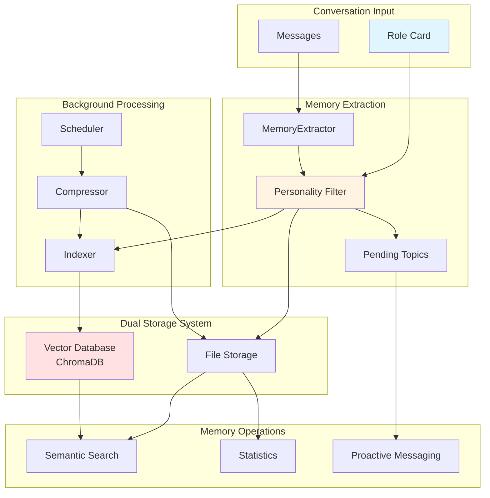
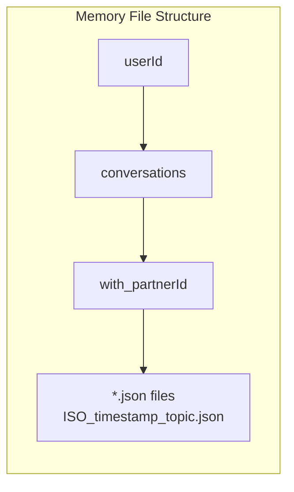
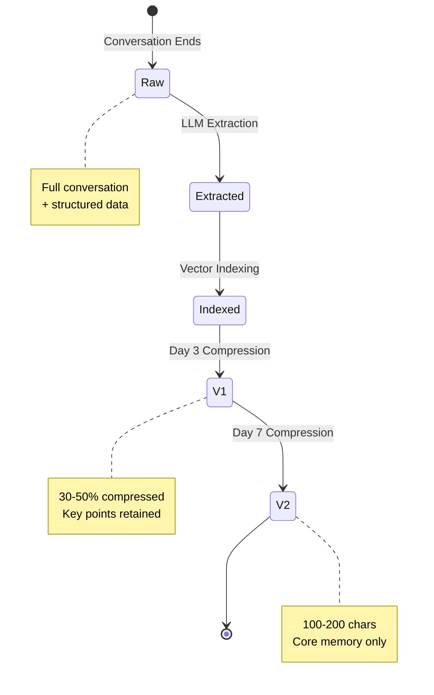

# Memory System Overview

The AFS Memory System provides intelligent conversation memory management with personality-driven filtering, automated compression, and vector-based semantic search. It enables the AI to maintain context-aware, long-term memory of conversations while automatically managing storage efficiency.

## Architecture



## Core Components

| Component | File | Purpose |
|-----------|------|---------|
| **MemoryStore** | `MemoryStore.js` | File-based memory storage and retrieval |
| **MemoryExtractor** | `MemoryExtractor.js` | LLM-driven structured memory extraction |
| **Compressor** | `Compressor.js` | Progressive memory compression (V1, V2) |
| **Indexer** | `Indexer.js` | Real-time vector indexing |
| **Scheduler** | `Scheduler.js` | Daily compression tasks |
| **PendingTopicsManager** | `PendingTopicsManager.js` | Unfinished topic tracking |
| **ProactiveMessagingManager** | `ProactiveMessagingManager.js` | Personality-driven proactive messages |

## Dual Storage Strategy

The memory system uses a dual storage approach:

### 1. File Storage (Primary)
- **Location**: `server/storage/userdata/{userId}/conversations/`
- **Format**: JSON files per conversation
- **Structure**: Organized by conversation partner
- **Purpose**: Complete memory persistence, compression stages

### 2. Vector Database (Secondary)
- **Technology**: ChromaDB
- **Purpose**: Semantic similarity search
- **Content**: Embedded memory summaries and key facts
- **Query**: Natural language memory retrieval



## Memory Lifecycle



## Data Flow

### Memory Creation Flow

1. **Conversation Processing** (`server/src/modules/chat/nodes/inputProcessor.js`)
   - Messages collected from active session
   - Triggered when session ends or message threshold reached

2. **Memory Extraction** (`MemoryExtractor.js`)
   - LLM analyzes conversation with personality context
   - Extracts: summary, facts, emotional journey, pending topics
   - Personality filtering determines retention score

3. **Storage** (`MemoryStore.js:saveMemory()`)
   - File saved to conversations directory
   - Bidirectional storage for both participants
   - Auto-indexing triggered

4. **Vector Indexing** (`Indexer.js`)
   - Background queue processing
   - Embeddings generated via EmbeddingService
   - Stored in ChromaDB user collection

### Compression Flow

1. **Daily Scheduler** (`Scheduler.js`)
   - Runs at 3:00 AM daily
   - Scans all user memories for compression eligibility

2. **V1 Compression** (Day 3, `Compressor.js:compressV1()`)
   - Removes redundancy
   - Merges similar content
   - 30-50% size reduction

3. **V2 Compression** (Day 7, `Compressor.js:compressV2()`)
   - Extracts core memories
   - Generates memory traces (clear/fuzzy/vague)
   - 100-200 character final size

## Memory File Schema

```javascript
{
  "memoryId": "mem_uuid-v4",
  "version": "1.0.0",
  "meta": {
    "createdAt": "2025-01-15T10:30:00.000Z",
    "participants": ["userId1", "userId2"],
    "participantRoles": {
      "userId1": "roleCard",
      "userId2": "family"
    },
    "messageCount": 24,
    "compressionStage": "raw|v1|v2",
    "compressedAt": null
  },
  "content": {
    "raw": "[{\"isOwner\":true,\"content\":\"...\"}]",
    "processed": {
      "summary": "Conversation summary...",
      "topicSummary": "Main topic",
      "keyTopics": ["topic1", "topic2"],
      "facts": ["fact1", "fact2"],
      "emotionalJourney": {
        "start": "initial emotion",
        "peak": "emotional peak",
        "end": "final emotion"
      },
      "memorableMoments": [
        {
          "content": "moment description",
          "importance": 0.9,
          "emotionTag": "joy",
          "reason": "why important"
        }
      ]
    }
  },
  "compression": {
    "v1": {
      "compressedContent": "...",
      "compressionRatio": 0.5,
      "keyPoints": [],
      "compressedAt": "..."
    },
    "v2": {
      "coreMemory": "...",
      "memoryTraces": {
        "clear": [],
        "fuzzy": [],
        "vague": []
      },
      "compressedAt": "..."
    }
  },
  "pendingTopics": {
    "hasUnfinished": true,
    "topics": [
      {
        "id": "topic_uuid",
        "topic": "unfinished topic",
        "context": "background",
        "suggestedFollowUp": "follow-up question",
        "urgency": "high|medium|low"
      }
    ]
  },
  "personalityFiltered": {
    "retentionScore": 0.85,
    "likelyToRecall": ["content types"],
    "likelyToForget": ["content types"],
    "forgetReason": "explanation"
  },
  "vectorIndex": {
    "indexed": true,
    "indexedAt": "2025-01-15T10:35:00.000Z",
    "autoIndex": true
  },
  "tags": ["family", "positive", "health"],
  "_filePath": "/full/path/to/memory/file.json"
}
```

## Vector Index Schema

```javascript
{
  "ids": ["mem_uuid"],
  "embeddings": [float[]],  // Generated by EmbeddingService
  "documents": ["searchable text"],
  "metadatas": [{
    "userId": "user123",
    "memoryId": "mem_uuid",
    "source": "conversation",
    "participants": "[\"user1\", \"user2\"]",
    "compressionStage": "raw",
    "category": "family|friend|self",
    "createdAt": "2025-01-15T10:30:00.000Z",
    "tags": "[\"tag1\", \"tag2\"]",
    "helperId": "partnerId"  // For family/friend memories
  }]
}
```

## Key Features

### Personality-Driven Memory

The memory system uses the role card's personality traits to:

1. **Filter Content**: Determine what's worth remembering based on values and interests
2. **Score Retention**: Assign 0.0-1.0 retention scores based on personality relevance
3. **Categorize**: Identify what the user is likely to recall vs. forget
4. **Prioritize**: Weight high-relevance content for compression and retrieval

### Progressive Compression

| Stage | Day | Size Reduction | Content Retention |
|-------|-----|----------------|-------------------|
| Raw | 0 | 100% | Full conversation |
| V1 | 3 | 50-70% | Summary + key points + emotional highlights |
| V2 | 7 | 90%+ | Core memory only (100-200 chars) |

### Semantic Search

Vector-based search enables:

- Natural language queries ("What did we talk about regarding health?")
- Relevance-ranked results
- Filtering by relationship type (family/friend/self)
- Context-aware memory retrieval

### Pending Topics

Track unfinished conversations for proactive follow-up:

- Automatic topic extraction from conversations
- Urgency classification (high/medium/low)
- Suggested follow-up questions
- Expiration after 7 days

## API Endpoints

| Endpoint | Method | Purpose |
|----------|--------|---------|
| `/api/memory/index/status` | GET | Get indexing status |
| `/api/memory/busy` | GET | Check if system is busy |
| `/api/memory/pending-topics` | GET | Get pending topics |
| `/api/memory/pending-topics/v2` | GET | Get v2 pending topics |
| `/api/memory/pending-topics/v2/:topicId` | DELETE | Clear pending topic |
| `/api/memory/index/trigger` | POST | Trigger indexing |
| `/api/memory/stats` | GET | Get memory statistics |
| `/api/memory/proactive/check/:withUserId` | GET | Check proactive timing |
| `/api/memory/proactive/generate/:withUserId` | POST | Generate proactive message |
| `/api/memory/proactive/status/:withUserId` | GET | Get proactive status |

## Environment Variables

```bash
# Embedding Service
EMBEDDING_BACKEND=ollama  # or 'openai'
EMBEDDING_MODEL=bge-m3
OLLAMA_BASE_URL=http://localhost:11434

# ChromaDB
CHROMA_URL=http://localhost:8000

# LLM for extraction/compression
LLM_BACKEND=ollama
LLM_MODEL=qwen2.5:14b
```

## Related Documentation

- [Storage Implementation](./storage) - File storage details
- [Memory Extraction](./extraction) - LLM-driven extraction process
- [Memory Compression](./compression) - Compression algorithms
- [Role Card System](../rolecard/overview) - Personality data source
