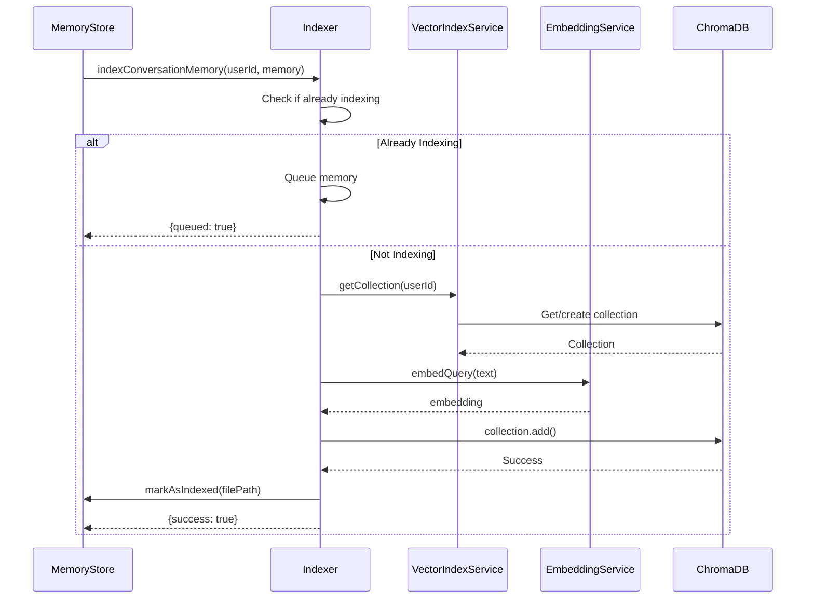

# Memory Storage Implementation

The memory storage system implements a dual-strategy approach combining file-based persistence with vector database indexing for efficient memory management and retrieval.

## Architecture

```mermaid
flowchart TB
    subgraph "Memory Storage Layer"
        MS[MemoryStore]
        FS[FileStorage]
        DS[DualStorage]
    end

    subgraph "Vector Layer"
        VIS[VectorIndexService]
        EMB[EmbeddingService]
        CHM[ChromaDBService]
    end

    subgraph "File System"
        USER[userdata/]
        UID[userId/]
        CONV[conversations/]
        PARTNER[with_partnerId/]
        FILES["*.json files"]
    end

    subgraph "Vector DB"
        COLL[user_{userId}<br/>Collection]
    end

    MS --> FS
    MS --> VIS
    VIS --> EMB
    VIS --> CHM
    CHM --> COLL
    FS --> USER
    USER --> UID
    UID --> CONV
    CONV --> PARTNER
    PARTNER --> FILES

    style COLL fill:#ffe1e1
    style FILES fill:#e1ffe1
```

## File Storage

### MemoryStore Class

**Location**: `server/src/modules/memory/MemoryStore.js`

The `MemoryStore` class handles all file-based memory operations.

#### Environment Detection

```javascript
// From MemoryStore.js:24-43
constructor() {
  const isDocker = fs.existsSync('/.dockerenv') ||
                   process.env.DOCKER_CONTAINER === 'true' ||
                   process.env.NODE_ENV === 'docker';

  if (isDocker) {
    this.basePath = '/app/storage/userdata';
  } else {
    const cwd = process.cwd();
    if (cwd.endsWith('server') || cwd.includes('server/') || cwd.includes('server\\')) {
      this.basePath = path.join(cwd, 'storage', 'userdata');
    } else {
      this.basePath = path.join(cwd, 'server', 'storage', 'userdata');
    }
  }
}
```

#### Directory Structure

```
storage/userdata/
├── userId/
│   ├── conversations/
│   │   ├── with_partnerId1/
│   │   │   ├── 2025-01-15T10-30-00_topic1.json
│   │   │   ├── 2025-01-16T14-20-00_topic2.json
│   │   │   └── ...
│   │   └── with_partnerId2/
│   │       └── ...
│   ├── pending_topics.json
│   ├── rolecard-v2.json
│   └── ...
```

#### Key Methods

##### saveMemory()

```javascript
// From MemoryStore.js:121-184
async saveMemory(userId, withUserId, memoryData, autoIndex = true)
```

Saves a conversation memory to file.

**Parameters**:
- `userId` (string): The user whose memory we're storing
- `withUserId` (string): The conversation partner
- `memoryData` (Object): The memory data to save
- `autoIndex` (boolean): Whether to trigger vector indexing

**Returns**: `{memoryId, filePath, memory}`

**Process**:
1. Creates conversation path directory
2. Generates unique memory ID (`mem_{uuid}`)
3. Generates file name from topic: `{ISO_TIMESTAMP}_{sanitized_topic}.json`
4. Builds complete memory object with metadata
5. Writes JSON file
6. Triggers background indexing if enabled

##### loadUserMemories()

```javascript
// From MemoryStore.js:191-224
async loadUserMemories(userId)
```

Loads all conversation memories for a user.

**Returns**: Object keyed by partner ID with arrays of memories

##### saveBidirectional()

```javascript
// From MemoryStore.js:271-346
async saveBidirectional(options)
```

Saves memory for both conversation participants with personality filtering.

**Parameters**:
- `userAId`, `userBId`: Participant IDs
- `conversationData`: Raw conversation data
- `userAMemory`, `userBMemory`: Processed memories
- `userBHasRoleCard`: Whether partner has role card

**Process**:
1. Creates separate memory objects for each user
2. Applies personality filtering if role card available
3. Saves both memories in parallel

##### updateMemory()

```javascript
// From MemoryStore.js:354-380
async updateMemory(filePath, updates)
```

Updates an existing memory file with deep merge.

##### getMemoryStats()

```javascript
// From MemoryStore.js:524-575
async getMemoryStats(userId)
```

Returns memory statistics:
- Total memories count
- Partner count
- By compression stage (raw/v1/v2)
- Indexed/pending index counts
- Oldest/newest memory timestamps
- Total size in bytes

### FileStorage Class

**Location**: `server/src/core/storage/file.js`

Handles questionnaire-based memory storage (A_set, Bste, Cste structure).

```javascript
// From file.js:93-133
async loadUserMemories(userId) {
  const memories = {
    A_set: [],  // Elder/self memories
    Bste: [],   // Family/helper memories
    Cste: []    // Friend/helper memories
  };

  // Load from categorized folders
  // ...
}
```

## Vector Storage

### VectorIndexService Class

**Location**: `server/src/core/storage/vector.js`

Manages ChromaDB vector indexing and semantic search.

#### Collection Management

```javascript
// From vector.js:66-86
async getCollection(userId) {
  this.validateUserId(userId);
  await this.initialize();

  const collectionName = `user_${userId}`;

  // Check cache first
  if (this.collectionCache.has(collectionName)) {
    return this.collectionCache.get(collectionName);
  }

  // Get or create collection from ChromaDB
  const collection = await this.chromaService.getCollection(collectionName, {
    type: 'user_memory',
    createdBy: 'VectorIndexService'
  });

  this.collectionCache.set(collectionName, collection);
  return collection;
}
```

#### User ID Validation

ChromaDB collection names must:
- Be 3-63 characters
- Start/end with alphanumeric
- Contain only alphanumeric, underscores, or hyphens

```javascript
// From vector.js:46-59
validateUserId(userId) {
  if (!userId || typeof userId !== 'string') {
    throw new Error('Invalid userId: must be a non-empty string');
  }

  const collectionName = `user_${userId}`;
  if (!/^[a-zA-Z0-9][a-zA-Z0-9_-]*$/.test(userId)) {
    throw new Error('Invalid userId: contains invalid characters');
  }
  if (collectionName.length < 3 || collectionName.length > 63) {
    throw new Error('Invalid userId: collection name must be between 3-63 characters');
  }
}
```

#### Search Operation

```javascript
// From vector.js:413-464
async search(userId, query, topK = 5, relationType = null, relationSpecificId = null)
```

Performs semantic similarity search with optional filtering.

**Parameters**:
- `userId`: User ID to search within
- `query`: Natural language search query
- `topK`: Number of results (default: 5)
- `relationType`: Filter by category (self/family/friend)
- `relationSpecificId`: Filter by helper/partner ID

**Returns**: Array of memories with relevance scores

```javascript
// Build where clause for ChromaDB
let where = undefined;
if (relationType && relationSpecificId) {
  where = {
    $and: [
      { category: relationType },
      { helperId: relationSpecificId }
    ]
  };
} else if (relationType) {
  where = { category: relationType };
} else if (relationSpecificId) {
  where = { helperId: relationSpecificId };
}

const results = await collection.query({
  queryEmbeddings: [queryEmbedding],
  nResults: topK,
  where: where
});
```

#### Index Rebuild

```javascript
// From vector.js:106-205
async rebuildIndex(userId, progressCallback)
```

Rebuilds entire vector index for a user.

**Process**:
1. Deletes existing collection
2. Loads all memories from file storage
3. Processes in batches of 50
4. Generates embeddings for each batch
5. Adds to ChromaDB collection
6. Reports progress via callback

### EmbeddingService Class

**Location**: `server/src/core/storage/embedding.js`

Provides embedding generation for vectorization.

```javascript
// From embedding.js:9-37
async initialize() {
  if (this.backend === 'ollama') {
    const { OllamaEmbeddings } = await import('@langchain/ollama');
    this.client = new OllamaEmbeddings({
      baseUrl: process.env.OLLAMA_BASE_URL || 'http://localhost:11434',
      model: process.env.EMBEDDING_MODEL || 'bge-m3'
    });
  } else if (this.backend === 'openai') {
    const { OpenAIEmbeddings } = await import('@langchain/openai');
    this.client = new OpenAIEmbeddings({
      openAIApiKey: process.env.OPENAI_API_KEY,
      modelName: 'text-embedding-3-small'
    });
  }
}
```

**Methods**:
- `embedQuery(text)`: Generate embedding for single text
- `embedDocuments(texts)`: Generate embeddings for batch
- `healthCheck()`: Verify service availability

### ChromaDBService Class

**Location**: `server/src/core/storage/chroma.js`

Direct ChromaDB v2 API client (no npm dependency).

```javascript
// From chroma.js:14-18
constructor() {
  this.baseUrl = process.env.CHROMA_URL || 'http://localhost:8000';
  this.apiBase = `${this.baseUrl}/api/v2/tenants/default_tenant/databases/default_database`;
}
```

**ChromaCollection Wrapper**:

```javascript
// From chroma.js:119-195
class ChromaCollection {
  async add({ ids, embeddings, documents, metadatas }) {
    // Convert memoryIds to valid UUIDs
    const validIds = ids.map(id => this.toValidUUID(id));
    return this.request('/add', {
      method: 'POST',
      body: JSON.stringify({ ids: validIds, embeddings, documents, metadatas })
    });
  }

  async query({ queryEmbeddings, nResults = 10, where }) {
    return this.request('/query', {
      method: 'POST',
      body: JSON.stringify({ query_embeddings: queryEmbeddings, n_results: nResults, where })
    });
  }
}
```

## Indexer Class

**Location**: `server/src/modules/memory/Indexer.js`

Handles real-time memory indexing with queue management.



### Indexing Queue

```javascript
// From Indexer.js:24-25
constructor() {
  this.indexingQueue = new Map(); // userId -> { status, memories, currentMemory }
}
```

### Status Management

```javascript
// From Indexer.js:167-184
getIndexingStatus(userId) {
  const status = this.indexingQueue.get(userId);
  if (!status) {
    return {
      status: 'idle',
      userId,
      queuedCount: 0
    };
  }
  return {
    status: status.status,
    userId,
    currentMemory: status.currentMemory || null,
    queuedCount: status.memories?.length || 0,
    error: status.error || null
  };
}
```

## DualStorage Class

**Location**: `server/src/core/storage/dual.js`

Manages dual storage for role cards, profiles, and assist relations.

### Supported Data Types

| Data Type | File Path | Purpose |
|-----------|-----------|---------|
| Role Card V2 | `userId/rolecard-v2.json` | User personality profile |
| Core Layer | `userId/core-layer.json` | Core personality data |
| Relation Layer | `userId/relation-layers/{relationId}.json` | Relationship-specific data |
| Assist Relations | `userId/assist-relations.json` | Helper relationships |
| Guidelines | `userId/assistants-guidelines.json` | Conversation guidelines |
| Sentiments | `userId/strangerSentiments.json` | Stranger affinity data |

```javascript
// From dual.js:442-458
async saveRoleCardV2(userId, roleCardV2) {
  await this.initialize();

  const userPath = path.join(this.basePath, String(userId));
  await fsPromises.mkdir(userPath, { recursive: true });

  const filePath = path.join(userPath, 'rolecard-v2.json');

  try {
    await fsPromises.writeFile(filePath, JSON.stringify(roleCardV2, null, 2), 'utf-8');
    console.log(`[DualStorage] V2角色卡已保存: ${filePath}`);
    return { success: true, filePath };
  } catch (error) {
    console.error(`[DualStorage] V2角色卡保存失败:`, error);
    throw error;
  }
}
```

## File Management

### Sanitization

```javascript
// From MemoryStore.js:99-111
sanitizeFileName(str) {
  if (!str || typeof str !== 'string') return 'conversation';

  return str
    .replace(/[<>:"/\\|?*\x00-\x1F]/g, '')  // Remove invalid chars
    .replace(/[\s]+/g, '_')                  // Spaces to underscores
    .replace(/_+/g, '_')                     // Remove duplicate underscores
    .replace(/^_|_$/g, '');                  // Remove leading/trailing
}
```

### Memory File Discovery

```javascript
// From MemoryStore.js:231-258
async loadMemoriesFromFolder(folderPath, targetArray) {
  const entries = await fsPromises.readdir(folderPath, { withFileTypes: true });

  for (const entry of entries) {
    const fullPath = path.join(folderPath, entry.name);

    if (entry.isDirectory()) {
      // Recursively load from subdirectories
      await this.loadMemoriesFromFolder(fullPath, targetArray);
    } else if (entry.isFile() && entry.name.endsWith('.json')) {
      const content = await fsPromises.readFile(fullPath, 'utf-8');
      const memory = JSON.parse(content);
      memory._filePath = fullPath;
      targetArray.push(memory);
    }
  }
}
```

## Related Documentation

- [Memory Overview](./overview) - System architecture
- [Memory Extraction](./extraction) - How memories are created
- [Memory Compression](./compression) - How memories are compressed
