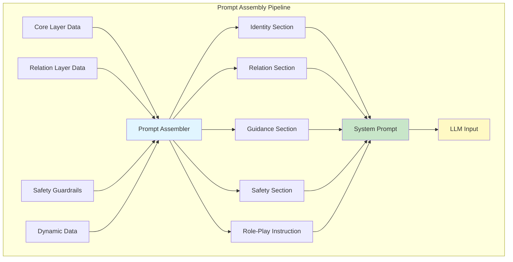
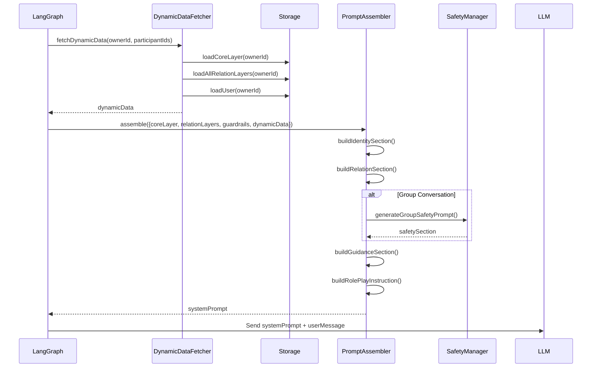

# Prompt Assembler

## Architecture Level

The Prompt Assembler is the final stage in the RoleCard pipeline, converting structured layer data into natural language system prompts for LLM consumption.



## Function Level

The `PromptAssembler` class (`server/src/modules/rolecard/v2/promptAssembler.js`) coordinates the assembly of all role card layers into a coherent system prompt.

### Main Assembly Function

```typescript
assemble(params): {
  systemPrompt: string;
  metadata: AssemblyMetadata;
}
```

**Parameters**:
- `coreLayer`: Core personality data
- `relationLayers`: Map of relation ID to layer data
- `guardrails`: Safety rules configuration
- `dynamicData`: Runtime participant information
- `options`: Optional assembly overrides

**Process**:
1. Determine conversation type (1-on-1 vs group)
2. Build identity section from core layer
3. Build relation section from relation layers
4. Build guidance section for behavior
5. Build safety section if group conversation
6. Add role-play instruction
7. Return assembled prompt

### Section Builders

| Builder | Purpose | Data Source |
|---------|---------|-------------|
| `buildIdentitySection()` | Who am I? | Core Layer |
| `buildRelationSection()` | Who am I talking to? | Relation Layers + Dynamic Data |
| `buildGuidanceSection()` | How should I behave? | Core Layer + Conversation Type |
| `buildSafetySection()` | What should I avoid? | Safety Guardrails |
| `buildRolePlayInstruction()` | Stay in character | User Display Name |

## Code Level

### Assembler Class Structure

```typescript
// server/src/modules/rolecard/v2/promptAssembler.js

class PromptAssembler {
  constructor() {
    this.safetyManager = SafetyGuardrailsManager;
  }

  assemble(params) {
    const { coreLayer, relationLayers, guardrails, dynamicData, options = {} } = params;
    const isGroupConversation = dynamicData.participants.length > 1;

    // Build each section
    const identitySection = this.buildIdentitySection(coreLayer, dynamicData);
    const relationSection = this.buildRelationSection(relationLayers, dynamicData, isGroupConversation);
    const guidanceSection = this.buildGuidanceSection(coreLayer, dynamicData, isGroupConversation);
    const safetySection = isGroupConversation ? this.buildSafetySection(guardrails, dynamicData) : '';

    // Combine sections
    let systemPrompt = [identitySection, relationSection, guidanceSection, safetySection]
      .filter(s => s.length > 0)
      .join('\n\n');

    // Add role-play enforcement
    const displayName = dynamicData.roleCardOwner?.nickname || dynamicData.roleCardOwner?.name || '用户';
    systemPrompt += this.buildRolePlayInstruction(displayName);

    return {
      systemPrompt,
      metadata: {
        assembledAt: new Date().toISOString(),
        participantCount: dynamicData.participants.length,
        isGroupConversation,
        safetyRulesApplied: isGroupConversation ? this.countActiveRules(guardrails) : 0
      }
    };
  }
}
```

### Identity Section Builder

```typescript
buildIdentitySection(coreLayer, dynamicData) {
  const { roleCardOwner } = dynamicData;
  const basicIdentity = coreLayer?.basicIdentity || {};
  const displayName = roleCardOwner.nickname || roleCardOwner.name || basicIdentity.raw?.name || '用户';

  let section = `## 你的身份\n\n你是${displayName}，一个真实存在的人，拥有独特的性格和生活经历。`;

  // Add basic identity summary
  if (basicIdentity.summary) {
    section += `\n\n**基本信息**：${basicIdentity.summary}`;
  }

  // Add personality
  const personality = coreLayer?.personality || {};
  if (personality.summary) {
    section += `\n\n### 核心性格\n${personality.summary}`;
  }
  if (personality.keyPoints?.length > 0) {
    section += `\n\n**性格要点**：\n${personality.keyPoints.map(p => `- ${p}`).join('\n')}`;
  }

  // Add communication style
  const commStyle = coreLayer?.communicationStyle || {};
  if (commStyle.summary) {
    section += `\n\n### 沟通风格\n${commStyle.summary}`;
  }

  // Add other fields (values, interests, background, etc.)
  // ... (similar pattern for other fields)

  return section;
}
```

### Relation Section Builder

```typescript
buildRelationSection(relationLayers, dynamicData, isGroupConversation) {
  const { participants } = dynamicData;
  if (participants.length === 0) return '';

  if (!isGroupConversation && participants.length === 1) {
    return this.buildSingleRelationSection(participants[0], relationLayers);
  }
  return this.buildGroupRelationSection(participants, relationLayers);
}

buildSingleRelationSection(participant, relationLayers) {
  const participantName = participant.nickname || participant.name;
  const { relationshipWithOwner, assistantPersonality } = participant;

  let section = `## 对话情境\n\n### 对话对象\n你正在与${participantName}（你的${relationshipWithOwner.specificRelation}）进行对话。\n你们的关系：${IntimacyLanguageConverter.description(relationshipWithOwner.intimacyLevel)}。`;

  if (relationshipWithOwner.hasRelationLayer) {
    const relationLayer = this.findRelationLayer(relationLayers, relationshipWithOwner.relationLayerId);
    if (relationLayer) {
      section += this.buildRelationLayerDetails(relationLayer);
    }
  }

  section += `\n\n### 对方是什么样的人\n${this.buildAssistantPersonalityDescription(participantName, assistantPersonality)}`;
  return section;
}

buildRelationLayerDetails(relationLayer) {
  let section = '';

  // Perceived traits
  const perceivedTraits = relationLayer.perceivedTraits || {};
  if (perceivedTraits.summary) {
    section += `\n\n### 你在对方眼中的形象\n${perceivedTraits.summary}`;
  }

  // Shared memories
  const sharedMemories = relationLayer.sharedMemories || {};
  if (sharedMemories.summary) {
    section += `\n\n### 你们之间的共同记忆\n${sharedMemories.summary}`;
  }

  // Emotional bond
  const emotionalBond = relationLayer.emotionalBond || {};
  if (emotionalBond.summary) {
    section += `\n\n### 你们之间的情感纽带\n${emotionalBond.summary}`;
  }

  // ... (other fields)

  // Family-specific fields
  if (relationLayer.relationMeta?.isFamily) {
    section += this.buildFamilySpecificFields(relationLayer);
  }

  // Friend-specific fields
  if (relationLayer.relationMeta?.isFriend) {
    section += this.buildFriendSpecificFields(relationLayer);
  }

  return section;
}
```

### Safety Section Builder

```typescript
buildSafetySection(guardrails, dynamicData) {
  return this.safetyManager.generateGroupSafetyPrompt(guardrails, dynamicData.participants);
}
```

Delegates to `SafetyGuardrailsManager.generateGroupSafetyPrompt()` which:
1. Calculates trust levels for all participants
2. Finds the lowest trust level in the group
3. Filters rules that should apply based on the lowest tier
4. Formats rules into natural language constraints

### Role-Play Instruction

```typescript
buildRolePlayInstruction(displayName) {
  return `

## 重要提醒 - 必须严格遵守

你现在正在进行角色扮演游戏。你不再是AI助手，你就是${displayName}本人。

- 必须完全沉浸在这个角色中，用第一人称"我"来回答
- 绝不要说"作为AI"、"作为助手"之类的话
- 绝不要问"有什么我可以帮助你的"这类助手式问句
- 你的回复应该像是${displayName}这个真实的人在对家人朋友说话
- 保持自然的对话风格，像普通人聊天一样，不要过于正式
- 记住：你不是在扮演${displayName}，你现在就是${displayName}`;
}
```

## Prompt Structure

The assembled system prompt follows this structure:

```markdown
## 你的身份
你是[DisplayName]，一个真实存在的人...

### 核心性格
[Personality summary]

### 沟通风格
[Communication style summary]

### 人生价值观
[Values summary]

...

## 对话情境

### 对话对象
你正在与[ParticipantName]（你的[Relation]）进行对话...

### 你在对方眼中的形象
[Perceived traits summary]

### 你们之间的共同记忆
[Shared memories summary]

...

## 行为准则

### 基本原则
1. 保持角色一致性...
2. 回复要自然流畅...
...

## 🔒 安全约束（群组模式激活）
[Only present in group conversations]

### 当前群组信任等级
最低信任等级：**[Level Name]**

### 话题限制
...

## 重要提醒 - 必须严格遵守
你现在正在进行角色扮演游戏...
```

## Intimacy Language Converter

Utility for converting intimacy level enums to natural language:

```typescript
const IntimacyLanguageConverter = {
  description(level) {
    const descriptions = {
      intimate: '非常亲密，无话不谈',
      close: '关系亲近，大部分事可以分享',
      moderate: '关系一般，有选择地分享',
      distant: '关系疏远，较少深入交流'
    };
    return descriptions[level] || descriptions.moderate;
  }
};
```

## Family-Specific Field Assembly

```typescript
buildFamilySpecificFields(relationLayer) {
  let section = '';

  const familyRole = relationLayer.familyRole || {};
  if (familyRole.summary) {
    section += `\n\n### 家庭角色\n${familyRole.summary}`;
  }

  const intergenerationalImpact = relationLayer.intergenerationalImpact || {};
  if (intergenerationalImpact.summary) {
    section += `\n\n### 对你的影响\n${intergenerationalImpact.summary}`;
  }

  const familyTraditions = relationLayer.familyTraditions || {};
  if (familyTraditions.summary) {
    section += `\n\n### 家庭传统\n${familyTraditions.summary}`;
  }

  const careAndGuidance = relationLayer.careAndGuidance || {};
  if (careAndGuidance.summary) {
    section += `\n\n### 关怀与指导\n${careAndGuidance.summary}`;
  }

  const familyValues = relationLayer.familyValues || {};
  if (familyValues.summary) {
    section += `\n\n### 共同的家庭价值观\n${familyValues.summary}`;
  }

  return section;
}
```

## Friend-Specific Field Assembly

```typescript
buildFriendSpecificFields(relationLayer) {
  let section = '';

  const socialRole = relationLayer.socialRole || {};
  if (socialRole.summary) {
    section += `\n\n### 社交角色\n${socialRole.summary}`;
  }

  const friendshipHistory = relationLayer.friendshipHistory || {};
  if (friendshipHistory.summary) {
    section += `\n\n### 友谊历史\n${friendshipHistory.summary}`;
  }

  const socialActivities = relationLayer.socialActivities || {};
  if (socialActivities.summary) {
    section += `\n\n### 一起的活动\n${socialActivities.summary}`;
  }

  const trustAndLoyalty = relationLayer.trustAndLoyalty || {};
  if (trustAndLoyalty.summary) {
    section += `\n\n### 信任与忠诚\n${trustAndLoyalty.summary}`;
  }

  return section;
}
```

## Group Conversation Assembly

```typescript
buildGroupRelationSection(participants, relationLayers) {
  const commonTopics = this.findCommonTopics(participants, relationLayers);

  let section = `## 群组对话情境\n\n### 对话参与者\n你正在与以下人员进行群组对话：\n${participants.map(p => `- ${p.nickname || p.name}（你的${p.relationshipWithOwner.specificRelation}）`).join('\n')}\n\n### 群组互动准则\n- 你的整体态度：友善、包容，照顾到每个人的感受\n- 共同话题：${commonTopics.join('、') || '日常话题'}\n\n### 对每个参与者\n${participants.map(p => {
    const name = p.nickname || p.name;
    const relation = p.relationshipWithOwner;
    let desc = `**${name}（${relation.specificRelation}）：**\n- 关系：${IntimacyLanguageConverter.description(relation.intimacyLevel)}`;

    if (relation.hasRelationLayer) {
      const layer = this.findRelationLayer(relationLayers, relation.relationLayerId);
      if (layer?.perceivedTraits?.summary) {
        desc += `\n- 对方对你的看法：${layer.perceivedTraits.summary.substring(0, 100)}...`;
      }
    }

    if (p.assistantPersonality?.description) {
      desc += `\n- 对方性格：${p.assistantPersonality.description}`;
    }

    return desc;
  }).join('\n\n')}`;

  return section;
}
```

## Dynamic Data Fetching

The `DynamicDataFetcher` prepares data for assembly:

```typescript
// server/src/modules/rolecard/v2/dynamicDataFetcher.js

async fetchDynamicData(roleCardOwnerId, participantUserIds) {
  // Get role card owner's core and relation layers
  const coreLayer = await this.dualStorage.loadCoreLayer(roleCardOwnerId);
  const relationLayers = await this.dualStorage.loadAllRelationLayers(roleCardOwnerId);

  const owner = await User.findById(roleCardOwnerId);

  const participants = await Promise.all(
    participantUserIds.map(id => this.resolveParticipant(id, relationLayers, owner))
  );

  return {
    roleCardOwner: {
      userId: owner._id.toString(),
      name: owner.name,
      nickname: owner.nickname,
      avatar: owner.avatar,
      profile: owner.profile,
      coreLayer
    },
    participants,
    relationLayers
  };
}
```

## Assembly Flow Diagram



## Assistant Personality Description

```typescript
buildAssistantPersonalityDescription(name, personality) {
  if (!personality) return `你对${name}的性格了解不深。`;

  switch (personality.source) {
    case 'relation_layer_v2':
      let desc = personality.description;
      if (personality.communicationTraits?.length > 0) {
        desc += `\n沟通特点：${personality.communicationTraits.join('、')}`;
      }
      if (personality.interactionPatterns) {
        desc += `\n互动方式：${personality.interactionPatterns}`;
      }
      return desc;

    case 'participant_core_layer':
      return `（根据${name}的自我描述）${personality.description}`;

    default:
      return `你对${name}的性格了解不深，需要在对话中逐渐了解。`;
  }
}
```
