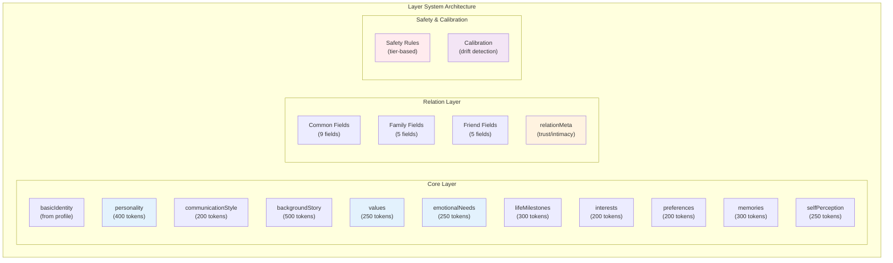
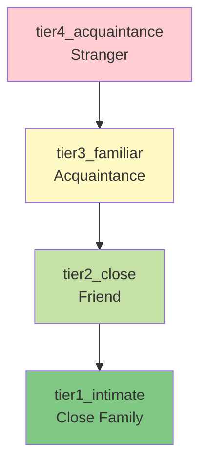
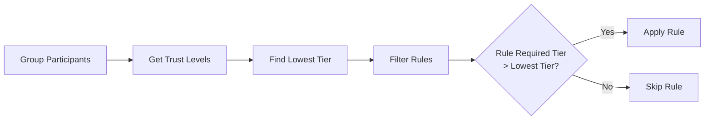
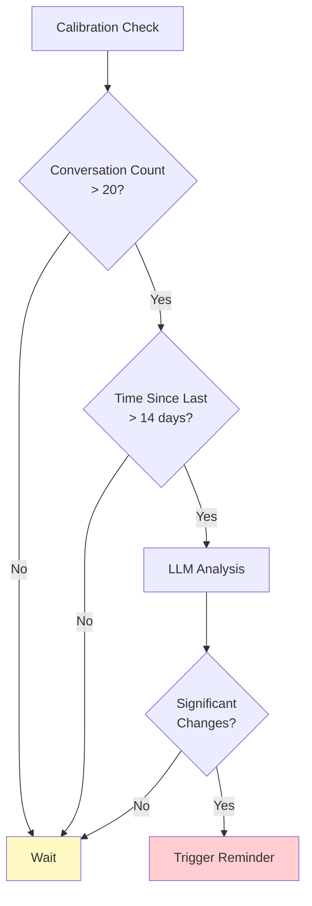
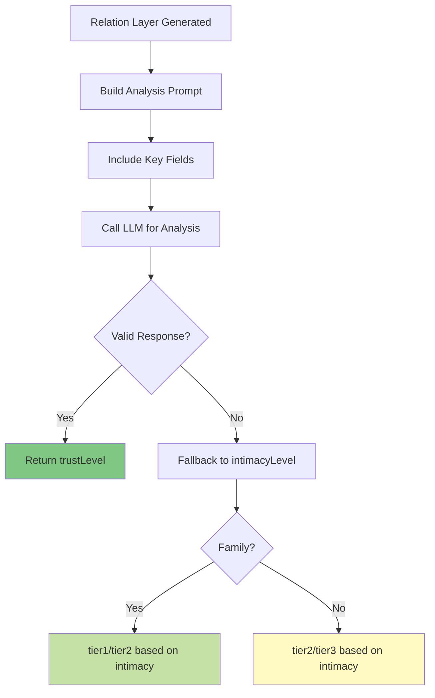

# Layer System

## Architecture Level

The RoleCard V2 system implements a three-layer architecture with an additional safety and calibration subsystem. Each layer serves a specific purpose in the overall profile management and conversation assembly process.



## Function Level

### Core Layer

**Purpose**: Contains the user's intrinsic personality traits and self-perception. Always loaded during conversation assembly.

**Data Source**: A-Set questionnaire answers (basic + emotional layers)

**Storage Location**: `server/storage/userdata/{userId}/core-layer.json`

**Load Strategy**: Always loaded (constant presence in conversations)

**Field Breakdown**:

| Field | Source | Token Target | Description |
|-------|--------|--------------|-------------|
| `basicIdentity` | Profile | 150 | Name, age, occupation, location, family |
| `personality` | LLM | 400 | Core personality traits |
| `communicationStyle` | LLM | 200 | Tone, pace, habits in communication |
| `backgroundStory` | LLM | 500 | Life history and background |
| `lifeMilestones` | LLM | 300 | Important life events |
| `interests` | LLM | 200 | Hobbies and interests |
| `preferences` | LLM | 200 | Likes and dislikes |
| `values` | LLM | 250 | Core values and beliefs |
| `emotionalNeeds` | LLM | 250 | Emotional requirements |
| `memories` | LLM | 300 | Significant memories |
| `selfPerception` | LLM | 250 | How user views themselves |

**Total Token Budget**: ~3000 tokens

### Relation Layer

**Purpose**: Contains relationship-specific information from the perspective of family members and friends.

**Data Source**: B-Set (family) and C-Set (friend) questionnaire answers

**Storage Location**: `server/storage/userdata/{userId}/relation-layers/{relationId}.json`

**Load Strategy**: On-demand based on conversation participants

**Common Fields** (family + friend):

| Field | Token Target | Description |
|-------|--------------|-------------|
| `relationshipBasis` | 200 | How they met, relationship evolution |
| `sharedMemories` | 300 | Important shared experiences |
| `interactionPatterns` | 200 | How they typically interact |
| `communicationStyle` | 200 | Specific communication style with this person |
| `emotionalBond` | 200 | Depth of emotional connection |
| `mutualInfluence` | 200 | How they influence each other |
| `supportDynamics` | 200 | How they support each other |
| `perceivedTraits` | 250 | How the assistant sees the user |
| `topicsAndInterests` | 200 | Common topics of discussion |

**Family-Specific Fields**:

| Field | Token Target | Description |
|-------|--------------|-------------|
| `familyRole` | 150 | Role in the family |
| `intergenerationalImpact` | 250 | Impact on growth/development |
| `familyTraditions` | 200 | Family customs and traditions |
| `careAndGuidance` | 200 | Care and guidance provided |
| `familyValues` | 200 | Shared family values |

**Friend-Specific Fields**:

| Field | Token Target | Description |
|-------|--------------|-------------|
| `socialRole` | 150 | Role in social circle |
| `friendshipHistory` | 200 | History of the friendship |
| `socialActivities` | 200 | Activities done together |
| `groupDynamics` | 200 | Behavior in groups |
| `trustAndLoyalty` | 150 | Trust and loyalty levels |

**Total Token Budget**: ~2900 tokens per relation

**Relation Meta** (always loaded):

```typescript
relationMeta: {
  specificRelation: string;    // "父亲", "大学同学", etc.
  relationType: 'family' | 'friend';
  isFamily: boolean;
  isFriend: boolean;
  intimacyLevel: 'intimate' | 'close' | 'moderate' | 'distant';
  trustLevel: 'tier1_intimate' | 'tier2_close' | 'tier3_familiar' | 'tier4_acquaintance';
}
```

### Safety Guardrails Layer

**Purpose**: Protect privacy in group conversations by enforcing disclosure rules based on trust levels.

**Data Source**: Configuration file `server/storage/safety-rules.json`

**Storage Location**: Global configuration

**Load Strategy**: Group conversations only (participants > 1)

**Trust Level System**:



**Rule Types**:

| Type | Description | Examples |
|------|-------------|----------|
| **Hard Rules** | Absolute prohibitions | Intimate relations, financial secrets |
| **Soft Rules** | Cautious handling required | Health concerns, past failures |

**Rule Application Logic**:



### Calibration Layer

**Purpose**: Detect personality drift over time and trigger role card regeneration.

**Data Source**: Conversation history, memory system

**Storage Location**: Embedded in role card JSON

**Load Strategy**: Internal system use (not for prompt assembly)

**Detection Dimensions**:

| Dimension | Core Field | Detection Method |
|-----------|------------|------------------|
| Personality | `personality` | Compare with recent memories |
| Values | `values` | Analyze conversation patterns |
| Communication | `communicationStyle` | Track changes in expression |
| Emotional | `emotionalNeeds` | Monitor shifts in focus |
| Life Status | `basicIdentity` | Detect major life events |

**Trigger Conditions**:



**Configuration** (`DEFAULT_CALIBRATION_CONFIG`):

```javascript
{
  minConversationCount: 20,      // Minimum conversations to analyze
  analysisIntervalDays: 14,      // Days between analyses
  significanceThreshold: 'medium', // Change significance threshold
  minConsistencyCount: 3,         // Required occurrences for change
  reminderCooldownDays: 7,        // Days between reminders
  analysisFields: [
    'personality',
    'values',
    'communicationStyle',
    'emotionalNeeds'
  ]
}
```

## Code Level

### Core Layer Field Structure

```typescript
// server/src/modules/rolecard/v2/coreLayerGenerator.js

interface CoreLayerV2 {
  version: string;           // "2.1.0"
  generatedAt: string;       // ISO timestamp
  userId: string;

  // From profile (no LLM processing)
  basicIdentity: {
    raw: {
      name: string;
      gender: string;
      age: number | null;
      birthPlace: object;
      residence: object;
      occupation: string;
      education: string;
      maritalStatus: string;
      children: object;
    };
    summary: string;         // Natural language summary
  };

  // LLM extracted fields (uniform structure)
  personality: FieldStructure;
  communicationStyle: FieldStructure;
  backgroundStory: FieldStructure;
  lifeMilestones: FieldStructure;
  interests: FieldStructure;
  preferences: FieldStructure;
  values: FieldStructure;
  emotionalNeeds: FieldStructure;
  memories: FieldStructure;
  selfPerception: FieldStructure;

  metadata: {
    sourceAnswerCount: number;
    sourceQuestionIds: string[];
    extractionModel: string;
    compressionModel: string;
  };
}

interface FieldStructure {
  keyPoints: string[];     // 3-5 key points extracted
  summary: string;         // Compressed natural language
  sourceCount: number;     // Number of source fragments
  sourceQuestionIds: string[];
}
```

### Relation Layer Field Structure

```typescript
// server/src/modules/rolecard/v2/relationLayerGenerator.js

interface RelationLayerV2 {
  version: string;           // "2.1.0"
  generatedAt: string;
  userId: string;
  relationId: string;
  assistantId: string;
  assistantName: string;

  // Simple relation layer (always loaded)
  relationMeta: {
    specificRelation: string;  // "父亲", "朋友", etc.
    relationType: 'family' | 'friend';
    isFamily: boolean;
    isFriend: boolean;
    intimacyLevel: 'intimate' | 'close' | 'moderate' | 'distant';
    trustLevel: 'tier1_intimate' | 'tier2_close' |
                'tier3_familiar' | 'tier4_acquaintance';
  };

  // Complex relation layer (on-demand)
  // Common fields (always present)
  relationshipBasis: FieldStructure;
  sharedMemories: FieldStructure;
  interactionPatterns: FieldStructure;
  communicationStyle: FieldStructure;
  emotionalBond: FieldStructure;
  mutualInfluence: FieldStructure;
  supportDynamics: FieldStructure;
  perceivedTraits: FieldStructure;
  topicsAndInterests: FieldStructure;

  // Family-specific (present when isFamily)
  familyRole?: FieldStructure;
  intergenerationalImpact?: FieldStructure;
  familyTraditions?: FieldStructure;
  careAndGuidance?: FieldStructure;
  familyValues?: FieldStructure;

  // Friend-specific (present when isFriend)
  socialRole?: FieldStructure;
  friendshipHistory?: FieldStructure;
  socialActivities?: FieldStructure;
  groupDynamics?: FieldStructure;
  trustAndLoyalty?: FieldStructure;

  metadata: {
    sourceAnswerCount: number;
    sourceQuestionIds: string[];
    extractionModel: string;
    compressionModel: string;
  };
}
```

### Safety Rule Structure

```typescript
// server/src/modules/rolecard/v2/safetyGuardrails.js

interface SafetyRule {
  id: string;
  type: 'hard' | 'soft';
  topic: {
    category: string;
    keywords: string[];
    description: string;
  };
  allowedAudience: {
    trustLevels: TrustLevel[];
  };
  action: {
    type: 'block' | 'redirect' | 'vague_response';
    vagueTemplate?: string;
    redirectHint?: string;
  };
  priority: number;
  enabled: boolean;
}

type TrustLevel = 'tier1_intimate' | 'tier2_close' |
                  'tier3_familiar' | 'tier4_acquaintance';
```

### Calibration Layer Structure

```typescript
// server/src/modules/rolecard/v2/calibrationLayer.js

interface CalibrationLayer {
  version: string;
  createdAt: string;
  updatedAt: string;

  baseline: {
    generatedAt: string;
    sourceQuestionIds: string[];
    fieldSummaries: {
      [fieldName: string]: {
        summary: string;
        keyPoints: string[];
        extractedAt: string;
      };
    };
  };

  currentState: {
    lastAnalyzedAt: string | null;
    totalConversations: number;
    lastConversationAt: string | null;
    pendingChanges: PendingChange[];
    confirmedChanges: ConfirmedChange[];
  };

  analysisHistory: AnalysisEntry[];

  reminderStatus: {
    lastRemindedAt: string | null;
    dismissed: boolean;
    pendingReminder: boolean;
  };

  calibrationConfig: CalibrationConfig;
}

interface PendingChange {
  field: string;
  originalSummary: string;
  observedChange: string;
  significance: 'low' | 'medium' | 'high';
  evidence: string;
  detectedCount: number;
  firstDetectedAt: string;
  lastDetectedAt: string;
}
```

## Loading Strategy Matrix

| Scenario | Core Layer | Relation Meta | Relation Fields | Safety | Calibration |
|----------|------------|---------------|-----------------|--------|-------------|
| **1-on-1 with family** | ✓ | ✓ | ✓ | ✗ | ✗ |
| **1-on-1 with friend** | ✓ | ✓ | ✓ | ✗ | ✗ |
| **1-on-1 with stranger** | ✓ | ✗ | ✗ | ✗ | ✗ |
| **Group: family only** | ✓ | ✓ | ✓ | ✓ | ✗ |
| **Group: mixed** | ✓ | ✓ | ✓ | ✓ | ✗ |
| **System maintenance** | ✗ | ✗ | ✗ | ✗ | ✓ |

## Intimacy Level Calculation

```javascript
// server/src/modules/rolecard/v2/relationLayerGenerator.js

function determineIntimacyLevel(answers, compressedFields) {
  // Count depth indicators from key fields
  const sharedMemories = compressedFields.sharedMemories?.sourceCount || 0;
  const emotionalBond = compressedFields.emotionalBond?.sourceCount || 0;
  const supportDynamics = compressedFields.supportDynamics?.sourceCount || 0;

  const totalDepth = sharedMemories + emotionalBond + supportDynamics;

  // Threshold-based classification
  if (totalDepth >= 6) return 'intimate';   // Very close
  if (totalDepth >= 4) return 'close';      // Close
  if (totalDepth >= 2) return 'moderate';   // Moderate
  return 'distant';                          // Distant
}
```

## Trust Level Analysis Flow


