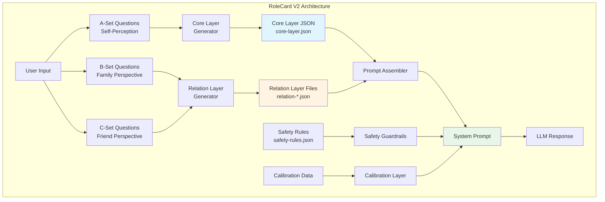
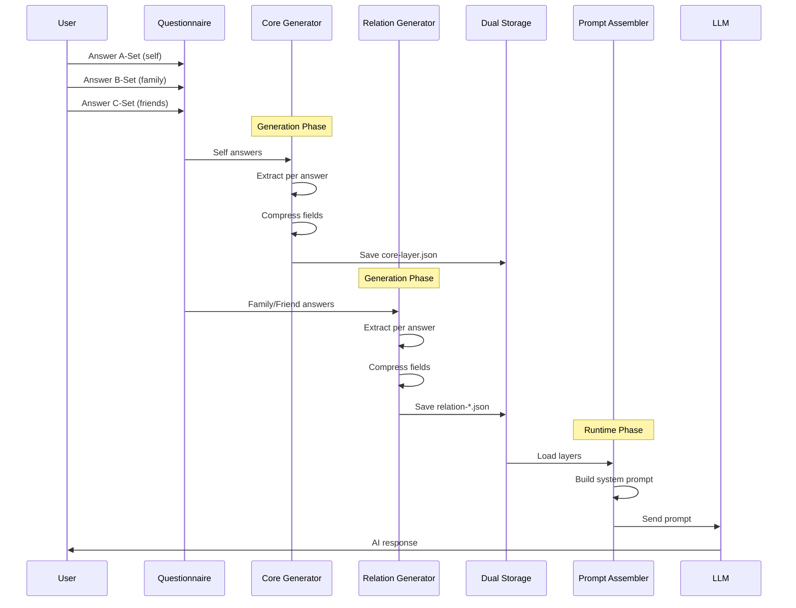

# RoleCard System Overview

## Architecture Level

The RoleCard System is a multi-layered profile management system that enables personalized AI interactions by maintaining detailed user profiles across multiple dimensions.



## System Components

The RoleCard System consists of five main layers:

| Component | Description | File Location |
|-----------|-------------|---------------|
| **Core Layer** | User's intrinsic personality, values, and self-perception | `server/src/modules/rolecard/v2/coreLayerGenerator.js` |
| **Relation Layer** | Relationship-specific information from family and friends | `server/src/modules/rolecard/v2/relationLayerGenerator.js` |
| **Safety Guardrails** | Privacy protection rules for group conversations | `server/src/modules/rolecard/v2/safetyGuardrails.js` |
| **Calibration Layer** | Drift detection and update triggers | `server/src/modules/rolecard/v2/calibrationLayer.js` |
| **Prompt Assembler** | Converts layers into natural language system prompts | `server/src/modules/rolecard/v2/promptAssembler.js` |

## Data Flow



## File Structure

```
server/src/modules/rolecard/
├── config.js                    # Configuration parameters
├── controller.js                # API endpoints
├── route.js                     # Route definitions
└── v2/
    ├── index.js                 # Module exports
    ├── coreLayerGenerator.js    # Core layer generation
    ├── relationLayerGenerator.js # Relation layer generation
    ├── safetyGuardrails.js      # Safety rules management
    ├── calibrationLayer.js      # Drift detection
    ├── dynamicDataFetcher.js    # Runtime data loading
    ├── promptAssembler.js       # Prompt construction
    └── prompts/
        ├── coreExtractionV2.js  # Core layer prompts
        └── relationExtractionV2.js # Relation layer prompts
```

## Storage Structure

```
server/storage/
├── safety-rules.json           # Global safety rules
└── userdata/
    └── {userId}/
        ├── core-layer.json         # Core personality data
        ├── profile.json            # User profile
        └── relation-layers/        # Relationship data
            ├── {relationId-1}.json # Family/friend #1
            ├── {relationId-2}.json # Family/friend #2
            └── {relationId-N}.json # Family/friend #N
```

## Key Features

### 1. Layered Architecture
- **Core Layer**: Always loaded, contains intrinsic personality
- **Relation Layer**: Loaded on-demand based on conversation participants
- **Safety Guardrails**: Activated for group conversations only

### 2. Progressive Generation
- Each layer can be generated independently
- SSE (Server-Sent Events) for real-time progress updates
- Graceful handling of missing data

### 3. Intelligent Compression
- Two-stage extraction: per-answer extraction → field compression
- Token budget control for each field
- Natural language output with key points extraction

### 4. Privacy Protection
- Trust level assessment via LLM analysis
- Dynamic rule filtering based on group composition
- Tiered disclosure levels

## Theoretical Foundation

### CPM Theory (Communication Privacy Management)
The system implements Petronio's CPM theory through:
- **Boundary Thickness**: Controlled via trust levels
- **Boundary Ownership**: Managed through relation-specific layers
- **Boundary Coordination**: Handled by safety guardrails in groups

### Self-Presentation Theory
The system supports Goffman's self-presentation theory through:
- **Front Stage Behavior**: Relation-specific communication styles
- **Impression Management**: Perceived traits from others' perspectives
- **Role Switching**: Dynamic loading based on conversation context

## API Endpoints

| Method | Endpoint | Description |
|--------|----------|-------------|
| POST | `/api/rolecard/generate` | Generate complete role card |
| POST | `/api/rolecard/generate/stream` | Generate with SSE progress |
| GET | `/api/rolecard` | Get user's role card |
| PUT | `/api/rolecard` | Update role card |
| DELETE | `/api/rolecard` | Delete role card |
| GET | `/api/rolecard/layers/status` | Check generation status |
| POST | `/api/rolecard/core/stream` | Generate core layer only |
| POST | `/api/rolecard/relation/:id/stream` | Generate single relation layer |
| POST | `/api/rolecard/batch/stream` | Batch generate layers |
