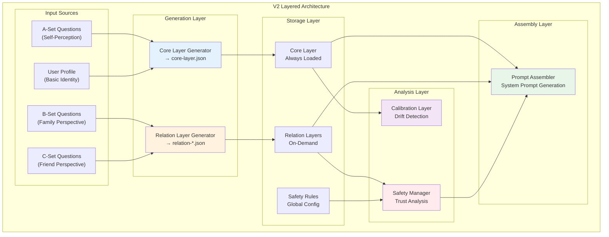
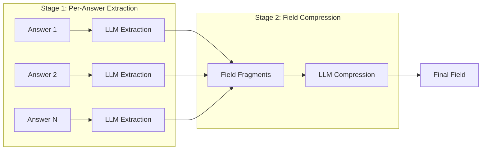

# V2 Layered Architecture

## Architecture Level

The V2 RoleCard System implements a sophisticated layered architecture that separates concerns between intrinsic personality traits, relationship-specific information, safety constraints, and drift detection.



## Function Level

### Core Layer (`coreLayerGenerator.js`)

**Purpose**: Extract and compress the user's intrinsic personality traits from self-answered questions.

**Key Functions**:

| Function | Description |
|----------|-------------|
| `generate(userId, onProgress)` | Main entry point for core layer generation |
| `collectASetAnswers(userId)` | Retrieve all self-answered questions (A-Set) |
| `processOneAnswer(item)` | Extract information from a single answer |
| `compressAllFields(onFieldProgress)` | Compress extracted fragments into final fields |
| `buildBasicIdentity(user)` | Create identity summary from user profile |

**Process Flow**:
1. Validate A-Set completion (basic + emotional layers)
2. Collect all self-answered questions
3. Extract information per answer (serial processing)
4. Compress each field from collected fragments
5. Build basic identity from profile
6. Assemble and store core layer

### Relation Layer (`relationLayerGenerator.js`)

**Purpose**: Generate relationship-specific profiles from family and friend perspectives.

**Key Functions**:

| Function | Description |
|----------|-------------|
| `generateAll(userId, onProgress)` | Generate all relation layers for a user |
| `generateOne(userId, relation)` | Generate a single relation layer |
| `collectAssistantAnswers(userId, assistantId, type)` | Get answers for specific assistant |
| `processOneAnswer(item, relationType, ...)` | Extract from single answer |
| `compressAllFields(relationType)` | Compress field fragments |
| `determineIntimacyLevel(answers, fields)` | Calculate relationship intimacy |
| `determineTrustLevel(...)` | LLM-based trust level analysis |

**Process Flow**:
1. Fetch all assist relationships for user
2. For each assistant:
   - Collect their answers about the user
   - Extract information per answer
   - Compress each field
   - Calculate intimacy level
   - Analyze trust level via LLM
   - Store relation layer file

### Safety Guardrails (`safetyGuardrails.js`)

**Purpose**: Manage privacy rules for group conversations based on trust levels.

**Key Functions**:

| Function | Description |
|----------|-------------|
| `loadRules()` | Load safety rules from config file |
| `getTrustLevel(participant)` | Get trust level for a participant |
| `calculateGroupTrustLevels(participants)` | Get all trust levels in group |
| `getLowestTrustLevel(trustLevels)` | Find minimum trust in group |
| `shouldApplyRule(ruleLevels, lowestTier)` | Check if rule applies |
| `generateGroupSafetyPrompt(guardrails, participants)` | Build safety prompt |

**Trust Level Tiers**:

| Tier | Name | Description |
|------|------|-------------|
| `tier1_intimate` | Most Intimate | Can share all private information |
| `tier2_close` | Close | Can share most personal matters |
| `tier3_familiar` | Familiar | Limited information sharing |
| `tier4_acquaintance` | Acquaintance | Only basic public information |

### Calibration Layer (`calibrationLayer.js`)

**Purpose**: Detect personality drift over time and trigger role card updates.

**Key Functions**:

| Function | Description |
|----------|-------------|
| `createInitialCalibrationLayer(coreLayer)` | Create baseline from core layer |
| `checkCalibrationNeeded(calibrationLayer)` | Check if analysis is due |
| `analyzeChanges(calibrationLayer, coreLayer, memories)` | LLM-based change detection |
| `generateReminder(calibrationLayer)` | Create user notification |
| `getStatusSummary(calibrationLayer)` | Get current calibration status |

**Triggers**:
- Minimum conversation count reached (default: 20)
- Time interval passed (default: 14 days)
- Significant changes detected in key fields

### Dynamic Data Fetcher (`dynamicDataFetcher.js`)

**Purpose**: Load role card data at runtime for conversation assembly.

**Key Functions**:

| Function | Description |
|----------|-------------|
| `fetchDynamicData(roleCardOwnerId, participantIds)` | Main data fetching |
| `resolveParticipant(participantId, ...)` | Resolve single participant info |
| `findRelationLayerByAssistantId(layers, assistantId)` | Find relation layer |
| `getCoreLayer(userId)` | Load core layer |
| `getRelationLayers(userId)` | Load all relation layers |

**Data Priority**:
1. Relation layer data (highest priority)
2. Participant's role card
3. Default fallback values

### Prompt Assembler (`promptAssembler.js`)

**Purpose**: Convert role card layers into natural language system prompts.

**Key Functions**:

| Function | Description |
|----------|-------------|
| `assemble(params)` | Main assembly function |
| `buildIdentitySection(coreLayer, data)` | Build identity section |
| `buildRelationSection(layers, data, isGroup)` | Build relation section |
| `buildSafetySection(guardrails, data)` | Build safety constraints |
| `buildGuidanceSection(coreLayer, data)` | Build behavioral guidelines |

**Prompt Structure**:
```
System Prompt
├── Identity Section (who am I?)
├── Relation Section (who am I talking to?)
├── Guidance Section (how should I behave?)
└── Safety Section (what should I avoid in groups?)
```

## Code Level

### Core Layer Structure

```typescript
// server/src/modules/rolecard/v2/coreLayerGenerator.js

class CoreLayerGenerator {
  constructor() {
    this.llmClient = new MultiLLMClient();
    this.dualStorage = new DualStorage();
    this.fieldFragments = {};
  }

  async generate(userId, onProgress = null) {
    // 1. Get user profile for basicIdentity
    const user = await User.findById(userId);

    // 2. Validate A-Set completion
    const completion = await validateASetCompletion(userId);
    if (!completion.isComplete) {
      throw new Error(`A-Set incomplete: ${completion.answered}/${completion.total}`);
    }

    // 3. Collect A-Set answers
    const answers = await this.collectASetAnswers(userId);

    // 4. Extract per answer (serial)
    for (const answer of answers) {
      await this.processOneAnswer(answer);
    }

    // 5. Compress all fields
    const compressed = await this.compressAllFields();

    // 6. Build basicIdentity
    const basicIdentity = this.buildBasicIdentity(user);

    // 7. Assemble core layer
    const coreLayer = {
      version: '2.1.0',
      generatedAt: new Date().toISOString(),
      userId,
      basicIdentity,
      ...compressed,
      metadata: { /* ... */ }
    };

    // 8. Store
    await this.dualStorage.saveCoreLayer(userId, coreLayer);

    return coreLayer;
  }
}
```

### Relation Layer Structure

```typescript
// server/src/modules/rolecard/v2/relationLayerGenerator.js

class RelationLayerGenerator {
  async generateOne(userId, relation, onProgress = null) {
    const { relationType, specificRelation, assistantId } = relation;

    // 1. Collect assistant's answers
    const answers = await this.collectAssistantAnswers(
      userId, assistantId, relationType
    );

    if (answers.length < 3) return null; // Insufficient data

    // 2. Reset field fragments for this relation type
    this.resetFieldFragments(relationType);

    // 3. Extract per answer
    for (const answer of answers) {
      await this.processOneAnswer(answer, relationType, assistantName, specificRelation);
    }

    // 4. Compress all fields
    const compressed = await this.compressAllFields(relationType, specificRelation);

    // 5. Determine intimacy level
    const intimacyLevel = this.determineIntimacyLevel(answers, compressed);

    // 6. LLM trust level analysis
    const trustLevel = await this.determineTrustLevel(
      relationType, specificRelation, intimacyLevel, compressed
    );

    // 7. Build relation layer
    const relationLayer = {
      version: '2.1.0',
      generatedAt: new Date().toISOString(),
      userId,
      relationId: relation._id,
      assistantId,
      assistantName,
      relationMeta: {
        specificRelation,
        relationType,
        isFamily: relationType === 'family',
        isFriend: relationType === 'friend',
        intimacyLevel,
        trustLevel
      },
      ...compressed,
      metadata: { /* ... */ }
    };

    // 8. Store
    await this.dualStorage.saveRelationLayer(userId, relation._id, relationLayer);

    return relationLayer;
  }
}
```

### Safety Guardrails Structure

```typescript
// server/src/modules/rolecard/v2/safetyGuardrails.js

class SafetyGuardrailsManager {
  async generateGroupSafetyPrompt(guardrails, participants) {
    // 1. Load rules
    const rules = guardrails?.rules || await this.loadRules();

    // 2. Calculate trust levels
    const trustLevels = this.calculateGroupTrustLevels(participants);
    const lowestTier = this.getLowestTrustLevel(trustLevels);

    // 3. Filter applicable rules
    const activeRules = rules.filter(r => {
      if (!r.enabled || r.type !== 'hard') return false;
      const requiredLevels = r.allowedAudience?.trustLevels || [];
      return this.shouldApplyRule(requiredLevels, lowestTier);
    });

    // 4. Build prompt
    if (activeRules.length === 0) return '';

    return `## 🔒 安全约束（群组模式激活）

### 当前群组信任等级
最低信任等级：**${TRUST_LEVEL_DEFINITIONS[lowestTier]?.name}**

### 话题限制
${activeRules.map(rule => this.formatRule(rule)).join('\n\n')}
...`;
  }
}
```

### Prompt Assembler Structure

```typescript
// server/src/modules/rolecard/v2/promptAssembler.js

class PromptAssembler {
  assemble(params) {
    const { coreLayer, relationLayers, guardrails, dynamicData, options } = params;
    const isGroup = dynamicData.participants.length > 1;

    const sections = [
      this.buildIdentitySection(coreLayer, dynamicData),
      this.buildRelationSection(relationLayers, dynamicData, isGroup),
      this.buildGuidanceSection(coreLayer, dynamicData, isGroup),
      isGroup ? this.buildSafetySection(guardrails, dynamicData) : ''
    ];

    let systemPrompt = sections.filter(s => s).join('\n\n');
    systemPrompt += this.buildRolePlayInstruction(dynamicData.roleCardOwner);

    return { systemPrompt, metadata: { /* ... */ } };
  }
}
```

## Processing Architecture

### Two-Stage Extraction & Compression



This architecture ensures:
- **Token Control**: Each LLM call stays within limits
- **Quality**: Focused tasks improve extraction accuracy
- **Flexibility**: Fields can be regenerated independently
