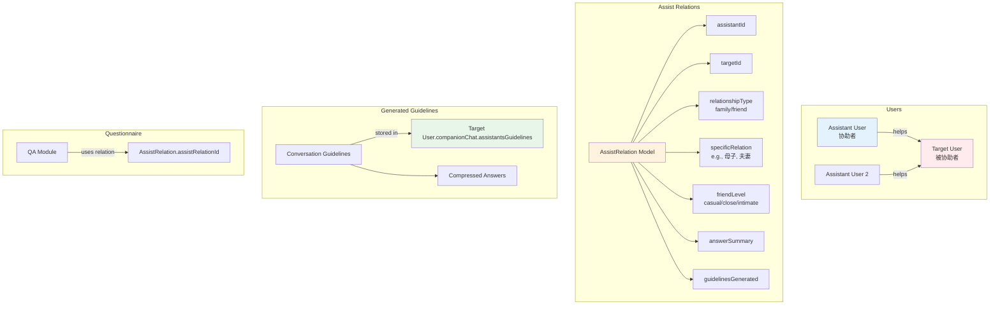
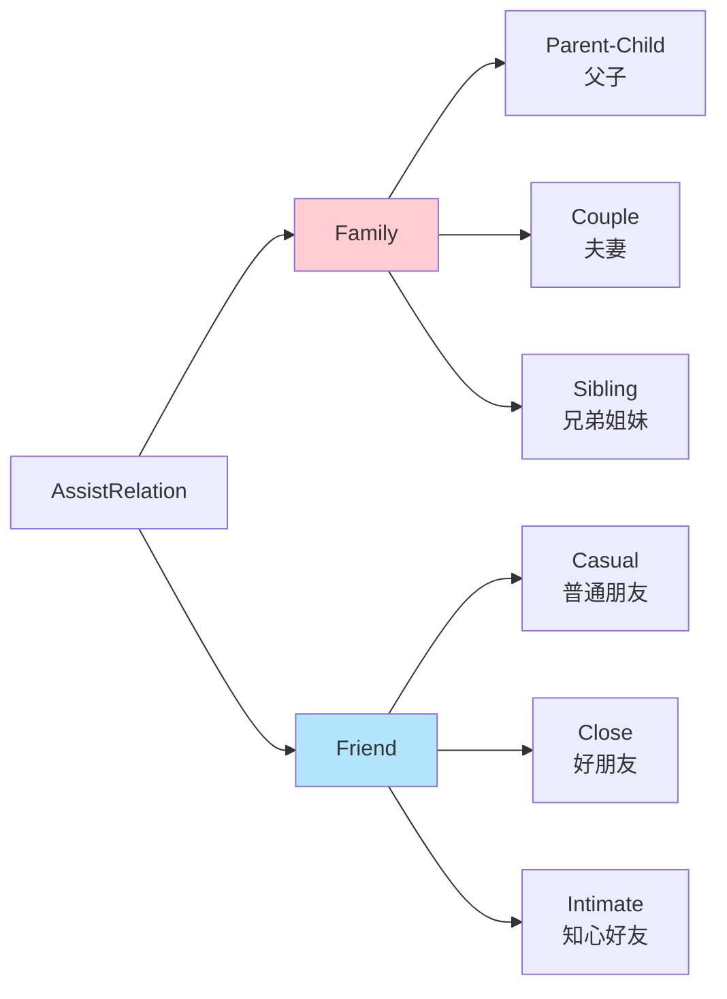
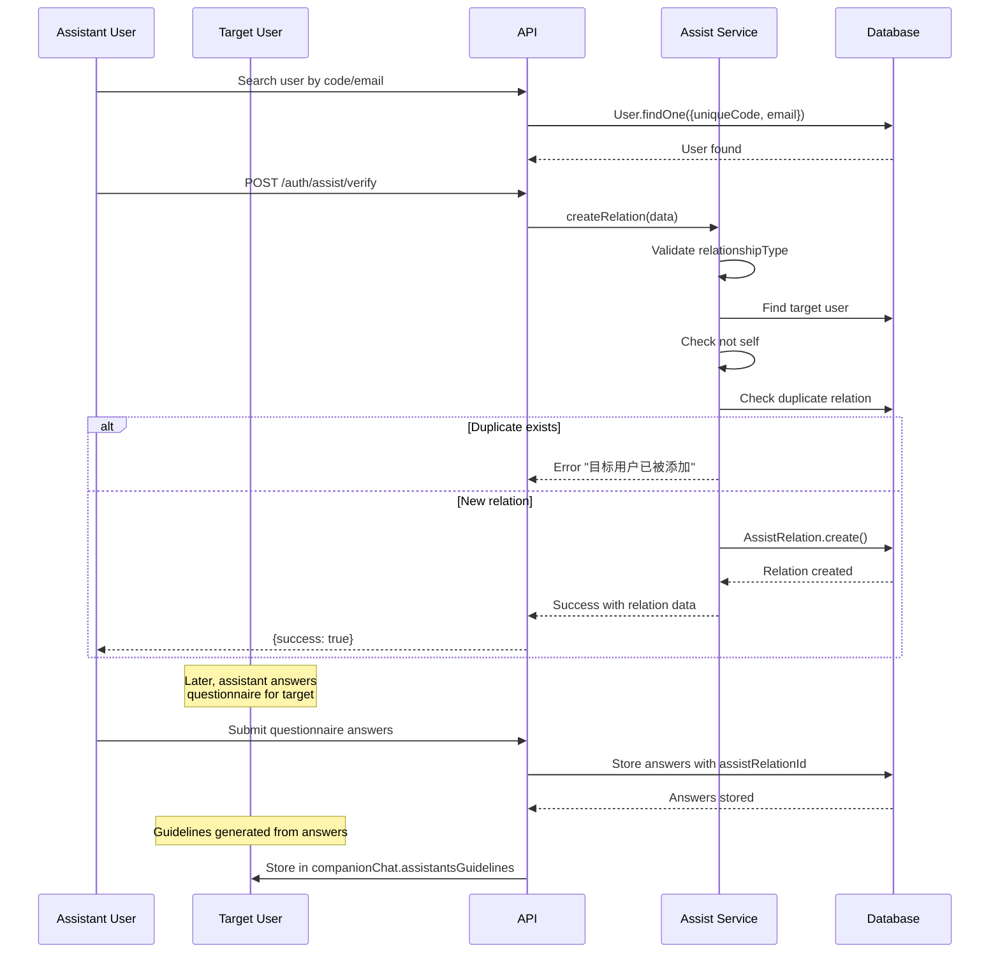

# Family Assist Relations

## 1. Architecture Level

The Family Assist Relations module manages connections between users who assist each other in the system. It enables family members and friends to help elderly users by answering questionnaires on their behalf, which then generates personalized conversation guidelines for AI interactions.

### Assist Relations Architecture



### Relationship Types



### Module Structure

```
server/src/modules/assist/
├── model.js           # AssistRelation schema
├── controller.js      # Request handlers
├── service.js        # Business logic
└── route.js          # Merged into auth routes

server/src/modules/qa/
└── services/answer.js  # Uses assistRelationId

web/
└── (components that consume assist relations)
```

### Assist Relation Creation Flow



## 2. Function Level

### AssistController Functions

| Function | Method | Endpoint | Description |
|----------|--------|----------|-------------|
| `searchUser()` | GET | `/api/auth/assist/search` | Find user by unique code or email |
| `createRelation()` | POST | `/api/auth/assist/verify` | Create new assist relation |
| `getRelations()` | GET | `/api/auth/assist/relations` | Get all relations for current user |
| `getHelpers()` | GET | `/api/auth/assist/helpers` | Get users who assist me |
| `deleteRelation()` | DELETE | `/api/auth/assist/relations/:id` | Delete an assist relation |
| `getIncompleteRelations()` | GET | `/api/auth/assist/check-incomplete` | Get relations without specificRelation |
| `batchUpdateRelations()` | POST | `/api/auth/assist/batch-update-relations` | Update multiple relations |

### AssistService Functions

| Function | Parameters | Returns | Description |
|----------|-----------|---------|-------------|
| `checkDuplicateRelation()` | `assistantId, targetId` | `Promise<boolean>` | Check if relation exists |
| `createRelation()` | `relationData` | `Promise<object>` | Validate and create relation |
| `getRelations()` | `userId` | `Promise<Array>` | Get user's assist relations |
| `getIncompleteRelations()` | `userId` | `Promise<Array>` | Get relations needing completion |
| `batchUpdateRelations()` | `relationsData[]` | `Promise<number>` | Update multiple relations |

### AssistRelation Model Schema Fields

| Field | Type | Description |
|-------|------|-------------|
| `assistantId` | ObjectId(ref: User) | The user providing assistance |
| `targetId` | ObjectId(ref: User) | The user being assisted |
| `relationshipType` | String enum | 'family' or 'friend' |
| `specificRelation` | String | Specific relationship (e.g., '母子', '夫妻') |
| `friendLevel` | String enum | 'casual', 'close', or 'intimate' (for friends) |
| `createdAt` | Date | When relation was created |
| `isActive` | Boolean | Whether relation is active |
| `answerSummary` | Object | Stats about questionnaire answers |
| `guidelinesGenerated` | Boolean | Whether conversation guidelines exist |

### Relationship Types and Levels

**Family Types:**
- No sub-types - uses `specificRelation` for description

**Friend Levels:**
| Level | Chinese | Description |
|-------|---------|-------------|
| `casual` | 普通朋友 | Casual acquaintance |
| `close` | 好朋友 | Close friend |
| `intimate` | 知心好友 | Very close, intimate friend |

## 3. Code Level

### Backend Implementation

#### AssistRelation Model

**File**: `server/src/modules/assist/model.js`

```javascript
import mongoose from 'mongoose';

const assistRelationSchema = new mongoose.Schema({
  // The user providing assistance
  assistantId: {
    type: mongoose.Schema.Types.ObjectId,
    ref: 'User',
    required: true,
    index: true
  },

  // The user being assisted
  targetId: {
    type: mongoose.Schema.Types.ObjectId,
    ref: 'User',
    required: true,
    index: true
  },

  // Type of relationship
  relationshipType: {
    type: String,
    enum: ['family', 'friend'],
    required: true
  },

  // Specific relationship description
  specificRelation: {
    type: String,
    description: '具体关系描述（如：夫妻、母子、同事等）',
    default: ''
  },

  // Friend relationship level (only for friends)
  friendLevel: {
    type: String,
    enum: ['casual', 'close', 'intimate'],
    description: '朋友关系级别：casual(普通朋友), close(好朋友), intimate(知心好友)',
    default: 'casual'
  },

  createdAt: {
    type: Date,
    default: Date.now
  },

  isActive: {
    type: Boolean,
    default: true
  },

  // Summary of questionnaire answers
  answerSummary: {
    hasAnswers: Boolean,
    basicAnswersCount: Number,
    emotionalAnswersCount: Number,
    lastAnswerUpdatedAt: Date
  },

  // Whether conversation guidelines have been generated
  guidelinesGenerated: {
    type: Boolean,
    default: false
  }
});

// Compound index to prevent duplicate relations
assistRelationSchema.index({ assistantId: 1, targetId: 1 }, { unique: true });

// Static method: Check if relation exists
assistRelationSchema.statics.hasRelation = async function(assistantId, targetId) {
  const relation = await this.findOne({
    assistantId,
    targetId,
    isActive: true
  });
  return !!relation;
};

// Static method: Get all assist relations for a user
assistRelationSchema.statics.getAssistRelations = async function(userId) {
  return this.find({
    assistantId: userId,
    isActive: true
  }).populate('targetId', 'uniqueCode email name');
};

export default mongoose.model('AssistRelation', assistRelationSchema);
```

#### Assist Controller

**File**: `server/src/modules/assist/controller.js`

```javascript
import assistService from './service.js';
import AnswerService from '../qa/services/answer.js';
import User from '../user/model.js';
import AssistRelation from './model.js';

class AssistController {
  /**
   * Search user by unique code or email
   * GET /api/auth/assist/search?code=XXX&email=XXX
   */
  async searchUser(req, res) {
    try {
      const { code, email } = req.query;

      if (!code && !email) {
        return res.status(400).json({
          success: false,
          error: '专属编号或邮箱不能为空'
        });
      }

      let user;
      if (code) {
        user = await User.findOne({ uniqueCode: code });
      } else {
        user = await User.findOne({ email: email.toLowerCase() });
      }

      if (!user) {
        return res.status(404).json({
          success: false,
          error: '未找到该用户'
        });
      }

      res.json({
        success: true,
        data: {
          user: {
            _id: user._id,
            name: user.name,
            email: user.email,
            uniqueCode: user.uniqueCode
          }
        }
      });
    } catch (error) {
      res.status(500).json({
        success: false,
        error: error.message
      });
    }
  }

  /**
   * Delete assist relation
   * DELETE /api/auth/assist/relations/:relationId
   */
  async deleteRelation(req, res) {
    try {
      const { relationId } = req.params;
      const userId = req.user?.id || req.user?._id;

      const relation = await AssistRelation.findById(relationId);

      if (!relation) {
        return res.status(404).json({
          success: false,
          error: '协助关系不存在'
        });
      }

      // Only the assistant or target can delete
      if (relation.assistantId.toString() !== userId.toString() &&
          relation.targetId.toString() !== userId.toString()) {
        return res.status(403).json({
          success: false,
          error: '无权限删除此关系'
        });
      }

      // Delete associated answers
      const answerService = new AnswerService();
      await answerService.deleteAssistAnswers(relation._id);

      // Delete relation
      await AssistRelation.findByIdAndDelete(relationId);

      res.json({
        success: true,
        message: '协助关系已删除'
      });
    } catch (error) {
      res.status(500).json({
        success: false,
        error: error.message
      });
    }
  }

  /**
   * Create assist relation
   * POST /api/auth/assist/verify
   */
  async createRelation(req, res) {
    try {
      const userId = req.user?.id || req.user?._id;
      const { targetCode, targetEmail, relationshipType, specificRelation, friendLevel } = req.body;

      if (!targetCode || !targetEmail) {
        return res.status(400).json({
          success: false,
          error: '缺少必填字段'
        });
      }

      const result = await assistService.createRelation({
        assistantId: userId,
        targetCode,
        targetEmail,
        relationshipType,
        specificRelation,
        friendLevel
      });

      res.json({
        success: true,
        message: '协助关系创建成功',
        ...result
      });
    } catch (error) {
      res.status(400).json({
        success: false,
        error: error.message
      });
    }
  }

  /**
   * Get all assist relations for current user
   * GET /api/auth/assist/relations
   */
  async getRelations(req, res) {
    try {
      const userId = req.user?.id || req.user?._id;

      // Get relations where user is the assistant
      const assistedRelations = await AssistRelation.find({
        assistantId: userId,
        isActive: true
      }).populate('targetId', 'name email uniqueCode');

      // Get relations where user is the target
      const assistantRelations = await AssistRelation.find({
        targetId: userId,
        isActive: true
      }).populate('assistantId', 'name email uniqueCode');

      // Format for frontend
      const formattedRelations = [];

      // Add assisted relations (I help them)
      assistedRelations.forEach(rel => {
        formattedRelations.push({
          _id: rel._id,
          assistedUser: {
            _id: rel.targetId._id.toString(),
            name: rel.targetId.name,
            email: rel.targetId.email
          },
          assistantUser: {
            _id: userId.toString(),
            name: req.user?.name || '我',
            email: req.user?.email || ''
          },
          status: 'accepted',
          createdAt: rel.createdAt
        });
      });

      // Add assistant relations (they help me)
      assistantRelations.forEach(rel => {
        formattedRelations.push({
          _id: rel._id,
          assistedUser: {
            _id: userId.toString(),
            name: req.user?.name || '我',
            email: req.user?.email || ''
          },
          assistantUser: {
            _id: rel.assistantId._id.toString(),
            name: rel.assistantId.name,
            email: rel.assistantId.email
          },
          status: 'accepted',
          createdAt: rel.createdAt
        });
      });

      res.json({
        success: true,
        data: formattedRelations
      });
    } catch (error) {
      res.status(500).json({
        success: false,
        error: error.message
      });
    }
  }

  /**
   * Get users who assist me
   * GET /api/auth/assist/helpers
   */
  async getHelpers(req, res) {
    try {
      const userId = req.user?.id || req.user?._id;

      const assistantRelations = await AssistRelation.find({
        targetId: userId,
        isActive: true
      }).populate('assistantId', 'name email uniqueCode');

      res.json({
        success: true,
        data: assistantRelations.map(rel => ({
          _id: rel._id,
          assistant: {
            _id: rel.assistantId._id.toString(),
            name: rel.assistantId.name,
            email: rel.assistantId.email
          },
          relationshipType: rel.relationshipType,
          specificRelation: rel.specificRelation,
          friendLevel: rel.friendLevel,
          status: rel.status || 'accepted',
          createdAt: rel.createdAt
        }))
      });
    } catch (error) {
      res.status(500).json({
        success: false,
        error: error.message
      });
    }
  }

  /**
   * Get incomplete relations (missing specificRelation)
   * GET /api/auth/assist/check-incomplete
   */
  async getIncompleteRelations(req, res) {
    try {
      const userId = req.user?.id || req.user?._id;
      const incompleteRelations = await assistService.getIncompleteRelations(userId);

      res.json({
        success: true,
        incompleteRelations
      });
    } catch (error) {
      res.status(500).json({
        success: false,
        error: error.message
      });
    }
  }

  /**
   * Batch update relations
   * POST /api/auth/assist/batch-update-relations
   */
  async batchUpdateRelations(req, res) {
    try {
      const { relations } = req.body;

      if (!relations || !Array.isArray(relations)) {
        return res.status(400).json({
          success: false,
          error: '请求数据格式错误'
        });
      }

      const modifiedCount = await assistService.batchUpdateRelations(relations);

      res.json({
        success: true,
        message: '关系更新成功',
        modifiedCount
      });
    } catch (error) {
      res.status(400).json({
        success: false,
        error: error.message
      });
    }
  }
}

export default new AssistController();
```

#### Assist Service

**File**: `server/src/modules/assist/service.js`

```javascript
import AssistRelation from './model.js';
import User from '../user/model.js';

class AssistService {
  /**
   * Check if assist relation already exists
   * @param {string} assistantId - Assistant user ID
   * @param {string} targetId - Target user ID
   * @returns {Promise<boolean>} True if exists
   */
  async checkDuplicateRelation(assistantId, targetId) {
    const existingRelation = await AssistRelation.findOne({
      assistantId,
      targetId,
      isActive: true
    });

    if (existingRelation) {
      throw new Error('目标用户已被添加');
    }

    return false;
  }

  /**
   * Validate and create assist relation
   * @param {object} data - Relation data
   * @returns {Promise<object>} Created relation info
   */
  async createRelation({ assistantId, targetCode, targetEmail, relationshipType, specificRelation, friendLevel }) {
    // Validate relationship type
    if (!['family', 'friend'].includes(relationshipType)) {
      throw new Error('无效的关系类型');
    }

    // Find target user (must match both code AND email)
    const targetUser = await User.findOne({
      uniqueCode: targetCode,
      email: targetEmail.toLowerCase()
    });

    if (!targetUser) {
      throw new Error('用户信息不匹配，请检查编号和邮箱');
    }

    // Cannot assist yourself
    if (targetUser._id.toString() === assistantId) {
      throw new Error('不能协助自己');
    }

    // Check for duplicate
    await this.checkDuplicateRelation(assistantId, targetUser._id);

    // Build relation data
    const relationData = {
      assistantId,
      targetId: targetUser._id,
      relationshipType
    };

    // Add optional fields
    if (specificRelation && specificRelation.trim()) {
      relationData.specificRelation = specificRelation.trim();
      if (relationshipType === 'friend' && friendLevel) {
        relationData.friendLevel = friendLevel;
      }
    }

    // Create relation
    const assistRelation = new AssistRelation(relationData);
    await assistRelation.save();

    return {
      targetUser: {
        id: targetUser._id,
        name: targetUser.name,
        uniqueCode: targetUser.uniqueCode
      },
      relationshipType,
      specificRelation: relationData.specificRelation,
      friendLevel: relationData.friendLevel
    };
  }

  /**
   * Get all assist relations for a user
   * @param {string} userId - User ID
   * @returns {Promise<Array>} User's assist relations
   */
  async getRelations(userId) {
    return await AssistRelation.find({
      assistantId: userId,
      isActive: true
    }).populate('targetId', 'uniqueCode email name');
  }

  /**
   * Get incomplete relations from target's perspective
   * Finds relations where assistant hasn't filled specificRelation
   * @param {string} userId - Target user ID
   * @returns {Promise<Array>} Incomplete relations
   */
  async getIncompleteRelations(userId) {
    return await AssistRelation.find({
      targetId: userId,
      $or: [
        { specificRelation: { $exists: false } },
        { specificRelation: null },
        { specificRelation: '' }
      ],
      isActive: true
    }).populate('assistantId');
  }

  /**
   * Batch update specificRelation for multiple relations
   * @param {Array} relationsData - Array of {relationId, specificRelation}
   * @returns {Promise<number>} Number of modified documents
   */
  async batchUpdateRelations(relationsData) {
    if (!Array.isArray(relationsData) || relationsData.length === 0) {
      throw new Error('无效的请求格式');
    }

    const updateOperations = [];

    relationsData.forEach(item => {
      if (item.relationId && item.specificRelation) {
        updateOperations.push({
          updateOne: {
            filter: { _id: item.relationId },
            update: { $set: { specificRelation: item.specificRelation } }
          }
        });
      }
    });

    if (updateOperations.length === 0) {
      throw new Error('没有有效的更新数据');
    }

    const result = await AssistRelation.bulkWrite(updateOperations, { ordered: false });
    return result.modifiedCount;
  }
}

export default new AssistService();
```

### Assist Relation Usage in Target User's Document

When an assist relation is created and questionnaire answers are submitted, the target user's document stores conversation guidelines:

```javascript
// In User model - companionChat.assistantsGuidelines
assistantsGuidelines: [{
  assistantId: {
    type: mongoose.Schema.Types.ObjectId,
    ref: 'User',
    required: true
  },

  // Assistant information
  assistantName: String,
  assistantUniqueCode: String,

  // Relation information
  assistRelationId: {
    type: mongoose.Schema.Types.ObjectId,
    ref: 'AssistRelation'
  },
  relationType: {
    type: String,
    enum: ['family', 'friend'],
    required: true
  },
  specificRelation: {
    type: String,
    required: true
  },

  // Pre-processed conversation guidelines
  conversationGuidelines: {
    type: String,
    required: true
  },

  // Compressed answers from questionnaire
  compressedAnswers: [{
    questionId: {
      type: mongoose.Schema.Types.ObjectId,
      ref: 'Question'
    },
    question: String,
    originalAnswer: String,
    compressed: String,
    questionLayer: {
      type: String,
      enum: ['basic', 'emotional']
    },
    compressedAt: Date
  }],

  // Timestamps
  generatedAt: { type: Date, default: Date.now },
  updatedAt: { type: Date, default: Date.now },

  // Validity flag
  isValid: { type: Boolean, default: true }
}]
```

## API Endpoints

### Search User

```
GET /api/auth/assist/search?code=XXX&email=XXX
Authorization: Bearer {token}

Response:
{
  "success": true,
  "data": {
    "user": {
      "_id": "507f1f77bcf86cd799439011",
      "name": "张三",
      "email": "zhangsan@example.com",
      "uniqueCode": "AB12CD34EF56GH78"
    }
  }
}
```

### Create Relation

```
POST /api/auth/assist/verify
Authorization: Bearer {token}
Content-Type: application/json

Request Body:
{
  "targetCode": "AB12CD34EF56GH78",
  "targetEmail": "zhangsan@example.com",
  "relationshipType": "family",
  "specificRelation": "母子"
}

Response:
{
  "success": true,
  "message": "协助关系创建成功",
  "targetUser": {
    "id": "507f1f77bcf86cd799439011",
    "name": "张三",
    "uniqueCode": "AB12CD34EF56GH78"
  },
  "relationshipType": "family",
  "specificRelation": "母子"
}
```

### Get Relations

```
GET /api/auth/assist/relations
Authorization: Bearer {token}

Response:
{
  "success": true,
  "data": [
    {
      "_id": "507f191e810c19729de860ea",
      "assistedUser": {
        "_id": "...",
        "name": "张三",
        "email": "zhangsan@example.com"
      },
      "assistantUser": {
        "_id": "...",
        "name": "我",
        "email": "me@example.com"
      },
      "status": "accepted",
      "createdAt": "2025-01-15T10:30:00.000Z"
    }
  ]
}
```

### Delete Relation

```
DELETE /api/auth/assist/relations/:relationId
Authorization: Bearer {token}

Response:
{
  "success": true,
  "message": "协助关系已删除"
}
```

### Batch Update Relations

```
POST /api/auth/assist/batch-update-relations
Authorization: Bearer {token}
Content-Type: application/json

Request Body:
{
  "relations": [
    {
      "relationId": "507f191e810c19729de860ea",
      "specificRelation": "父子"
    },
    {
      "relationId": "507f191e810c19729de860eb",
      "specificRelation": "夫妻"
    }
  ]
}

Response:
{
  "success": true,
  "message": "关系更新成功",
  "modifiedCount": 2
}
```

## Integration with Questionnaire Module

The assist relations integrate with the QA module through the `assistRelationId` field:

1. When answering questions for another user, the `assistRelationId` is stored with each answer
2. The `AnswerService` can filter answers by `assistRelationId`
3. When generating conversation guidelines, answers are grouped by `assistRelationId`
4. Guidelines are stored in the target user's `companionChat.assistantsGuidelines` array

This allows the AI to have different conversation styles based on who is being talked to and their relationship.
