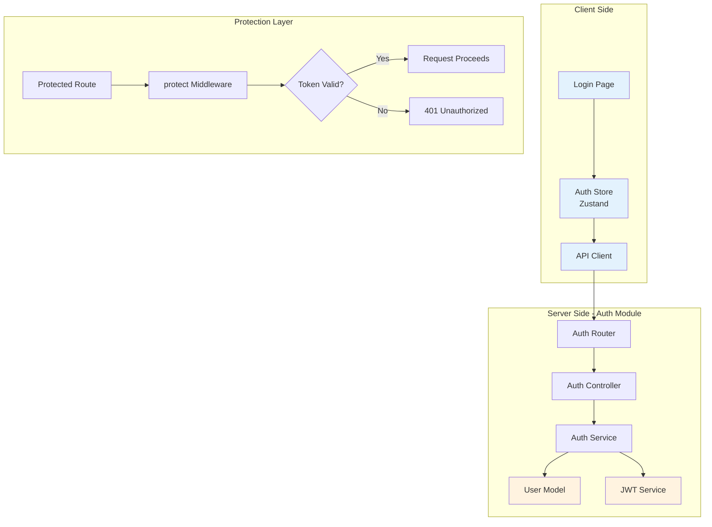

# Authentication Module

## 1. Architecture Level

The Authentication module handles user registration, login, token management, and request authentication. It provides JWT-based authentication with middleware protection for secure API access.

### Authentication Flow Architecture



### Module Structure

```
server/src/modules/auth/
├── controller.js        # HTTP request handlers
├── service.js          # Business logic & token generation
├── middleware.js       # JWT verification middleware
└── route.js           # Route definitions

web/
├── app/login/         # Login page component
├── app/register/      # Registration page component
├── stores/auth.ts     # Zustand auth state management
└── lib/api.ts        # API client with auth helpers
```

### Authentication Data Flow

```mermaid
sequenceDiagram
    participant C as Client
    participant R as Router
    participant M as Middleware
    participant Ctrl as Controller
    participantSvc as Service
    participant DB as Database

    Note over C,DB: Registration Flow
    C->>R: POST /auth/register {email,password,name}
    R->>Ctrl: register(req,res)
    Ctrl->>Ctrl: Validate inputs
    Ctrl->>Svc: register({email,password,name})
    Svc->>DB: Check existing user
    DB-->>Svc: Not found
    Svc->>Svc: Generate uniqueCode
    Svc->>DB: Create user
    DB-->>Svc: User created
    Svc->>Svc: generateToken(user)
    Svc-->>Ctrl: {user, token}
    Ctrl-->>C: {success:true, user, token}
    C->>C: Store in auth store

    Note over C,DB: Login Flow
    C->>R: POST /auth/login {email,password}
    R->>Ctrl: login(req,res)
    Ctrl->>Svc: login(email,password)
    Svc->>DB: User.findOne().populate('role')
    DB-->>Svc: User with role
    Svc->>Svc: comparePassword()
    Svc->>DB: Update lastLogin
    Svc->>Svc: generateToken(user)
    Svc-->>Ctrl: {user, token}
    Ctrl-->>C: {success:true, user, token}
    C->>C: Store token in localStorage

    Note over C,DB: Protected Request Flow
    C->>M: GET /auth/me<br/>Authorization: Bearer {token}
    M->>M: Extract token from header
    M->>M: jwt.verify(token, secret)
    alt Token Valid
        M->>M: Attach user to req
        M->>Ctrl: getMe(req,res)
        Ctrl-->>C: User data
    else Token Invalid/Expired
        M-->>C: 401 Unauthorized
    end
```

## 2. Function Level

### AuthController Functions

| Function | Method | Endpoint | Description |
|----------|--------|----------|-------------|
| `register()` | POST | `/api/auth/register` | Register new user account |
| `login()` | POST | `/api/auth/login` | Authenticate user and return token |
| `getMe()` | GET | `/api/auth/me` | Get current authenticated user |

### AuthService Functions

| Function | Parameters | Returns | Description |
|----------|-----------|---------|-------------|
| `register()` | `{email, password, name}` | `Promise<User>` | Create new user with unique code |
| `login()` | `email, password` | `Promise<User>` | Validate credentials |
| `generateToken()` | `user` | `string` | Generate JWT token |
| `getUserById()` | `userId` | `Promise<User>` | Fetch user by ID |
| `generateUniqueCode()` | - | `Promise<string>` | Generate 16-char unique code |
| `getDefaultRole()` | - | `Promise<Role>` | Get or create default role |
| `formatUserData()` | `user` | `Promise<object>` | Format user for client response |

### Middleware Functions

| Function | Description |
|----------|-------------|
| `protect()` | Verify JWT token and attach user to request |

### Frontend Auth Store Actions

| Action | Parameters | Description |
|--------|-----------|-------------|
| `login()` | `user, token` | Store user and token in state |
| `logout()` | - | Clear auth state and localStorage |
| `setUser()` | `user` | Update user in state |
| `setLoading()` | `boolean` | Set loading state |
| `setHasHydrated()` | `boolean` | Mark hydration complete |

## 3. Code Level

### Backend Implementation

#### Auth Controller

**File**: `server/src/modules/auth/controller.js`

```javascript
import authService from './service.js';

class AuthController {
  /**
   * Register a new user
   * POST /api/auth/register
   * Body: { email, password, name }
   */
  async register(req, res) {
    try {
      const { email, password, name } = req.body;

      // Input validation
      if (!email || !password || !name) {
        return res.status(400).json({
          success: false,
          error: '缺少必要参数：邮箱、密码、姓名'
        });
      }

      // Email format validation
      if (typeof email !== 'string' || email.trim() === '') {
        return res.status(400).json({
          success: false,
          error: '邮箱格式不正确'
        });
      }

      // Password length validation
      if (typeof password !== 'string' || password.length < 6) {
        return res.status(400).json({
          success: false,
          error: '密码长度至少为6位'
        });
      }

      // Create user via service
      const user = await authService.register({ email, password, name });

      // Generate JWT token
      const token = authService.generateToken(user);

      res.json({
        success: true,
        user,
        token
      });
    } catch (error) {
      res.status(400).json({
        success: false,
        error: error.message
      });
    }
  }

  /**
   * Login user
   * POST /api/auth/login
   * Body: { email, password }
   */
  async login(req, res) {
    try {
      const { email, password } = req.body;

      // Input validation
      if (!email || !password) {
        return res.status(400).json({
          success: false,
          error: '缺少必要参数：邮箱、密码'
        });
      }

      if (typeof email !== 'string' || email.trim() === '') {
        return res.status(400).json({
          success: false,
          error: '邮箱格式不正确'
        });
      }

      if (typeof password !== 'string' || password.length === 0) {
        return res.status(400).json({
          success: false,
          error: '密码不能为空'
        });
      }

      // Authenticate via service
      const user = await authService.login(email, password);

      // Generate JWT token
      const token = authService.generateToken(user);

      res.json({
        success: true,
        user,
        token
      });
    } catch (error) {
      res.status(401).json({
        success: false,
        error: error.message
      });
    }
  }

  /**
   * Get current authenticated user
   * GET /api/auth/me
   * Requires: JWT token
   */
  async getMe(req, res) {
    try {
      // User is attached to req by protect middleware
      const user = await authService.getUserById(req.user.id || req.user._id);

      console.log('[AuthController] /auth/me 返回用户数据:', {
        userId: user._id,
        hasCompanionChat: !!user.companionChat,
        companionChat: user.companionChat ? {
          hasRoleCard: !!user.companionChat.roleCard,
          memoryTokenCount: user.companionChat.roleCard?.memoryTokenCount
        } : null
      });

      res.json({
        success: true,
        user
      });
    } catch (error) {
      res.status(404).json({
        success: false,
        error: error.message
      });
    }
  }
}

export default new AuthController();
```

#### Auth Service

**File**: `server/src/modules/auth/service.js`

```javascript
import jwt from 'jsonwebtoken';
import User from '../user/model.js';
import Role from '../roles/models/role.js';
import RolecardStorage from '../../core/storage/rolecard.js';

const JWT_SECRET = process.env.JWT_SECRET || 'afs-super-secret-key-2025-change-me-in-production';

class AuthService {
  /**
   * Generate unique 16-character code
   * Uses base36 encoding for URL-safe characters
   */
  async generateUniqueCode() {
    const code = Math.random().toString(36).substring(2, 18).toUpperCase();
    return code;
  }

  /**
   * Get or create default system role
   * Ensures every user has a role assigned
   */
  async getDefaultRole() {
    let defaultRole = await Role.findOne({ isSystem: true });
    if (!defaultRole) {
      // Create system default role if it doesn't exist
      defaultRole = await Role.create({
        name: 'user',
        description: '默认用户角色',
        isSystem: true,
        permissions: []
      });
    }
    return defaultRole;
  }

  /**
   * Format user data for client response
   * Handles dual storage (MongoDB + file system) for rolecard data
   */
  async formatUserData(user) {
    const userData = {
      _id: user._id,
      id: user._id,
      uniqueCode: user.uniqueCode,
      email: user.email,
      name: user.name,
      createdAt: user.createdAt,
      lastLogin: user.lastLogin
    };

    // Fallback to file system for rolecard data
    if (!user.companionChat) {
      try {
        const rolecardStorage = new RolecardStorage();
        const rolecard = await rolecardStorage.getLatestRolecard(user._id);

        if (rolecard) {
          userData.companionChat = {
            memoryTokenCount: 0,
            currentMode: 'mode1',
            relationships: [],
            roleCard: {
              personality: rolecard.systemPrompt,
              background: '',
              interests: [],
              communicationStyle: '',
              values: [],
              emotionalNeeds: [],
              lifeMilestones: [],
              preferences: [],
              strangerInitialSentiment: '',
              generatedAt: rolecard.generatedAt,
              updatedAt: rolecard.generatedAt,
              memoryTokenCount: 0
            },
            modelStatus: { hasCustomModel: false, trainingStatus: 'none' }
          };
        } else {
          // Empty companion chat structure
          userData.companionChat = {
            memoryTokenCount: 0,
            currentMode: 'mode1',
            relationships: [],
            roleCard: {
              personality: '',
              background: '',
              interests: [],
              communicationStyle: '',
              values: [],
              emotionalNeeds: [],
              lifeMilestones: [],
              preferences: [],
              strangerInitialSentiment: '',
              generatedAt: null,
              updatedAt: null
            },
            modelStatus: { hasCustomModel: false, trainingStatus: 'none' }
          };
        }
      } catch (error) {
        console.error('[AuthService] 从文件系统读取角色卡失败:', error);
        userData.companionChat = {
          memoryTokenCount: 0,
          currentMode: 'mode1',
          relationships: [],
          roleCard: { /* empty structure */ },
          modelStatus: { hasCustomModel: false, trainingStatus: 'none' }
        };
      }
    } else {
      userData.companionChat = user.companionChat;
    }

    // Handle role information
    if (user.role && !userData.companionChat?.roleCard) {
      const rolecardStorage = new RolecardStorage();
      const rolecard = await rolecardStorage.getLatestRolecard(user._id);

      if (rolecard) {
        userData.companionChat.roleCard = {
          personality: rolecard.systemPrompt,
          background: '',
          interests: [],
          communicationStyle: '',
          values: [],
          emotionalNeeds: [],
          lifeMilestones: [],
          preferences: [],
          strangerInitialSentiment: '',
          generatedAt: rolecard.generatedAt,
          updatedAt: rolecard.generatedAt
        };
      }
    }

    // Add role to response
    if (user.role && typeof user.role === 'object') {
      userData.role = user.role;
    } else {
      userData.role = {
        _id: 'default',
        name: 'user',
        description: '默认用户',
        permissions: [],
        isSystem: true
      };
    }

    return userData;
  }

  /**
   * Register new user
   * @param {string} email - User email
   * @param {string} password - User password (min 6 chars)
   * @param {string} name - Display name
   * @returns {Promise<object>} Formatted user data
   */
  async register({ email, password, name }) {
    // Validate email
    if (!email || typeof email !== 'string' || email.trim() === '') {
      throw new Error('邮箱格式不正确');
    }

    // Validate password
    if (!password || typeof password !== 'string' || password.length < 6) {
      throw new Error('密码长度至少为6位');
    }

    // Validate name
    if (!name || typeof name !== 'string' || name.trim() === '') {
      throw new Error('姓名不能为空');
    }

    // Check for existing user
    const existingUser = await User.findOne({ email: email.toLowerCase() });
    if (existingUser) {
      throw new Error('该邮箱已被注册');
    }

    // Generate unique code and get default role
    const uniqueCode = await this.generateUniqueCode();
    const defaultRole = await this.getDefaultRole();

    // Create user
    const newUser = new User({
      email: email.toLowerCase(),
      password,
      name: name || '用户',
      uniqueCode,
      role: defaultRole._id
    });

    await newUser.save();

    return this.formatUserData(newUser);
  }

  /**
   * Login user
   * @param {string} email - User email
   * @param {string} password - User password
   * @returns {Promise<object>} Formatted user data
   */
  async login(email, password) {
    // Validate email
    if (!email || typeof email !== 'string' || email.trim() === '') {
      throw new Error('邮箱格式不正确');
    }

    // Validate password
    if (!password || typeof password !== 'string' || password.length === 0) {
      throw new Error('密码不能为空');
    }

    // Find user with role
    const user = await User.findOne({ email: email.toLowerCase() }).populate('role');
    if (!user) {
      throw new Error('用户不存在');
    }

    // Verify password
    const isPasswordValid = await user.comparePassword(password);
    if (!isPasswordValid) {
      throw new Error('密码错误');
    }

    // Update last login
    user.lastLogin = new Date();
    await user.save();

    return this.formatUserData(user);
  }

  /**
   * Generate JWT token
   * @param {object} user - User object
   * @returns {string} JWT token valid for 7 days
   */
  generateToken(user) {
    return jwt.sign(
      {
        id: user._id || user.id,
        email: user.email,
        uniqueCode: user.uniqueCode
      },
      JWT_SECRET,
      { expiresIn: '7d' }
    );
  }

  /**
   * Get user by ID
   * @param {string} userId - User ID
   * @returns {Promise<object>} Formatted user data
   */
  async getUserById(userId) {
    const user = await User.findById(userId).populate('role');
    if (!user) {
      throw new Error('用户不存在');
    }
    return this.formatUserData(user);
  }
}

export default new AuthService();
```

#### Protect Middleware

**File**: `server/src/modules/auth/middleware.js`

```javascript
import jwt from 'jsonwebtoken';

const JWT_SECRET = process.env.JWT_SECRET || 'afs-super-secret-key-2025-change-me-in-production';

/**
 * Authentication middleware
 * Verifies JWT token from Authorization header
 * Attaches decoded user to req.user
 */
export const protect = (req, res, next) => {
  // Extract token from "Bearer <token>" format
  const token = req.headers.authorization?.split(' ')[1];

  if (!token) {
    return res.status(401).json({
      success: false,
      message: '未登录，请先登录'
    });
  }

  try {
    // Verify token signature and expiration
    const decoded = jwt.verify(token, JWT_SECRET);

    // Attach decoded user data to request
    req.user = decoded;

    // Proceed to next middleware/route handler
    next();
  } catch (err) {
    // Handle token expiration or invalid signature
    return res.status(401).json({
      success: false,
      message: '登录已过期，请重新登录'
    });
  }
};
```

#### Auth Routes

**File**: `server/src/modules/auth/route.js`

```javascript
import express from 'express';
import authController from './controller.js';
import { protect } from './middleware.js';

const router = express.Router();

// Public routes
router.post('/register', authController.register);
router.post('/login', authController.login);

// Protected routes
router.get('/me', protect, (req, res) => {
  authController.getMe(req, res);
});

export default router;
```

### Frontend Implementation

#### Login Page Component

**File**: `web/app/login/page.tsx`

```typescript
'use client'

import { useState } from 'react';
import { useRouter } from 'next/navigation';
import { useAuthStore } from '@/stores/auth';
import { postAuth } from '@/lib/api';

export default function LoginPage() {
  const router = useRouter();
  const login = useAuthStore((state) => state.login);
  const setLoading = useAuthStore((state) => state.setLoading);

  const [email, setEmail] = useState('');
  const [password, setPassword] = useState('');
  const [error, setError] = useState('');
  const [isLoading, setIsLoading] = useState(false);

  const handleSubmit = async (e: React.FormEvent) => {
    e.preventDefault();
    setError('');

    // Client-side validation
    if (!email.trim()) {
      setError('请输入邮箱');
      return;
    }

    if (!password.trim()) {
      setError('请输入密码');
      return;
    }

    if (!email.includes('@') || !email.includes('.')) {
      setError('请输入有效的邮箱地址');
      return;
    }

    if (password.length < 6) {
      setError('密码长度至少为6位');
      return;
    }

    setIsLoading(true);
    setLoading(true);

    try {
      // Call login API
      const response = await postAuth('/auth/login', {
        email: email.trim().toLowerCase(),
        password,
      });

      if (response.success && response.user && response.token) {
        // Store user and token in Zustand
        login(response.user, response.token);

        // Redirect to dashboard
        router.push('/dashboard');
      } else {
        setError(response.error || '登录失败');
      }
    } catch (err: any) {
      console.error('登录错误:', err);

      if (err.status === 400) {
        setError('请检查输入的邮箱和密码格式');
      } else if (err.status === 401) {
        setError('邮箱或密码错误');
      } else if (err.message) {
        setError(err.message);
      } else {
        setError('网络错误，请稍后重试');
      }
    } finally {
      setIsLoading(false);
      setLoading(false);
    }
  };

  // ... JSX render code
}
```

#### Auth Store (Zustand)

**File**: `web/stores/auth.ts`

```typescript
import { create } from 'zustand';
import { persist, createJSONStorage } from 'zustand/middleware';
import type { User } from '@/types';

interface AuthState {
  user: User | null;
  token: string | null;
  isAuthenticated: boolean;
  isLoading: boolean;
  hasHydrated: boolean;
  login: (user: User, token: string) => void;
  logout: () => void;
  setUser: (user: User) => void;
  setLoading: (loading: boolean) => void;
  setHasHydrated: (state: boolean) => void;
}

export const useAuthStore = create<AuthState>()(
  persist(
    (set, get) => ({
      user: null,
      token: null,
      isAuthenticated: false,
      isLoading: false,
      hasHydrated: false,

      login: (user, token) => {
        console.log('[Auth] Login called, storing token to localStorage');

        // Store token to localStorage for API calls
        if (typeof window !== 'undefined') {
          localStorage.setItem('token', token);
          console.log('[Auth] Token stored to localStorage:', token.substring(0, 20) + '...');
        }

        set({
          user,
          token,
          isAuthenticated: true,
          isLoading: false,
        });
      },

      logout: () => {
        console.log('[Auth] Logout called, removing token from localStorage');

        // Clear token from localStorage
        if (typeof window !== 'undefined') {
          localStorage.removeItem('token');
        }

        set({
          user: null,
          token: null,
          isAuthenticated: false,
          isLoading: false,
        });
      },

      setUser: (user) => {
        set({ user });
      },

      setLoading: (isLoading) => set({ isLoading }),

      setHasHydrated: (hasHydrated) => {
        console.log('[Auth] Hydration state changed:', hasHydrated);
        set({ hasHydrated });
      },
    }),
    {
      name: 'auth-storage',
      storage: createJSONStorage(() => localStorage),
      partialize: (state) => ({
        user: state.user,
        token: state.token,
        isAuthenticated: state.isAuthenticated,
      }),
      onRehydrateStorage: () => (state) => {
        console.log('[Auth] onRehydrateStorage called');
        state?.setHasHydrated(true);

        // Sync token to localStorage after hydration
        if (state?.token && typeof window !== 'undefined') {
          console.log('[Auth] Syncing token to localStorage after hydration:', state.token.substring(0, 20) + '...');
          localStorage.setItem('token', state.token);
        }
      }
    }
  )
);
```

#### API Client

**File**: `web/lib/api.ts`

```typescript
const API_BASE_URL = process.env.NEXT_PUBLIC_API_URL || 'http://localhost:3001';

export const API_URL = `${API_BASE_URL}/api`;

export interface AuthResponse {
  success: boolean;
  user?: any;
  token?: string;
  error?: string;
  status?: number;
}

// Get token from localStorage
const getToken = (): string | undefined => {
  if (typeof window === 'undefined') return undefined;
  try {
    const token = localStorage.getItem('token');
    return token || undefined;
  } catch {
    return undefined;
  }
};

/**
 * Authentication request helper
 * Returns AuthResponse format for login/register
 */
export async function postAuth(endpoint: string, body: any): Promise<AuthResponse> {
  const headers: HeadersInit = {
    'Content-Type': 'application/json',
  };

  const url = `${API_URL}${endpoint}`;

  try {
    const response = await fetch(url, {
      method: 'POST',
      headers,
      body: JSON.stringify(body),
    });
    const data = await response.json();

    if (!response.ok) {
      return {
        success: false,
        error: data.error || '请求失败',
        status: response.status
      };
    }

    return data;
  } catch (error) {
    return {
      success: false,
      error: error instanceof Error ? error.message : '网络错误',
    };
  }
}

/**
 * Generic API request with automatic token injection
 */
export async function apiRequest<T = any>(
  endpoint: string,
  options: RequestInit = {}
): Promise<{ success: boolean; error?: string; data?: T }> {
  const url = `${API_URL}${endpoint}`;

  const headers: Record<string, string> = {
    'Content-Type': 'application/json',
  };

  // Add user headers
  if (options.headers) {
    const userHeaders = options.headers as Record<string, string>;
    Object.keys(userHeaders).forEach(key => {
      headers[key] = userHeaders[key];
    });
  }

  // Auto-add Authorization header
  if (!headers['Authorization'] && typeof window !== 'undefined') {
    const token = getToken();
    if (token) {
      console.log('[API] Sending request with token:', token.substring(0, 20) + '...');
      headers['Authorization'] = `Bearer ${token}`;
    }
  }

  const config: RequestInit = {
    ...options,
    headers,
  };

  try {
    const response = await fetch(url, config);
    const data = await response.json();

    if (!response.ok) {
      return {
        success: false,
        error: data.error || '请求失败',
      };
    }

    return data;
  } catch (error) {
    return {
      success: false,
      error: error instanceof Error ? error.message : '网络错误',
    };
  }
}
```

## Error Handling

### Common Error Responses

| Status | Error | Description |
|--------|-------|-------------|
| 400 | `缺少必要参数：邮箱、密码、姓名` | Missing required registration fields |
| 400 | `邮箱格式不正确` | Invalid email format |
| 400 | `密码长度至少为6位` | Password too short |
| 400 | `该邮箱已被注册` | Email already exists |
| 401 | `用户不存在` | User not found during login |
| 401 | `密码错误` | Invalid password |
| 401 | `未登录，请先登录` | No token provided |
| 401 | `登录已过期，请重新登录` | Token expired or invalid |

## Security Considerations

1. **JWT Secret**: Should be changed in production environment
2. **Token Expiration**: Tokens expire after 7 days
3. **Password Hashing**: Uses bcrypt with 10 salt rounds
4. **Email Normalization**: All emails stored in lowercase
5. **Token Storage**: Stored in localStorage (consider httpOnly cookies for production)
