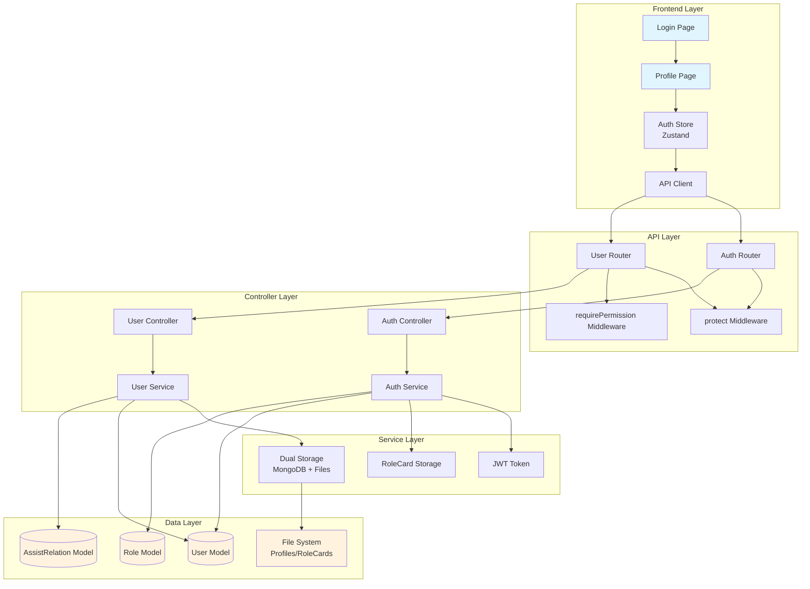
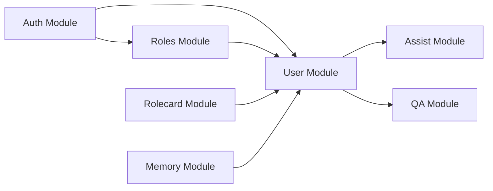
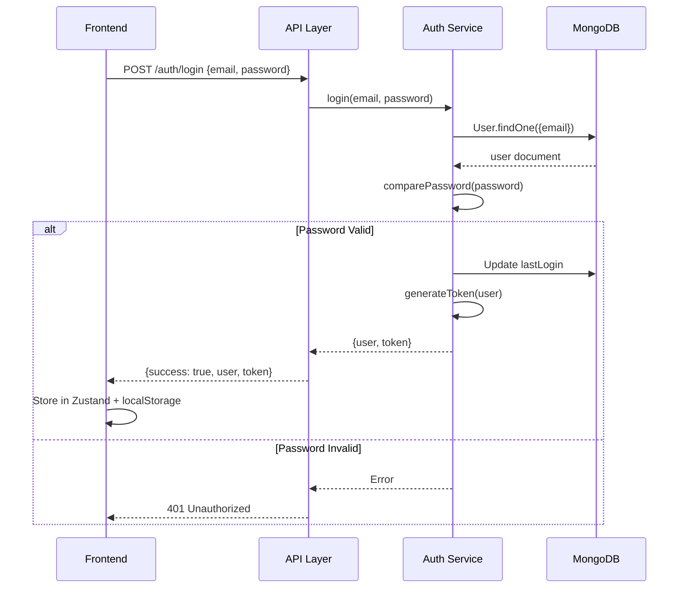
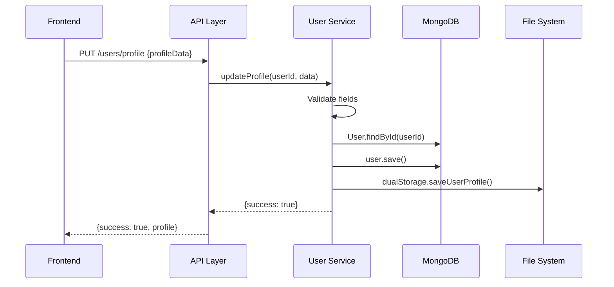
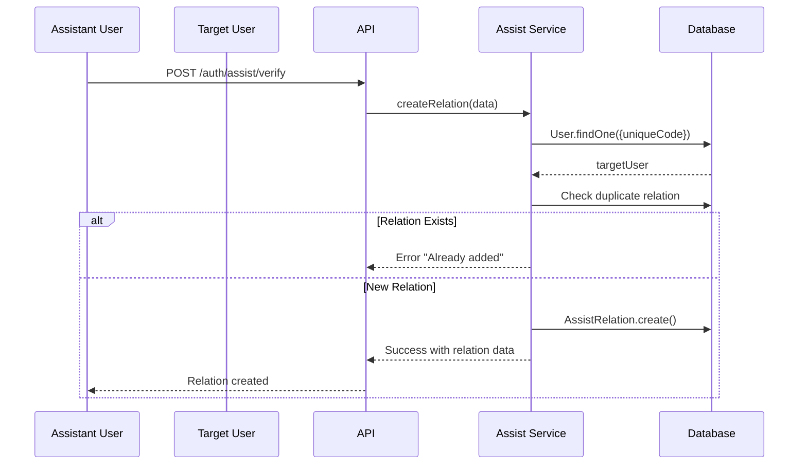

# User System Overview

## 1. Architecture Level

The User System is a core component of AFS System that handles user management, authentication, profile management, and family assist relationships. It follows a layered architecture with clear separation of concerns.

### System Architecture Diagram



### Module Dependencies



### File Structure

```
server/src/modules/
├── auth/                          # Authentication module
│   ├── controller.js              # Request handlers
│   ├── service.js                 # Business logic
│   ├── middleware.js              # JWT protection
│   └── route.js                   # API routes
├── user/                          # User management module
│   ├── model.js                   # User schema
│   ├── controller.js              # Request handlers
│   ├── service.js                 # Business logic
│   ├── repository.js              # Data access layer
│   └── route.js                   # API routes
├── roles/                         # Role & permissions module
│   ├── models/
│   │   ├── role.js               # Role schema
│   │   └── permission.js         # Permission schema
│   ├── controller.js
│   ├── service.js
│   └── route.js
└── assist/                        # Family assist relations
    ├── model.js                   # AssistRelation schema
    ├── controller.js
    ├── service.js
    └── route.js (merged into auth)

web/
├── app/
│   ├── login/page.tsx             # Login page
│   ├── register/page.tsx          # Registration page
│   └── profile/page.tsx           # Profile management
├── stores/
│   └── auth.ts                    # Zustand auth store
├── lib/
│   └── api.ts                     # API client
└── types/
    └── index.ts                   # TypeScript types
```

## 2. Function Level

### Core Functionalities

| Module | Function | Description |
|--------|----------|-------------|
| Auth | User Registration | Creates new user with unique code and default role |
| Auth | User Login | Validates credentials and returns JWT token |
| Auth | Token Verification | Middleware to protect routes |
| Auth | Get Current User | Returns authenticated user data |
| User | Get Profile | Fetches user profile data |
| User | Update Profile | Updates user profile with validation |
| User | User Management | CRUD operations for admin users |
| User | User Statistics | Aggregated user metrics |
| Roles | Role Management | CRUD for roles and permissions |
| Assist | Search Users | Find users by code or email |
| Assist | Create Relation | Establish assist relationship |
| Assist | Get Relations | Fetch user's assist relationships |
| Assist | Delete Relation | Remove assist relationship |
| Assist | Batch Update | Update multiple relations at once |

### Data Flow: Authentication



### Data Flow: Profile Update



### Data Flow: Assist Relation Creation



## 3. Code Level

### User Model Schema

**File**: `server/src/modules/user/model.js`

The User model uses Mongoose with bcrypt for password hashing and includes comprehensive profile and chat-related data.

```javascript
// Key schema fields
const userSchema = new mongoose.Schema({
  uniqueCode: {
    type: String,
    required: true,
    unique: true,
    index: true
  },
  email: {
    type: String,
    required: true,
    unique: true,
    lowercase: true,
    trim: true
  },
  password: {
    type: String,
    required: true
  },
  name: {
    type: String,
    default: '用户'
  },
  role: {
    type: mongoose.Schema.Types.ObjectId,
    ref: 'Role'
  },
  isActive: {
    type: Boolean,
    default: true
  },

  // Profile data
  profile: {
    gender: { type: String, enum: ['男', '女', '其他'] },
    birthDate: Date,
    birthHour: { type: Number, min: 0, max: 23 },
    birthPlace: {
      provinceCode: String,
      provinceName: String,
      cityCode: String,
      cityName: String
    },
    residence: { /* similar structure */ },
    nationality: String,
    ethnicity: String,
    occupation: String,
    education: String,
    maritalStatus: String,
    children: {
      sons: { type: Number, default: 0 },
      daughters: { type: Number, default: 0 }
    },
    height: Number,
    appearanceFeatures: String
  },

  // AI Companion Chat features
  companionChat: {
    roleCard: { /* personality, background, etc. */ },
    assistantsGuidelines: [{ /* per-assistant guidelines */ }],
    currentMode: { type: String, enum: ['mode1', 'mode2', 'mode3'] },
    modelStatus: { /* training status */ },
    strangerSentiments: [{ /* sentiment tracking */ }],
    conversationsAsTarget: [{ /* chat history */ }]
  }
});
```

**Static Method - generateUniqueCode()**

```javascript
// Generates a 16-character unique code
userSchema.statics.generateUniqueCode = async function() {
  let code;
  let exists = true;

  while (exists) {
    code = generateUniqueCode();
    const user = await this.findOne({ uniqueCode: code });
    exists = !!user;
  }

  return code;
};
```

**Pre-save Hook - Password Hashing**

```javascript
// Automatically hash passwords before saving
userSchema.pre('save', async function (next) {
  if (this.isModified('password')) {
    this.password = await bcrypt.hash(this.password, 10);
  }
  next();
});
```

**Instance Method - Password Comparison**

```javascript
// Compare candidate password with hashed password
userSchema.methods.comparePassword = async function (candidatePassword) {
  return bcrypt.compare(candidatePassword, this.password);
};
```

### Auth Service Key Methods

**File**: `server/src/modules/auth/service.js`

**register() - User Registration**

```javascript
async register({ email, password, name }) {
  // 1. Validate inputs
  if (!email || typeof email !== 'string' || email.trim() === '') {
    throw new Error('邮箱格式不正确');
  }
  if (!password || typeof password !== 'string' || password.length < 6) {
    throw new Error('密码长度至少为6位');
  }

  // 2. Check for existing user
  const existingUser = await User.findOne({ email: email.toLowerCase() });
  if (existingUser) {
    throw new Error('该邮箱已被注册');
  }

  // 3. Generate unique code and get default role
  const uniqueCode = await this.generateUniqueCode();
  const defaultRole = await this.getDefaultRole();

  // 4. Create new user
  const newUser = new User({
    email: email.toLowerCase(),
    password,
    name: name || '用户',
    uniqueCode,
    role: defaultRole._id
  });

  await newUser.save();

  // 5. Return formatted user data
  return this.formatUserData(newUser);
}
```

**generateToken() - JWT Token Generation**

```javascript
generateToken(user) {
  return jwt.sign(
    {
      id: user._id || user.id,
      email: user.email,
      uniqueCode: user.uniqueCode
    },
    JWT_SECRET,
    { expiresIn: '7d' }
  );
}
```

**formatUserData() - User Data Formatting**

```javascript
async formatUserData(user) {
  const userData = {
    _id: user._id,
    id: user._id,
    uniqueCode: user.uniqueCode,
    email: user.email,
    name: user.name,
    createdAt: user.createdAt,
    lastLogin: user.lastLogin
  };

  // Handle companionChat data from file system fallback
  if (!user.companionChat) {
    try {
      const rolecardStorage = new RolecardStorage();
      const rolecard = await rolecardStorage.getLatestRolecard(user._id);

      if (rolecard) {
        userData.companionChat = {
          roleCard: {
            personality: rolecard.systemPrompt,
            // ... other fields
          },
          // ... other companionChat fields
        };
      }
    } catch (error) {
      console.error('[AuthService] 从文件系统读取角色卡失败:', error);
    }
  }

  // Add role information
  if (user.role && typeof user.role === 'object') {
    userData.role = user.role;
  } else {
    userData.role = {
      _id: 'default',
      name: 'user',
      description: '默认用户',
      permissions: [],
      isSystem: true
    };
  }

  return userData;
}
```

### Protect Middleware

**File**: `server/src/modules/auth/middleware.js`

```javascript
export const protect = (req, res, next) => {
  // Extract token from Authorization header
  const token = req.headers.authorization?.split(' ')[1];

  if (!token) {
    return res.status(401).json({
      success: false,
      message: '未登录，请先登录'
    });
  }

  try {
    // Verify JWT token
    const decoded = jwt.verify(token, JWT_SECRET);
    req.user = decoded;
    next();
  } catch (err) {
    return res.status(401).json({
      success: false,
      message: '登录已过期，请重新登录'
    });
  }
};
```

### Assist Relation Model

**File**: `server/src/modules/assist/model.js`

```javascript
const assistRelationSchema = new mongoose.Schema({
  assistantId: {
    type: mongoose.Schema.Types.ObjectId,
    ref: 'User',
    required: true,
    index: true
  },
  targetId: {
    type: mongoose.Schema.Types.ObjectId,
    ref: 'User',
    required: true,
    index: true
  },
  relationshipType: {
    type: String,
    enum: ['family', 'friend'],
    required: true
  },
  specificRelation: {
    type: String,
    default: ''
  },
  friendLevel: {
    type: String,
    enum: ['casual', 'close', 'intimate'],
    default: 'casual'
  },
  createdAt: { type: Date, default: Date.now },
  isActive: { type: Boolean, default: true },

  // Answer summary for guidelines generation
  answerSummary: {
    hasAnswers: Boolean,
    basicAnswersCount: Number,
    emotionalAnswersCount: Number,
    lastAnswerUpdatedAt: Date
  },

  guidelinesGenerated: { type: Boolean, default: false }
});

// Compound index to prevent duplicate relations
assistRelationSchema.index({ assistantId: 1, targetId: 1 }, { unique: true });
```

### Role and Permission Models

**Files**: `server/src/modules/roles/models/role.js`, `server/src/modules/roles/models/permission.js`

```javascript
// Permission Schema
const permissionSchema = new mongoose.Schema({
  name: {
    type: String,
    required: true,
    unique: true,
    trim: true
  },
  description: { type: String, default: '' },
  category: {
    type: String,
    enum: ['user', 'role', 'system', 'content', 'other'],
    default: 'other'
  }
});

// Role Schema
const roleSchema = new mongoose.Schema({
  name: {
    type: String,
    required: true,
    unique: true,
    trim: true
  },
  description: { type: String, default: '' },
  permissions: [{
    type: mongoose.Schema.Types.ObjectId,
    ref: 'Permission'
  }],
  isSystem: { type: Boolean, default: false },
  isAdmin: { type: Boolean, default: false }
});
```

## API Endpoints Summary

| Method | Endpoint | Description | Protected |
|--------|----------|-------------|-----------|
| POST | `/api/auth/register` | User registration | No |
| POST | `/api/auth/login` | User login | No |
| GET | `/api/auth/me` | Get current user | Yes |
| GET | `/api/users/profile` | Get user profile | Yes |
| PUT | `/api/users/profile` | Update profile | Yes |
| GET | `/api/users` | List all users | Yes + Permission |
| GET | `/api/users/:id` | Get user by ID | Yes + Permission |
| POST | `/api/users` | Create user | Yes + Permission |
| PUT | `/api/users/:id` | Update user | Yes + Permission |
| DELETE | `/api/users/:id` | Delete user | Yes + Permission |
| GET | `/api/auth/assist/search` | Search users | Yes |
| POST | `/api/auth/assist/verify` | Create relation | Yes |
| GET | `/api/auth/assist/relations` | Get relations | Yes |
| GET | `/api/auth/assist/helpers` | Get helpers | Yes |
| DELETE | `/api/auth/assist/relations/:id` | Delete relation | Yes |

## Configuration

### Environment Variables

```env
# JWT Configuration
JWT_SECRET=afs-super-secret-key-2025-change-me-in-production

# API Configuration
NEXT_PUBLIC_API_URL=http://localhost:3001
```

### Default Roles and Permissions

The system initializes with default roles and permissions on first startup:

**Permissions:**
- `user:view` - View users
- `user:create` - Create users
- `user:update` - Update users
- `user:delete` - Delete users
- `role:view` - View roles
- `role:create` - Create roles
- `role:update` - Update roles
- `role:delete` - Delete roles
- `permission:view` - View permissions
- `system:view` - View system settings
- `system:update` - Update system settings
- `content:manage` - Manage content

**Roles:**
- **管理员 (Admin)** - Has all permissions
- **普通用户 (User)** - Has `content:manage` permission
