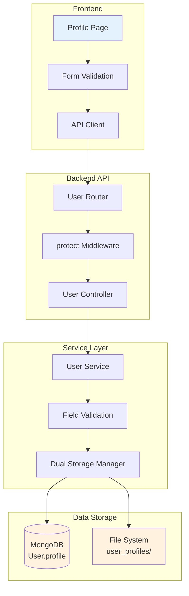
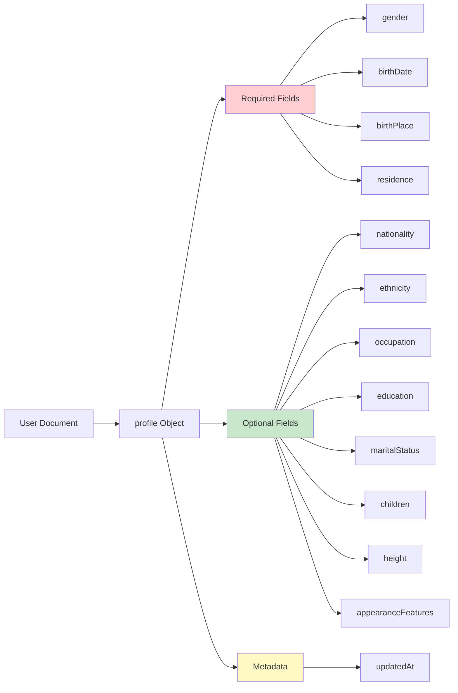
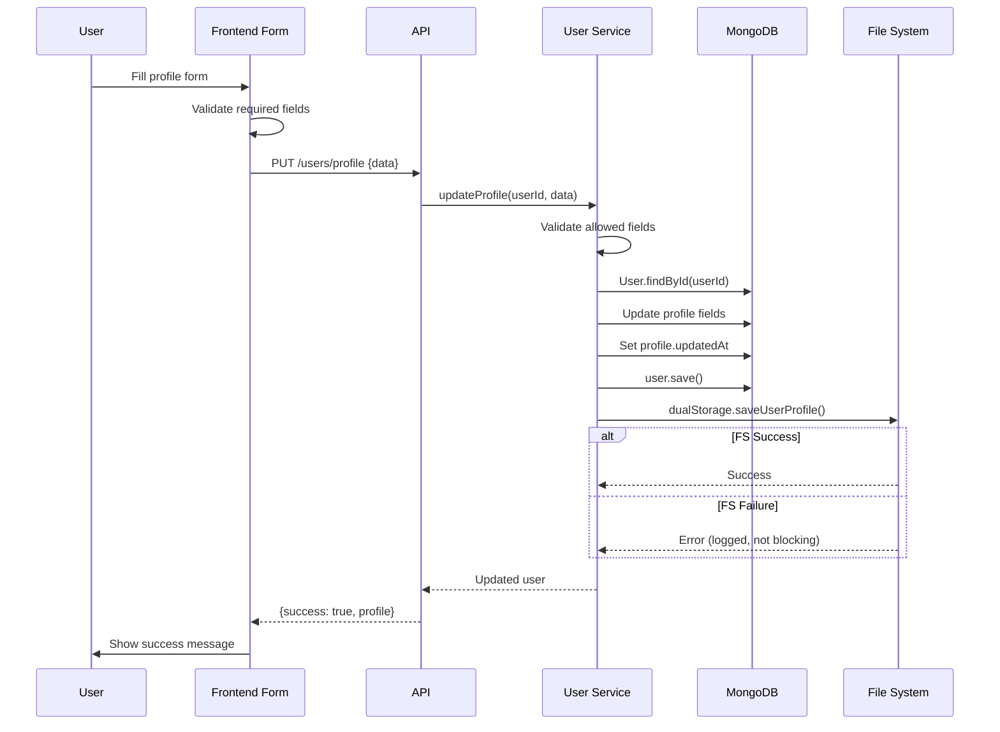

# User Profile Management

## 1. Architecture Level

User Profile Management handles personal demographic information storage and retrieval. It uses a dual storage strategy (MongoDB + File System) to ensure data persistence and enable efficient rolecard generation.

### Profile Data Architecture



### Profile Schema Structure



### Module Structure

```
server/src/modules/user/
├── model.js          # User schema with profile fields
├── controller.js     # Profile get/update endpoints
├── service.js        # Profile business logic
└── route.js         # Profile routes

web/
├── app/profile/
│   └── page.tsx     # Profile form component
└── components/
    └── ProvinceCitySelector.tsx  # Location picker
```

### Profile Update Flow



## 2. Function Level

### UserController Profile Functions

| Function | Method | Endpoint | Description |
|----------|--------|----------|-------------|
| `getProfile()` | GET | `/api/users/profile` | Get current user's profile |
| `updateProfile()` | PUT | `/api/users/profile` | Update current user's profile |

### UserService Profile Functions

| Function | Parameters | Returns | Description |
|----------|-----------|---------|-------------|
| `getProfile()` | `userId` | `Promise<User>` | Fetch user with profile data |
| `updateProfile()` | `userId, profileData` | `Promise<User>` | Validate and update profile |

### DualStorage Profile Functions

| Function | Parameters | Description |
|----------|-----------|-------------|
| `saveUserProfile()` | `userId, profileData` | Save profile to file system |

### Allowed Profile Fields

| Category | Fields | Required |
|----------|--------|----------|
| **Demographic** | `gender`, `birthDate`, `birthHour` | Partial |
| **Location** | `birthPlace`, `residence` | Yes |
| **Personal** | `nationality`, `ethnicity`, `occupation`, `education` | No |
| **Family** | `maritalStatus`, `children` | No |
| **Physical** | `height`, `appearanceFeatures` | No |

### Location Object Structure

Both `birthPlace` and `residence` follow this structure:

```typescript
{
  provinceCode: string;   // Province code
  provinceName: string;   // Province display name
  cityCode: string;       // City code
  cityName: string;       // City display name
}
```

### Children Object Structure

```typescript
{
  sons: number;    // Number of sons (default: 0)
  daughters: number; // Number of daughters (default: 0)
}
```

## 3. Code Level

### Backend Implementation

#### User Model - Profile Schema

**File**: `server/src/modules/user/model.js`

```javascript
// Profile schema within User model
profile: {
  // Required fields
  gender: {
    type: String,
    enum: ['男', '女', '其他'],
    default: undefined
  },
  birthDate: {
    type: Date,
    default: undefined
  },
  birthHour: {
    type: Number,
    min: 0,
    max: 23,
    default: undefined
  },
  birthPlace: {
    provinceCode: String,
    provinceName: String,
    cityCode: String,
    cityName: String
  },
  residence: {
    provinceCode: String,
    provinceName: String,
    cityCode: String,
    cityName: String
  },

  // Optional fields
  nationality: String,
  ethnicity: String,
  occupation: String,
  education: String,
  maritalStatus: {
    type: String,
    enum: ['未婚', '已婚', '离异', '丧偶'],
    default: undefined
  },
  children: {
    sons: { type: Number, default: 0 },
    daughters: { type: Number, default: 0 }
  },
  height: Number,
  appearanceFeatures: String,

  // Metadata
  updatedAt: Date
}
```

#### User Controller - Profile Handlers

**File**: `server/src/modules/user/controller.js`

```javascript
class UserController {
  /**
   * Get user profile
   * GET /api/users/profile
   * Returns: { success: true, profile }
   */
  async getProfile(req, res) {
    try {
      // Get userId from JWT payload
      const userId = req.user.id;  // JWT uses 'id', not '_id'

      // Fetch user with profile fields only
      const profile = await userService.getProfile(userId);

      res.json({
        success: true,
        profile
      });
    } catch (error) {
      res.status(404).json({
        success: false,
        error: error.message
      });
    }
  }

  /**
   * Update user profile
   * PUT /api/users/profile
   * Body: Profile fields to update
   * Returns: { success: true, profile, message }
   */
  async updateProfile(req, res) {
    try {
      // Get userId from JWT payload
      const userId = req.user.id;

      // Get profile data from request body
      const profileData = req.body;

      // Update profile via service
      const user = await userService.updateProfile(userId, profileData);

      res.json({
        success: true,
        profile: user.profile,
        message: '个人档案已更新'
      });
    } catch (error) {
      res.status(400).json({
        success: false,
        error: error.message
      });
    }
  }
}
```

#### User Service - Profile Logic

**File**: `server/src/modules/user/service.js`

```javascript
import User from './model.js';
import DualStorage from '../../core/storage/dual.js';

// Create DualStorage instance
const dualStorage = new DualStorage();

class UserService {
  /**
   * Get user profile
   * @param {string} userId - User ID from JWT
   * @returns {Promise<object>} User with profile data
   */
  async getProfile(userId) {
    // Select only profile-related fields
    const user = await User.findById(userId)
      .select('name email profile uniqueCode');

    if (!user) {
      throw new Error('用户不存在');
    }

    return user;
  }

  /**
   * Update user profile with dual storage
   * @param {string} userId - User ID
   * @param {object} profileData - Profile fields to update
   * @returns {Promise<object>} Updated user
   */
  async updateProfile(userId, profileData) {
    // Find user
    const user = await User.findById(userId);
    if (!user) {
      throw new Error('用户不存在');
    }

    // Define allowed fields for security
    const allowedFields = [
      'gender', 'birthDate', 'birthHour',
      'birthPlace', 'residence',
      'nationality', 'ethnicity', 'occupation', 'education',
      'maritalStatus', 'children', 'height', 'appearanceFeatures'
    ];

    // Initialize profile object if it doesn't exist
    if (!user.profile) {
      user.profile = {};
    }

    // Update only allowed fields
    for (const field of allowedFields) {
      if (profileData[field] !== undefined) {
        user.profile[field] = profileData[field];
      }
    }

    // Update metadata
    user.profile.updatedAt = new Date();

    // Save to MongoDB
    await user.save();

    // Sync to file system (non-blocking)
    try {
      await dualStorage.saveUserProfile(userId, {
        ...user.profile.toObject(),
        userId,
        name: user.name,
        email: user.email,
        uniqueCode: user.uniqueCode,
        updatedAt: new Date().toISOString()
      });
    } catch (error) {
      console.error('[UserService] 同步档案到文件系统失败:', error);
      // File system failure doesn't block the operation
    }

    return user;
  }
}
```

#### User Routes - Profile Endpoints

**File**: `server/src/modules/user/route.js`

```javascript
import express from 'express';
import userController from './controller.js';
import { protect } from '../auth/middleware.js';

const router = express.Router();

// Profile routes - User can access their own profile
// No special permission required beyond being logged in

router.get('/profile', protect, (req, res) => {
  profileLogger.info('GET /profile', { userId: req.user._id });
  userController.getProfile(req, res);
});

router.put('/profile', protect, (req, res) => {
  profileLogger.info('PUT /profile', { userId: req.user._id });
  userController.updateProfile(req, res);
});

export default router;
```

### Frontend Implementation

#### Profile Page Component

**File**: `web/app/profile/page.tsx`

```typescript
'use client'

import { useEffect, useState } from 'react'
import { api } from '@/lib/api'
import { useAuthStore } from '@/stores/auth'

interface ProfileData {
  gender?: string
  birthDate?: string
  birthHour?: number
  birthPlace?: {
    provinceCode: string
    provinceName: string
    cityCode: string
    cityName: string
  }
  residence?: {
    provinceCode: string
    provinceName: string
    cityCode: string
    cityName: string
  }
  nationality?: string
  ethnicity?: string
  occupation?: string
  education?: string
  maritalStatus?: string
  children?: {
    sons: number
    daughters: number
  }
  height?: number
  appearanceFeatures?: string
}

export default function ProfilePage() {
  const { user, hasHydrated } = useAuthStore()
  const [loading, setLoading] = useState(true)
  const [saving, setSaving] = useState(false)
  const [saved, setSaved] = useState(false)
  const [profile, setProfile] = useState<ProfileData>({})

  // Load profile on mount
  useEffect(() => {
    if (hasHydrated) {
      fetchProfile()
    }
  }, [hasHydrated])

  const fetchProfile = async () => {
    try {
      setLoading(true)
      const res = await api.get<{ profile?: ProfileData }>('/users/profile')

      if (res.success && (res as any).profile?.profile) {
        const profileData = (res as any).profile.profile
        setProfile({
          ...profileData,
          birthDate: profileData.birthDate
            ? new Date(profileData.birthDate).toISOString().split('T')[0]
            : undefined
        })
      }
    } catch (error) {
      console.error('获取个人档案失败:', error)
    } finally {
      setLoading(false)
    }
  }

  const handleSave = async () => {
    // Client-side validation for required fields
    if (!profile.gender) {
      alert('请选择性别')
      return
    }
    if (!profile.birthDate) {
      alert('请选择出生日期')
      return
    }
    if (!profile.birthPlace?.provinceCode || !profile.birthPlace?.cityCode) {
      alert('请选择出生地')
      return
    }
    if (!profile.residence?.provinceCode || !profile.residence?.cityCode) {
      alert('请选择常住地')
      return
    }

    try {
      setSaving(true)
      const res = await api.put<{ success: boolean; message: string }>(
        '/users/profile',
        profile
      )
      if (res.success) {
        setSaved(true)
        setTimeout(() => setSaved(false), 2000)
      }
    } catch (error) {
      console.error('保存个人档案失败:', error)
      alert('保存失败，请重试')
    } finally {
      setSaving(false)
    }
  }

  const updateProfile = (field: keyof ProfileData, value: any) => {
    setProfile(prev => ({ ...prev, [field]: value }))
  }

  // ... JSX render code with form fields
}
```

#### TypeScript Types

**File**: `web/types/index.ts`

```typescript
// Profile interface (partial User interface)
export interface User {
  // ... other fields
  profile?: {
    gender?: '男' | '女' | '其他'
    birthDate?: string
    birthHour?: number
    birthPlace?: {
      provinceCode: string
      provinceName: string
      cityCode: string
      cityName: string
    }
    residence?: {
      provinceCode: string
      provinceName: string
      cityCode: string
      cityName: string
    }
    nationality?: string
    ethnicity?: string
    occupation?: string
    education?: string
    maritalStatus?: '未婚' | '已婚' | '离异' | '丧偶'
    children?: {
      sons: number
      daughters: number
    }
    height?: number
    appearanceFeatures?: string
    updatedAt?: string
  }
}
```

## Form Validation Rules

### Required Fields

| Field | Validation | Error Message |
|-------|-----------|---------------|
| `gender` | Must be one of: 男, 女, 其他 | 请选择性别 |
| `birthDate` | Valid ISO date string | 请选择出生日期 |
| `birthPlace.provinceCode` | Non-empty string | 请选择出生地 |
| `birthPlace.cityCode` | Non-empty string | 请选择出生地 |
| `residence.provinceCode` | Non-empty string | 请选择常住地 |
| `residence.cityCode` | Non-empty string | 请选择常住地 |

### Optional Fields

| Field | Type | Validation |
|-------|------|------------|
| `birthHour` | Number | 0-23 |
| `nationality` | String | Max length 255 |
| `ethnicity` | String | Max length 255 |
| `occupation` | String | Max length 255 |
| `education` | String | Max length 255 |
| `maritalStatus` | Enum | 未婚, 已婚, 离异, 丧偶 |
| `children.sons` | Number | >= 0 |
| `children.daughters` | Number | >= 0 |
| `height` | Number | 50-250 (cm) |
| `appearanceFeatures` | String | Text area |

## API Endpoints

### Get Profile

```
GET /api/users/profile
Authorization: Bearer {token}

Response:
{
  "success": true,
  "profile": {
    "gender": "男",
    "birthDate": "1950-01-01",
    "birthHour": 8,
    "birthPlace": {
      "provinceCode": "110000",
      "provinceName": "北京市",
      "cityCode": "110100",
      "cityName": "北京市"
    },
    "residence": { /* ... */ },
    "nationality": "中国",
    "ethnicity": "汉族",
    "occupation": "退休教师",
    "education": "大学",
    "maritalStatus": "已婚",
    "children": { "sons": 1, "daughters": 1 },
    "height": 170,
    "appearanceFeatures": "身材中等，头发花白",
    "updatedAt": "2025-01-15T10:30:00.000Z"
  }
}
```

### Update Profile

```
PUT /api/users/profile
Authorization: Bearer {token}
Content-Type: application/json

Request Body:
{
  "gender": "男",
  "birthDate": "1950-01-01",
  "birthHour": 8,
  "birthPlace": {
    "provinceCode": "110000",
    "provinceName": "北京市",
    "cityCode": "110100",
    "cityName": "北京市"
  },
  "residence": { /* ... */ }
}

Response:
{
  "success": true,
  "profile": { /* updated profile data */ },
  "message": "个人档案已更新"
}
```

## Dual Storage Strategy

The profile data is stored in two locations:

1. **MongoDB** - Primary storage for queries and relationships
2. **File System** - Backup for rolecard generation and offline access

The file storage path follows the pattern:
```
data/user_profiles/{userId}.json
```

File system failures are logged but don't block the main operation, ensuring system reliability.
