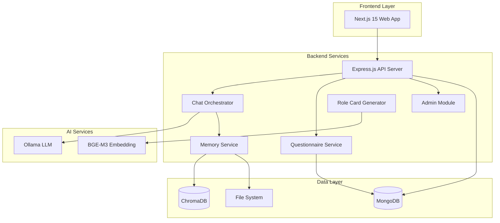

# AFS System Introduction

:::info Project Overview
**AFS System** (Artificial Flashlight Simulation) is a **digital memory heritage system** designed for seniors, helping them preserve life stories and providing personalized AI companion conversations.
:::

## Overview

AFS System is an innovative application that combines AI technology with family memory preservation. It helps elderly users record their life stories through guided conversations and preserves these precious memories for future generations. The system uses advanced AI technologies including LangGraph for conversation orchestration and RAG (Retrieval-Augmented Generation) for personalized memory-based interactions.

### Core Value Proposition

- **Digital Memory Preservation**: Structured storage of life stories and precious memories across multiple layers
- **AI-Powered Companionship**: Personalized conversations that remember who you are and understand your stories
- **Family Collaboration**: Multi-user support allowing family members to collaboratively build complete memory archives
- **Privacy Protection**: Complete RBAC (Role-Based Access Control) system for data security

## System Architecture

## Tech Stack Summary

| Layer | Technology |
|-------|-----------|
| Frontend | Next.js 15, React 19, TypeScript, TailwindCSS, Zustand |
| Backend | Node.js 20+, Express.js, MongoDB, Mongoose |
| AI Framework | LangGraph, LangChain, Ollama |
| Vector DB | ChromaDB with BGE-M3 embeddings |
| Deployment | Docker, Docker Compose |

## Features

### 1. User Management System

Complete user authentication and profile management with role-based access control. Supports user registration, login, profile editing, and role assignment for different access levels.

[Learn more about User System](/docs/core/user/overview)

### 2. Questionnaire System

Multi-layered questionnaire structure with basic and emotional questions. Supports role-based questions (elder, family, friend) and progress tracking for guided memory collection.

[Learn more about Questionnaire System](/docs/core/questionnaire/overview)

### 3. AI Companion Chat

LangGraph-based conversation orchestration with RAG integration. Provides personalized conversations based on user memories with context-aware responses and memory persistence.

[Learn more about AI Chat](/docs/core/chat/overview)

### 4. Role Card System

Automated role card generation from user memories using multi-layer architecture (core, relation, safety calibration) with vector index for efficient memory retrieval.

[Learn more about Role Cards](/docs/core/rolecard/overview)

### 5. Memory Management

Dual storage system (MongoDB + file system) for reliable data persistence. Includes conversation memory storage, compression algorithms, and archival capabilities.

[Learn more about Memory System](/docs/core/memory/overview)

### 6. Admin Panel

Comprehensive management interface with user management, questionnaire CRUD operations, memory database management, system statistics, and role/permission management.

[Learn more about Admin Panel](/docs/admin/overview)

## Quick Links

| Topic | Link |
|-------|------|
| Installation Guide | [/docs/getting-started/installation](/docs/getting-started/installation) |
| Project Overview | [/docs/getting-started/project-overview](/docs/getting-started/project-overview) |
| Core Features | [/docs/core/overview](/docs/core/overview) |
| Tech Stack | [/docs/reference/tech-stack](/docs/reference/tech-stack) |
| API Reference | [/docs/api/overview](/docs/api/overview) |
| Admin Panel Guide | [/docs/admin/overview](/docs/admin/overview) |
| Architecture Overview | [/docs/architecture/overview](/docs/architecture/overview) |
| Docker Deployment | [/docs/deployment/docker](/docs/deployment/docker) |

## Project Status

:::success v2.1.0 Released
- Modular backend architecture with 12 independent feature modules
- Complete admin panel with comprehensive management features
- Enhanced memory management with conversation memories
- Improved role card generation V2 with layered architecture
- LangGraph-based conversation orchestration
:::

## Recent Updates

- **Admin Panel**: Full-featured management interface with user, questionnaire, and memory management
- **Memory Management**: Enhanced with conversation memories and compression algorithms
- **Permission System**: Fine-grained RBAC access control
- **Dashboard**: System statistics and monitoring capabilities
- **Questionnaire Management**: Complete CRUD with filtering and ordering
- **Role Card V2**: Multi-layer architecture with core, relation, and safety calibration layers

## Next Steps

- [Installation Guide](/docs/getting-started/installation) - Set up AFS System on your machine
- [Project Overview](/docs/getting-started/project-overview) - Understand the project structure
- [Core Features](/docs/core/overview) - Explore all feature modules
- [Admin Panel](/docs/admin/overview) - Learn about system administration
